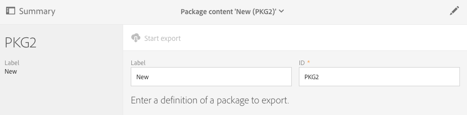

# Managing packages{#managing-packages}

管理者は、構造化XMLファイルを介して異なるAdobe Campaignインスタンス間のリソースを交換するパッケージを定義できます。これらは、設定パラメーターまたはデータです。

これは、あるサーバーから別のサーバーにデータを転送したり、インスタンスの設定を複製したりする場合に便利です。

Packages are available under the **[!UICONTROL Administration]** &gt; **[!UICONTROL Deployment]** &gt; **[!UICONTROL Package exports]** or **[!UICONTROL Package imports]** menus. 2つのメニューは同様に機能します。

各リストの要素は、デフォルトで、変更日またはインストール日に応じて、最新から最も古いものに変更されます。

要素のコンテンツを表示および変更するには、ラベルをクリックします。Refer to the [Exporting a package](../../automating/using/managing-packages.md#exporting-a-package) and [Importing a package](../../automating/using/managing-packages.md#importing-a-package) sections.

## Package exports {#package-exports}

### Standard packages {#standard-packages}

**[!UICONTROL Platform]** と **[!UICONTROL Administration]** は2つのビルトインパッケージで、書き出されるリソースのリストがあらかじめ定義されています。読み取り専用モードで開くことができ、書き出しにのみ適しています。

>[!CAUTION]
>
>書き出したリソースにデフォルトIDがある場合、パッケージのエクスポートは許可されません。そのため、エクスポート可能なリソースのIDは、Adobe Campaign Standardの標準として提供されているテンプレートとは異なる名前を使用して変更する必要があります。例えば、テストプロファイルをエクスポートする場合、値"AST"または"dm"を含むIDを使用することはできません。デフォルトIDを含むパッケージをエクスポートしようとすると、次のようなエラーが表示されます。「ブランド（ブランド）のエンティティタイプは、パッケージの読み込み時に競合を引き起こす可能性のあるデフォルトのID（'BRRD1'）を使用します。この名前を変更して、操作を繰り返します」。

The package export steps are described in the [Exporting a package](../../automating/using/managing-packages.md#exporting-a-package) section.

* **[!UICONTROL Platform]** パッケージによって、技術的な設定で追加されたすべてのリソースが再グループ化されます。カスタムリソース、カスタムリソースセット、トリガー、 **[!UICONTROL System]** およびタイプを持つアプリケーションオプション。
* **[!UICONTROL Administration]** パッケージにより、次のようなビジネス設定時に追加されたすべてのオブジェクトが再グループ化されます。キャンペーンテンプレート、コンテンツテンプレート、配信テンプレート、ランディングページテンプレート、プログラムテンプレート、ワークフローテンプレート

   It also includes the following objects: content blocks, target mappings, external accounts, organizational units, application options with the **[!UICONTROL User]** type, roles, typologies, typology rules and users.

>[!NOTE]
>
>これら2つのパッケージのコンテンツは変更できません。一方、これらのパッケージには常に最新のデータが含まれています。You can [create your own packages](../../automating/using/managing-packages.md#creating-a-package) to export specific elements.

### Creating a package {#creating-a-package}

特定のデータセットを書き出す必要がある場合は、パッケージを作成する必要があります。

パッケージを作成するには、管理者権限が必要です。

1. From **[!UICONTROL Administration]** &gt; **[!UICONTROL Deployment]** &gt; **[!UICONTROL Package exports]**, click the **[!UICONTROL Create]** button in the list of package contents.

   要素はすぐに作成されます。作成をキャンセルするには、リストに戻り、対応するボックスをチェックして削除します。

1. パッケージのコンテンツ画面で、名前とIDを指定します。
1. Click the **[!UICONTROL Edit properties]** button if you would like to add a description and restrict access to certain users.

   

1. Use the **[!UICONTROL Create element]** button in the **[!UICONTROL Export content]** tab to select the resources you wish to export.

   

1. リソースはアルファベット順に表示され、名前でフィルターできます。技術的な名前は括弧で囲まれて表示されます。リストから要素を選択し、確認します。

   

1. The resource name is displayed in the **[!UICONTROL Export content]** tab. To modify a resource, check the corresponding box and use the **[!UICONTROL Show detail of the element selected]** button.

   

1. クエリーエディターを使用すると、エクスポートする要素をフィルタリングできます。For more on this, refer to the [Editing queries](../../automating/using/editing-queries.md#creating-queries) section.

   

   >[!NOTE]
   >
   >リソースごとに最大5000個のオブジェクトを書き出すことができます。

1. エクスポートするすべてのリソースを指定したら、選択を保存します。

パッケージが作成され、エクスポートできるようになりました。

### Exporting a package {#exporting-a-package}

パッケージをエクスポートすると、同じインスタンス上の別のインスタンスまたは後で再読み込みできるリソースの特定の状態を保存できます。

>[!CAUTION]
>
>書き出したリソースにあらかじめ用意されているIDがある場合、パッケージの書き出しは許可されません。そのため、エクスポート可能なリソースのIDは、Adobe Campaign Standardの標準として提供されているテンプレートとは異なる名前を使用して変更する必要があります。例えば、テストプロファイルをエクスポートする場合、値"AST"または"dm"を含むIDを使用することはできません。

1. From **[!UICONTROL Administration]** &gt; **[!UICONTROL Deployment]** &gt; **[!UICONTROL Package exports]**, select a package to access its detail.
1. パッケージに必要なデータが含まれていることを確認します。
1. Click the **[!UICONTROL Start export]** button.

書き出されたファイルは、使用中のブラウザーのダウンロードフォルダーに保存されます。"package_xxx.xml"は自動的に「」という名前になり、パッケージIDに対応します。

操作が完了すると、いくつかのセクションが表示されます。

* **[!UICONTROL Export status]**:この節では、操作が正しく実行されているかどうかを示します。

   

* **[!UICONTROL Log]** タブを使用して、エクスポートの様々な手順を確認できます。これには、以前のすべてのエクスポートのステータスが含まれます。

   

>[!NOTE]
>
>When selecting an element from the package content list that has already been exported, the **[!UICONTROL Log]** and **[!UICONTROL Last export]** tabs are still available.

## Package imports {#package-imports}

### System updates {#system-updates}

上記のパッケージインポートリストには、アドビが実行したアップデートにリンクされた自動インポートが含まれています。

**[!UICONTROL Execution logs]** このタブには、すべてのインポート手順が保存されます。サイドパネルには一般的な情報が表示されます。

>[!NOTE]
>
>これらの要素は読み取り専用モードでアクセスできます。

### Importing a package {#importing-a-package}

管理者は、Adobe Campaignインスタンスから以前に実行されたエクスポートからのパッケージを手動でインポートできます。For more on this, refer to the [Package exports](../../automating/using/managing-packages.md#package-exports) section.

手動パッケージのインポートは、次の2つの手順で構成されます。まず、ファイルをアップロードしてから、そのコンテンツをインポートすることができます。

1. From **[!UICONTROL Administration]** &gt; **[!UICONTROL Deployment]** &gt; **[!UICONTROL Package imports]**, click the **[!UICONTROL Create]** button in the package import list.

   要素はすぐに作成されます。作成をキャンセルするには、リストに戻り、対応するボックスをチェックして削除します。

1. 新しいインポートの名前とIDを指定します。
1. Select the file you wish to upload by dragging and dropping it, or by clicking the **[!UICONTROL Select from folder]** link.

   読み込まれたファイルは、XMLまたはZIP（XMLファイルを含む）形式である必要があります。

   

   >[!NOTE]
   >
   >アップロードしたドキュメントを置き換えるには、まずそのファイルを名前の右側にあるXアイコンから削除し、操作を繰り返します。

1. Once the file is uploaded, import its content into the database by using the **[!UICONTROL Start import]** button.

   

操作が完了すると、いくつかのセクションが表示されます。

* **[!UICONTROL Import status]**:この節では、操作が正しく実行されているかどうかを示します。
* **[!UICONTROL Execution logs]** タブを使用して、インポートの様々な手順を確認できます。これは、エラーを表示する際に特に重要です。

   

パッケージが読み込まれたら、同じ要素から再読み込みすることはできません。ラベルとIDのみ変更できます。

同じパッケージを再読み込みするには、パッケージの読み込みリストに戻り、要素を作成してから、選択したファイルを再度アップロードします。
