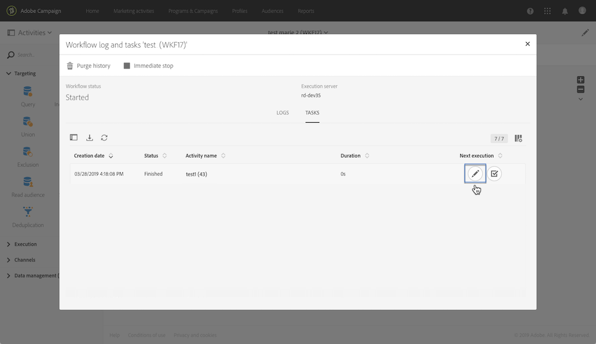

# イベント変数の監視 {#monitoring-the-events-variables}

宣言された外部パラメーターを含め、ワークフローで使用可能なイベント変数を監視できます。 これは、次の手順に従って行います。

1. **[!UICONTROL External signal]**&#x200B;アクティビティに続くアクティビティを選択し、「**[!UICONTROL Log and tasks]**」ボタンをクリックします。
1. 「**[!UICONTROL Tasks]**」タブで、「」ボタンをクリックします。

   

1. タスクの実行コンテキスト（ID、ステータス、期間など）が表示されます。これには、ワークフローで使用できるすべてのイベント変数が含まれます。

   
