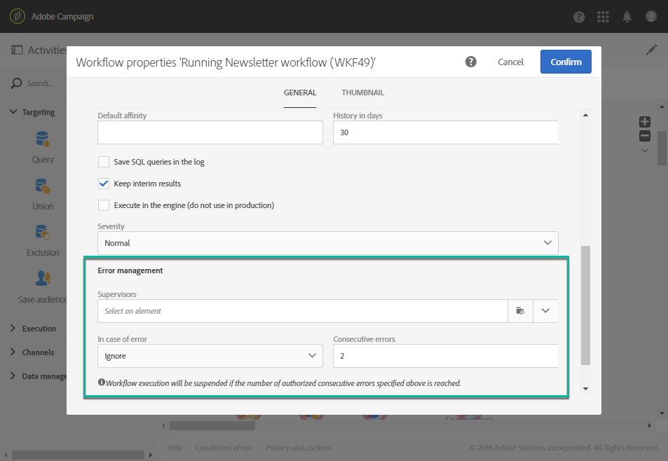

# ワークフローの実行の監視 {#monitoring}

## ワークフローログとタスク {#workflow-log-and-tasks}

The  アイコン：ワークフローログとタスクメニューを開きます。

ワークフローの履歴は、ワークフローの実行オプションで指定された期間保存されます ( [ワークフローのプロパティ](../../automating/using/managing-execution-options.md)) をクリックします。 この期間中は、再起動後も、すべてのメッセージが保存されます。 以前の実行のメッセージを保存しない場合は、「  」ボタンをクリックします。

The **[!UICONTROL Log]** 「 」タブには、すべてのアクティビティまたは選択したアクティビティの実行履歴が表示されます。 実行された操作と実行エラーのインデックスを時系列順に作成します。

The **[!UICONTROL Tasks]** 「 」タブでは、アクティビティの実行順序の詳細を説明します。 タスクをクリックして詳細を表示します。

次の 2 つのリストで、

* カウンターをクリックし、適用したフィルターに従ったアクティビティの合計数を確認します。 リスト内の要素の数が 30 未満の場合は、カウンターがデフォルトで表示されます。
* The **[!UICONTROL Configure list]** 「 」ボタンを使用すると、表示される情報の選択、列の順序の定義、リストの並べ替えをおこなうことができます。
* フィルターを使用して、必要な情報をすばやく見つけることができます。 検索フィールドを使用して、ワークフローアクティビティ名（例：「クエリ」）とログで特定のテキストを検索します。

## エラー管理 {#error-management}

エラーが発生した場合、ワークフローが一時停止し、エラーが発生した際に実行中だったアクティビティが赤く点滅します。

ワークフローのステータスが赤に変わり、エラーがログに記録されます。

一時停止せず、エラーなしに実行を続行するように、ワークフローを設定できます。 これをおこなうには、  ボタンと、 **[!UICONTROL Execution]** セクションで、 **無視** オプションを **エラーの場合** フィールドに入力します。

この場合、エラーのあるタスクは中止されます。 このモードは、後で操作を再試行するように設計されたワークフロー（定期的なアクション）に特に適しています。

>[!NOTE]
>
>この設定は、各アクティビティに個別に適用できます。これをおこなうには、アクティビティを選択し、クイックアクションを使用して開きます . 次に、 **実行オプション** タブをクリックします。 詳しくは、 [アクティビティ実行オプション](../../automating/using/activity-properties.md).

Adobe Analytics の [ワークフローのプロパティ](../../automating/using/managing-execution-options.md)に値を指定しない場合は、エラー管理に関するその他のオプションを使用できます。

選択できるオプションは次のとおりです。

* **[!UICONTROL Supervisors]**：ワークフローでエラーが発生した場合に通知するユーザーのグループ（電子メールおよびアプリ内通知）を定義できます。 グループが定義されていない場合、誰にも通知されません。 Adobe Campaign 通知について詳しくは、[Adobe Campaign 通知](../../administration/using/sending-internal-notifications.md)を参照してください。

* **[!UICONTROL In case of error]**：アクティビティでエラーが発生した場合に実行するアクションを指定できます。 これには、次の 2 つのオプションを使用できます。

   * **プロセスを休止**：ワークフローは自動的に休止されます。 次に、ワークフローのステータスが「 **エラー** そして関連する色が赤く変わる。 問題が解決したら、ワークフローを再起動します。
   * **無視**：アクティビティは実行されず、その結果、後続のアクティビティも（同じ分岐内で）発生しません。 これは、繰り返しタスクに役立つ場合があります。 上流で分岐にスケジューラーが設定されている場合、これは次の実行日にトリガーする必要があります。

* **[!UICONTROL Consecutive errors]** ：ワークフローの実行が自動的に中断されるまでに許可される連続するエラーの数を定義できます。

   * 指定した数値が **[!UICONTROL 0]**&#x200B;または、指定された数に達しない限り、エラーが発生したアクティビティは無視されます。 その他のワークフローブランチは、通常どおり実行されます。

   * 指定した数に達すると、ワークフロー全体が休止され、 **[!UICONTROL Erroneous]**. スーパーバイザーが定義されている場合、スーパーバイザーには E メールで自動的に通知されます。  [Adobe Campaign 通知](../../administration/using/sending-internal-notifications.md)を参照してください。
