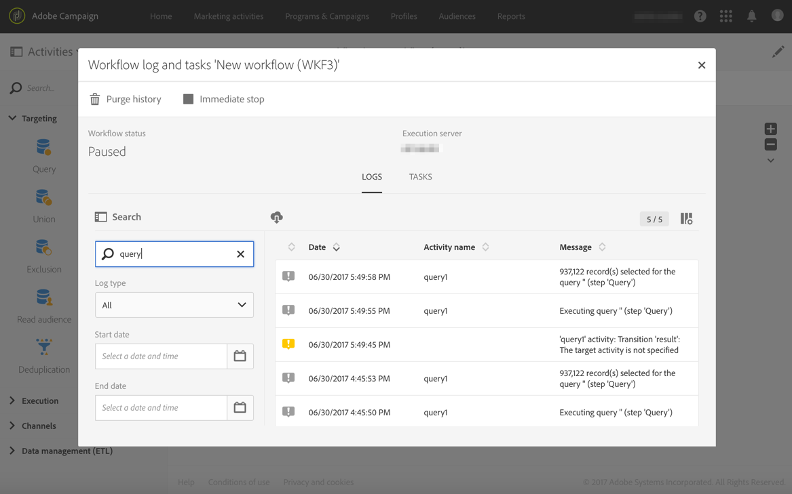
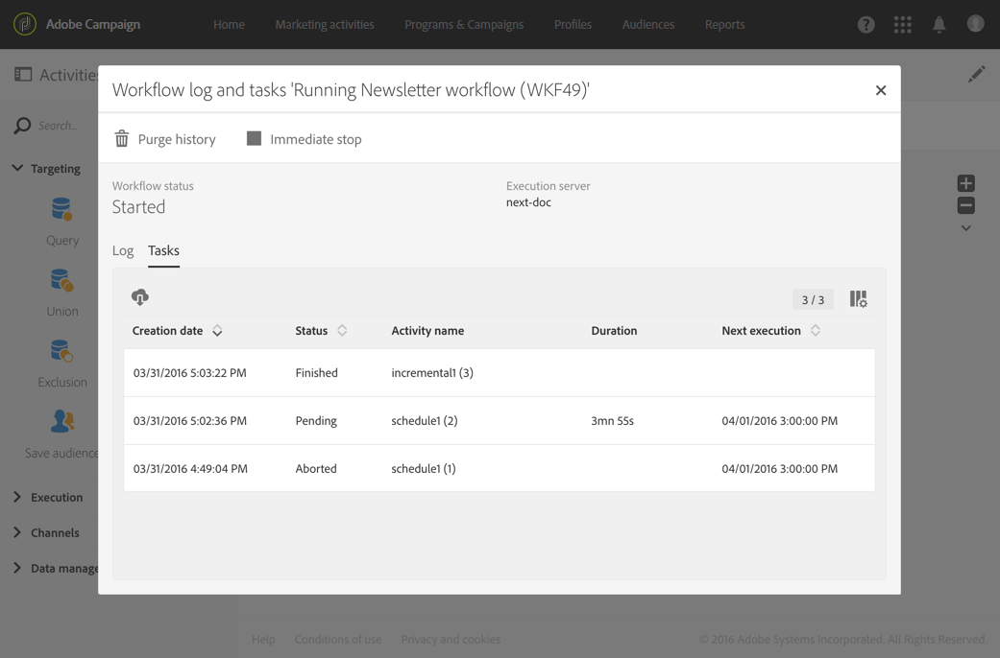
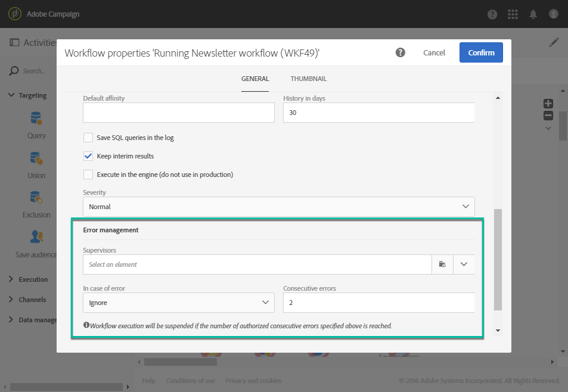

# ワークフローの実行の監視 {#monitoring}

## ワークフローのログとタスク {#workflow-log-and-tasks}

 アイコンがワークフローログとタスクメニューを開きます。

ワークフロー履歴は、ワークフロー実行オプションで指定された期間にわたって保存されます（[&#x200B; ワークフローのプロパティ &#x200B;](../../automating/using/managing-execution-options.md)を参照）。 この期間中、再起動後でも、すべてのメッセージが保存されます。 以前の実行からメッセージを保存しない場合は、 ボタンをクリックして履歴をパージする必要があります。

「**[!UICONTROL Log]**」タブには、すべてのアクティビティまたは選択した任意のアクティビティの実行履歴が含まれます。 実行された操作と実行エラーのインデックスを時系列の順序で作成します。

「**[!UICONTROL Tasks]**」タブには、アクティビティの実行シーケンスの詳細が表示されます。 タスクをクリックすると詳細が表示されます。

これら2つのリストで：

* カウンターをクリックすると、適用されたフィルターに従ったアクティビティの合計数が表示されます。 リスト内の要素の数が30未満の場合、カウンターはデフォルトで表示されます。
* **[!UICONTROL Configure list]** ボタンを使用すると、表示される情報を選択し、列の順序を定義し、リストを並べ替えることができます。
* フィルターを使用して、必要な情報をすばやく見つけることができます。 検索フィールドを使用して、ワークフローアクティビティ名（「クエリ」など）とログ内の特定のテキストを検索します。

## エラー管理 {#error-management}

エラーが発生すると、ワークフローは一時停止され、エラーが発生したときに実行されていたアクティビティが赤で点滅します。

ワークフローステータスが赤になり、エラーがログに記録されます。

ワークフローを一時停止しないように設定し、エラーなしで実行を続行できます。 これを行うには、 ボタンを使用してワークフロープロパティに移動し、**[!UICONTROL Execution]** セクションで、**エラーの場合** フィールドで&#x200B;**無視** オプションを選択します。

この場合、誤ったタスクは中止されます。 このモードは、後で操作を再試行するように設計されたワークフロー（定期的なアクション）に特に適しています。

>[!NOTE]
>
>この設定は、各アクティビティに個別に適用できます。 これを行うには、アクティビティを選択し、クイックアクション を使用して開きます。 次に、**実行オプション** タブでエラー管理モードを選択します。 [&#x200B; アクティビティ実行オプション &#x200B;](../../automating/using/activity-properties.md)を参照してください。

[&#x200B; ワークフローのプロパティ &#x200B;](../../automating/using/managing-execution-options.md)で、エラー管理に関連する追加のオプションを利用できます。

選択できるオプションは次のとおりです。

* **[!UICONTROL Supervisors]**: ワークフローでエラーが発生した場合に通知するユーザーのグループ（メールおよびアプリ内通知）を定義できます。 グループが定義されていない場合は、誰にも通知されません。 Adobe Campaign 通知について詳しくは、[Adobe Campaign 通知](../../administration/using/sending-internal-notifications.md)を参照してください。

* **[!UICONTROL In case of error]**: アクティビティでエラーが発生した場合に実行するアクションを指定できます。 これには2つのオプションがあります。

   * **プロセスを中断**：ワークフローは自動的に中断されます。 ワークフローのステータスは&#x200B;**エラー**&#x200B;になり、関連付けられている色が赤になります。 問題が解決したら、ワークフローを再起動します。
   * **無視**: アクティビティは実行されないため、そのアクティビティに続くアクティビティも（同じブランチ内に）実行されません。 これは、繰り返し作業に役立つ場合があります。 ブランチにスケジューラーがアップストリームに配置されている場合、これは次の実行日にトリガーされます。

* **[!UICONTROL Consecutive errors]**：ワークフローの実行が自動的に中断される前に承認される連続したエラーの数を定義できます。

   * 指定された数値が&#x200B;**[!UICONTROL 0]**&#x200B;である場合、または指定された数値に達しない限り、エラーが発生したアクティビティは無視されます。 その他のワークフローブランチは正常に実行されます。

   * 指定された数に達すると、ワークフロー全体が一時停止され、**[!UICONTROL Erroneous]**&#x200B;になります。 スーパーバイザーが定義されている場合は、電子メールで自動的に通知されます。 [Adobe Campaign 通知](../../administration/using/sending-internal-notifications.md)を参照してください。
