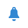

# プッシュ通知配信{#push-notification-delivery}

## 説明 {#description}

**[!UICONTROL Push notification]** アクティビティを使用すると、ワークフローでプッシュ通知の送信を設定できます。 これは、1回の送信通知で1回だけ送信することも、繰り返し送信することもできます。

* **シングル**&#x200B;の送信通知は、標準モバイルアプリのプッシュ通知配信で、1回送信されます。
* **繰り返し**&#x200B;通知を使用すると、同じモバイルアプリのプッシュ通知配信を、定義された期間にわたって異なるターゲットに複数回送信できます。 期間ごとの配信を集計して、ニーズに応じたレポートを取得できます。

## Context of use {#context-of-use}

**[!UICONTROL Push notification]** アクティビティは、通常、同じワークフローで計算されたターゲットに通知を自動的に送信するために使用されます。

スケジューラーにリンクすると、繰り返しプッシュ通知を定義できます。

受信者は、クエリ、積集合などのターゲティングアクティビティを使用して、同じワークフローのアクティビティの上流で定義されます。

メッセージの準備は、ワークフロー実行パラメーターに従ってトリガーされます。 メッセージを送信するために手動確認を要求するかどうかをメッセージダッシュボードで選択できます（デフォルトでは必須）。 ワークフローは、手動で開始するか、ワークフロー内に「スケジューラー」アクティビティを配置して自動的に実行することができます。

**関連トピック**

* [ワークフローを使用した定期的なプッシュ通知の送信](../../automating/using/recurring-push-notifications.md)

## 設定 {#configuration}

1. ワークフローに「**[!UICONTROL Push notification]**」アクティビティをドラッグ＆ドロップします。
1. アクティビティを選択し、表示されるクイックアクションの  ボタンを使用して開きます。

   >[!NOTE]
   >
   >アクティビティのクイックアクションの  ボタンを使用して、（配信自体のオプションではなく）アクティビティの一般的なプロパティや詳細設定オプションにアクセスできます。 このボタンは「**[!UICONTROL Push notification]**」アクティビティに固有のものです。 プッシュ通知のプロパティには、プッシュダッシュボードのアクションバーからアクセスできます。

1. プッシュ通知送信モードを選択します。

   * **[!UICONTROL Single notification]**: プッシュ通知は1回送信されます。 アウトバウンドトランジションをアクティビティに追加するかどうかをここで指定できます。 トランジションタイプについては、この手順のステップ 7 で詳しく説明します。
   * **[!UICONTROL Recurring notification]**: プッシュ通知は、**[!UICONTROL Scheduler]** アクティビティで定義された頻度に従って、複数回送信されます。 送信の集計期間を選択します。 これにより、定義された期間内に発生したすべての送信を、**繰り返し実行**&#x200B;とも呼ばれる1つのプッシュ通知に再グループ化し、アプリケーションのマーケティングアクティビティリストからアクセスできます。

     例えば、毎日送信される定期的な誕生日の通知の場合、1か月あたりの送信の集計を選択できます。 これにより、通知は毎日送信されますが、毎月配信に関するレポートを受け取ることができます。

1. 通知タイプを選択します。 これらのタイプは、**[!UICONTROL Resources]** > **[!UICONTROL Templates]** > **[!UICONTROL Delivery templates]** メニューで定義されたプッシュ通知テンプレートから取得されます。
1. プッシュ通知の一般的なプロパティを入力します。 既存のキャンペーンに SMS を添付することもできます。 ワークフローの配信アクティビティのラベルが、プッシュ通知ラベルで更新されます。
1. プッシュ通知のコンテンツを定義します。 [ プッシュ通知の作成](../../channels/using/preparing-and-sending-a-push-notification.md)を参照してください
1. デフォルトでは、「**[!UICONTROL Push notification]**」アクティビティにアウトバウンドトランジションは含まれていません。 アウトバウンドトランジションを「**[!UICONTROL Push Notification]**」アクティビティに追加する場合は、アクティビティの詳細設定オプション（アクティビティのクイックアクションにある  ボタンで開く）の「**[!UICONTROL General]**」タブに移動し、次のいずれかのオプションをオンにします。

   * **[!UICONTROL Add outbound transition without the population]**：インバウンドトランジションとまったく同じ母集団を含んだアウトバウンドトランジションを生成できます。
   * **[!UICONTROL Add outbound transition with the population]**：これにより、通知の送信先の母集団を含むアウトバウンドトランジションを生成できます。 配信準備中に除外されたターゲットのメンバーは、この移行から除外されます。

1. アクティビティの設定を確認し、ワークフローを保存します。

アクティビティを再度開くと、プッシュ通知ダッシュボードに直接移動します。 そのコンテンツのみ編集可能です。

デフォルトでは、配信ワークフローを開始すると、メッセージの準備のみトリガーされます。 ワークフローで作成したメッセージでも、ワークフローを開始した後で送信の確認をおこなう必要があります。 ただし、メッセージダッシュボードから操作している場合と、メッセージをワークフローから作成した場合に限り、「**[!UICONTROL Request confirmation before sending messages]**」オプションを無効にできます。 このオプションをオフにした場合は、準備が完了したら、追加の通知なしでそのままメッセージが送信されます。

## 備考 {#remarks}

ワークフロー内で作成された配信には、アプリケーションのマーケティングアクティビティリストからアクセスできます。 ダッシュボードを使用して、ワークフローの実行ステータスを確認できます。 プッシュ通知の概要ペインのリンクを使用すると、リンクされた要素（ワークフロー、キャンペーンなど）に直接アクセスできます。

マーケティング活動リストからアクセスできる親配信では、処理された送信の合計数を表示できます（**[!UICONTROL Push notification]** アクティビティが設定されたときに指定された集計期間に従います）。 この合計数を表示するには、 をクリックして、親配信の「**[!UICONTROL Deployment]**」ブロックの詳細表示を開きます。
