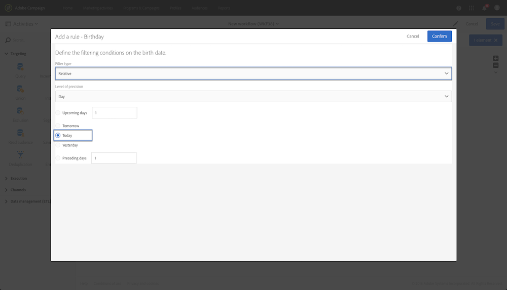
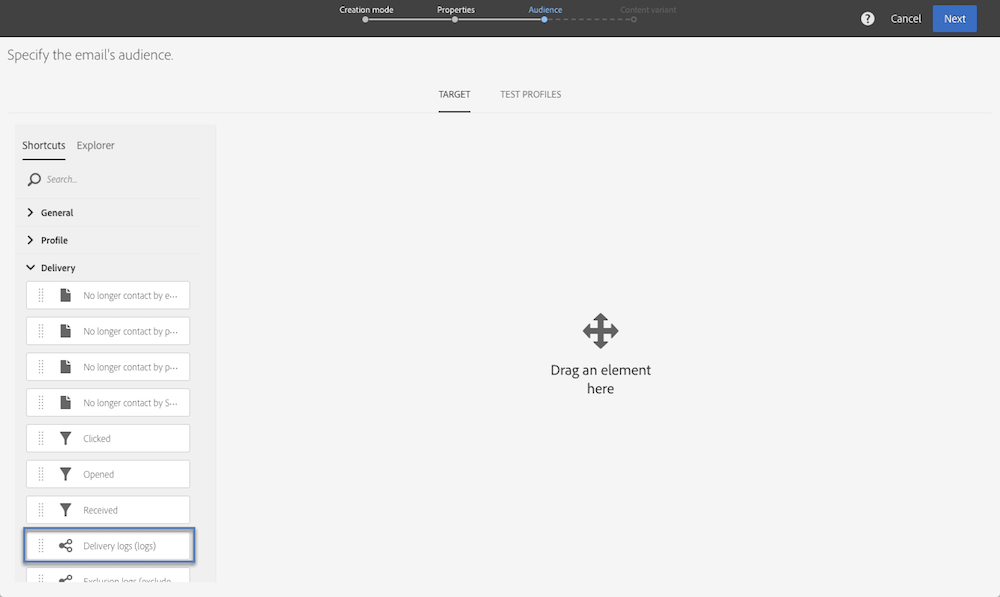

# クエリのサンプル {#query-samples}

このセクションでは、**[!UICONTROL Query]** アクティビティを使用する場合の使用例を示します。 **[!UICONTROL Query]** アクティビティの使用方法について詳しくは、[この節](../../automating/using/query.md)を参照してください。

## シンプルなプロファイル属性をターゲットにする {#targeting-on-simple-profile-attributes}

次の例は、ロンドンに居住している 18～30 歳の男性をターゲットするように設定されたクエリアクティビティを示しています。

## メール属性のターゲティング {#targeting-on-email-attributes}

次の例は、メールアドレスドメインが「orange.co.uk」のプロファイルをターゲットするように設定されたクエリアクティビティを示しています。

次の例は、メールアドレスを提供したプロファイルをターゲットするように設定されたクエリアクティビティを示しています。

## 今日が誕生日のプロファイルをターゲットにする {#targeting-profiles-whose-birthday-is-today}

次の例は、今日が誕生日のプロファイルをターゲットするように設定されたクエリアクティビティを示しています。

1. クエリに **[!UICONTROL Birthday]** フィルターをドラッグします。

   

1. **[!UICONTROL Filter type]** を **[!UICONTROL Relative]** に設定し、「**[!UICONTROL Today]**」を選択します。

   

## 特定の配信を開封したプロファイルをターゲットにする {#targeting-profiles-who-opened-a-specific-delivery}

次の例は、「Summer Time」というラベルの配信を開いたプロファイルをフィルターするように設定されたクエリアクティビティを示しています。

1. クエリに **[!UICONTROL Opened]** フィルターをドラッグします。

   

1. 配信を選択して「**[!UICONTROL Confirm]**」をクリックします。

   

## 特定の理由で配信が失敗したプロファイルをターゲットにする {#targeting-profiles-for-whom-deliveries-failed-for-a-specific-reason}

次の例は、メールボックスの容量が超過したために配信が失敗したプロファイルをフィルターするように設定されたクエリアクティビティを示しています。 このクエリは、管理権限を持ち、**[!UICONTROL All (all)]** 組織単位に属するユーザーのみが使用できます（[この節](../../administration/using/organizational-units.md)を参照）。

1. 配信ログテーブルで直接フィルターするには、**[!UICONTROL Delivery logs]** リソースを選択します（[ターゲティングディメンションとは異なるリソースの使用](../../automating/using/using-resources-different-from-targeting-dimensions.md)を参照）。

   

1. クエリに **[!UICONTROL Nature of failure]** フィルターをドラッグします。

   

1. ターゲットする失敗のタイプを選択します。 ここでは **[!UICONTROL Mailbox full]** です。

   

## 過去7日間に連絡しなかったプロファイルをターゲットにする {#targeting-profiles-not-contacted-during-the-last-7-days}

次の例は、過去 7 日間に連絡していないプロファイルをフィルターするように設定されたクエリアクティビティを示しています。

1. クエリに **[!UICONTROL Delivery logs (logs)]** フィルターをドラッグします。

   

   ドロップダウンリストで「**[!UICONTROL Does not exist]**」を選択し、**[!UICONTROL Delivery]** フィルターをドラッグします。

   

1. 次のようにフィルターを設定します。

   

## 特定のリンクをクリックしたプロファイルをターゲットにする {#targeting-profiles-who-clicked-a-specific-link-}

1. クエリに **[!UICONTROL Tracking logs (tracking)]** フィルターをドラッグします。

   

1. **[!UICONTROL Label (urlLabel)]** フィルターをドラッグします。

   

1. 配信にリンクを挿入する際に定義したラベルを「**[!UICONTROL Value]**」フィールドに入力し、確定します。

   
