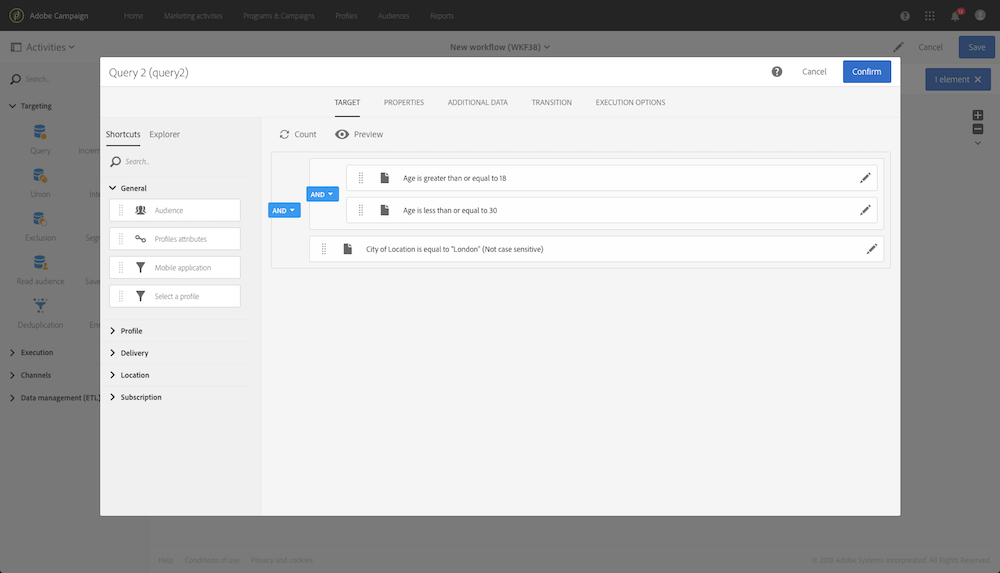

# クエリ{#query}

## 説明 {#description}

アクティビティ **[!UICONTROL Query]** を使用すると、Adobe Campaignデータベースから要素の母集団をフィルターおよび抽出できます。 専用タブを使用し **[!UICONTROL Additional data]** て、ターゲット母集団を定義できます。 このデータは追加の列に保存され、処理中のワークフローでのみ使用できます。

アクティビティでは、クエリエディターツールを使用します。 このツールの詳細は、専用のセクション [で説明します](../../automating/using/editing-queries.md#about-query-editor)。

## 使用状況 {#context-of-use}

アクテ **[!UICONTROL Query]** ィビティは、様々な用途に使用できます。

* 個人をセグメント化して、メッセージ、オーディエンスなどのターゲットを定義します。
* Adobe Campaignデータベース表全体のデータを強化します。
* データのエクスポート.

## 設定 {#configuration}

1. アクティビティをワークフロー **[!UICONTROL Query]** にドラッグ&amp;ドロップします。
1. アクティビティを選択し、表示されるクイックアクシ  ョンのボタンを使用して開きます。 デフォルトでは、アクティビティはプロファイルを検索するように事前設定されています。
1. プロファイルリソース以外のリソースに対してクエリーを実行する場合は、アクティビティのタブに移動し、 **[!UICONTROL Properties]** およびを選 **[!UICONTROL Resource]** 択します **[!UICONTROL Targeting dimension]**。

   を使 **[!UICONTROL Resource]****[!UICONTROL Targeting dimension]**&#x200B;用すると、パレットに表示されるフィルタを絞り込むことができます。一方、選択したリソースに関するコンテキストは、取得する母集団のタイプ（特定されたプロファイル、配信、選択したリソースにリンクされたデータなど）に対応します。

   詳しくは、ディメンションとリソースのターゲ [ット設定を参照してください](#targeting-dimensions-and-resources)。

1. タブで、ル **[!UICONTROL Target]** ールを定義して組み合わせてクエリを実行します。
1. 専用タブを使用し **[!UICONTROL Additional data]** て、ターゲット母集団を定義できます。 このデータは追加の列に保存され、処理中のワークフローでのみ使用できます。 特に、クエリのターゲットディメンションにリンクされたAdobe Campaignデータベーステーブルのデータを追加できます。 「データの富化 [」の節を参照](#enriching-data) 。

   >[!NOTE]
   >
   >デフォルトでは、こ **[!UICONTROL Remove duplicate rows (DISTINCT)]** のオプションはクエリーのタ **[!UICONTROL Advanced options]** ブでチ **[!UICONTROL Additional data]** ェックされています。 アクティビティに **[!UICONTROL Query]** 多数の（100からの）追加のデータが定義されている場合は、パフォーマンス上の理由から、このオプションのチェックを外すことをお勧めします。 このオプションをオフにすると、クエリーされたデータに応じて重複が生じる可能性があるので注意してください。

1. このタブで **[!UICONTROL Transition]** は、デー **[!UICONTROL Enable an outbound transition]** タを取得しない場合でも、クエリーアクティビティの後にアウトバウンド遷移を追加できます。

   アウトバウンドトランジションのセグメントコードは、標準の式とイベント変数を使用してパーソナライズできます(イベント変数を使用したア [クティビティのカスタマイズを参照](../../automating/using/calling-a-workflow-with-external-parameters.md#customizing-activities-with-events-variables))。

1. アクティビティの設定を確認し、ワークフローを保存します。

## ディメンションとリソースのターゲット設定 {#targeting-dimensions-and-resources}

ターゲットディメンションとリソースを使用すると、クエリの基になる要素を定義して、配信のターゲットを決定できます。

ターゲットディメンションは、ターゲットマッピングで定義されます。 詳しくは、[この節](../../administration/using/target-mappings-in-campaign.md)を参照してください。

### クエリーのターゲットディメンションとリソースの定義 {#defining-the-targeting-dimension-and-resource-of-a-query}

ターゲットディメンションとリソースは、ワークフローの作成時に、クエリアクティビティのタ **[!UICONTROL Properties]** ブで定義されるものです。

>[!NOTE]
>
>ターゲットディメンションは、オーディエンスの作成時にも定義で [きます(](../../audiences/using/creating-audiences.md))。

ターゲットディメンションとリソースはリンクされています。 したがって、使用可能なターゲットディメンションは、選択したリソースによって異なります。

例えば、リソースの場合、次のタ **[!UICONTROL Profiles (profile)]**&#x200B;ーゲットディメンションを使用できます。

の場合、リスト **[!UICONTROL Deliveries (delivery)]**&#x200B;には次のターゲットディメンションが含まれます。

ターゲットディメンションとリソースを指定すると、クエリで様々なフィルターを使用できます。

リソースに使用できるフィルタの **[!UICONTROL Profiles (profile)]** 例：

リソースに使用できるフィルタの **[!UICONTROL Deliveries (delivery)]** 例：

### ターゲットディメンションとは異なるリソースの使用 {#using-resources-different-from-targeting-dimensions}

デフォルトでは、ターゲットディメンションとリソースは、ターゲットプロファイルに設定されます。

ただし、遠隔テーブル内の特定のレコードを検索する場合は、ターゲットディメンションとは異なるリソースを使用すると便利です。

**例1:「おかえり！」というラベルを使用して、配信のターゲットとなるプロファイルを識別します**。

* この場合、プロファイルをターゲットにします。 ターゲットディメンションをに設定しま **[!UICONTROL Profiles (profile)]**&#x200B;す。
* 配信ラベルに従って選択したプロファイルをフィルタリングします。 そのため、資源をに設定します **[!UICONTROL Delivery logs]**。 この方法で、配信ログテーブルで直接フィルタリングを行い、パフォーマンスを向上させます。

**例2:「おかえり！」というラベルを使用して、配信のターゲットになっていないプロファイルを識別します。**

前の例では、ターゲットディメンションとは異なるリソースを使用しました。 この操作は、遠隔テーブルに存在するレコードを検索する **場合** （この例では配信ログ）にのみ可能です。

遠隔テーブルに存在しないレコード **(特定の配信でターゲット設定されていないプロファイルなど** )を見つける場合は、遠隔テーブル（配信ログ）にレコードが存在しないので、同じリソースとターゲットディメンションを使用する必要があります。

* この場合、プロファイルをターゲットにします。 ターゲットディメンションをに設定しま **[!UICONTROL Profiles (profile)]**&#x200B;す。
* 配信ラベルに従って選択したプロファイルをフィルタリングします。 配信ログテーブルに存在しないレコードを探しているので、配信ログで直接フィルタリングすることはできません。 したがって、リソースをに設定し、プロフ **[!UICONTROL Profile (profile)]** ァイルテーブルでクエリを作成します。

## データのエンリッチメント {#enriching-data}

「、」 **[!UICONTROL Additional data]** のタブと「ア **[!UICONTROL Query]**&#x200B;クティビテ **[!UICONTROL Incremental query]****[!UICONTROL Enrichment]** ィ」を使用すると、対象のデータを強化し、このデータを次のワークフローアクティビティに転送して、このアクティビティを利用できます。 特に、以下を追加できます。

* 単純なデータ
* 集計
* コレクション

集計とコレクションの場合、は **[!UICONTROL Alias]** 複雑な式に技術IDを与えるために自動的に定義されます。 このエイリアスは一意である必要があり、その後集計とコレクションを簡単に見つけることができます。 簡単に認識できる名前を付けるように変更できます。

>[!NOTE]
>
>エイリアスは、次の構文ルールを順守する必要があります。英数字と「_」文字のみが許可されます。 エイリアスでは大文字と小文字が区別されます。 エイリアスは「@」文字で始まる必要があります。 「@」の直後の文字は数値にできません。 例：@myAlias_1と@_1エイリアスが正しい；一方、@myAlias#1と@1Aliasは正しくありません。

追加のデータを追加した後、定義した追加のデータに基づいて条件を作成することで、最初にターゲットとしたデータに追加のフィルターレベルを適用できます。

>[!NOTE]
>
>デフォルトでは、こ **[!UICONTROL Remove duplicate rows (DISTINCT)]** のオプションはクエリーのタ **[!UICONTROL Advanced options]** ブでチ **[!UICONTROL Additional data]** ェックされています。 アクティビティに **[!UICONTROL Query]** 多数の（100からの）追加のデータが定義されている場合は、パフォーマンス上の理由から、このオプションのチェックを外すことをお勧めします。 このオプションをオフにすると、クエリーされたデータに応じて重複が生じる可能性があるので注意してください。

### 単純なフィールドの追加 {#adding-a-simple-field}

単純なフィールドを追加データとして追加すると、そのフィールドは、アクティビティのアウトバウンド移行時に直接表示されます。 これにより、例えば、クエリのデータが目的のデータであるかどうかをユーザーが確認できます。

1. タブから新 **[!UICONTROL Additional data]** しい要素を追加します。
1. 開いたウィンドウのフィールドで、ターゲッ **[!UICONTROL Expression]** トディメンションまたはリンクディメンションの1つで直接使用できるフィールドの1つを選択します。 式を編集し、ディメンションフィールドから関数や単純な演算（集計を除く）を使用できます。

   単純 **[!UICONTROL Alias]** なXPATHパスではない式を編集すると、が自動的に作成されます(例：&quot;Year(&lt;@birthDate>)&quot;)。 必要に応じて、変更を加えることができます。 1つのフィールドのみを選択した場合(例：「@age」)に置き換える必要があります **[!UICONTROL Alias]**。

1. 追加デ **[!UICONTROL Add]** ータへのフィールドの追加を確認する場合に選択します。 クエリが実行されると、追加されたフィールドに対応する追加の列がアクティビティのアウトバウンド遷移に表示されます。

### 集計の追加 {#adding-an-aggregate}

集計を使用すると、ターゲットディメンションのフィールドまたはターゲットディメンションにリンクされたディメンションのフィールドから値を計算できます。 例：プロファイルが購入した平均金額。
クエリで集計を使用する場合、その関数は0を返し、NULLと見なされます。 クエリーのタ **[!UICONTROL Output filtering]** ブを使用して、集計値をフィルターします。

* ゼロ値が必要な場合は、フィルタを適用しま **[!UICONTROL is null]**&#x200B;す。
* を返します **[!UICONTROL is not null]**。

集計に並べ替えを適用する必要がある場合は、ゼロ値をフィルタで除外する必要があります。除外しない場合は、NULL値が最大値として表示されます。

1. タブから新 **[!UICONTROL Additional data]** しい要素を追加します。
1. 開いたウィンドウで、集計の作成に使用するコレクションをフィールドで選択し **[!UICONTROL Expression]** ます。

   が自動 **[!UICONTROL Alias]** 的に作成されます。 必要に応じて、クエリのタブに戻って変更でき **[!UICONTROL Additional data]** ます。

   集計定義ウィンドウが開きます。

1. タブから集計を定義し **[!UICONTROL Data]** ます。 選択した集計のタイプに応じて、データに互換性がある要素のみがフィールドで使用でき **[!UICONTROL Expression]** ます。 例えば、合計は数値データでのみ計算できます。

   

   選択したコレクションのフィールドに複数の集計を追加できます。 アクティビティのアウトバウンドデータの詳細の異なる列を区別するために、明示的なラベルを必ず定義してください。

   また、各集計に対して自動的に定義される別名を変更することもできます。

   

1. 必要に応じて、フィルターを追加し、使用するデータを制限できます。

   Refer to the [Filtering added data](#filtering-added-data) section.

1. 集計を追 **[!UICONTROL Confirm]** 加する場合に選択します。

>[!NOTE]
>
>ウィンドウのフィールドから直接集計を含む式を作 **[!UICONTROL Expression]** 成することはでき **[!UICONTROL New additional data]** ません。

### コレクションの追加 {#adding-a-collection}

1. タブから新 **[!UICONTROL Additional data]** しい要素を追加します。
1. 開いたウィンドウで、フィールドに追加するコレクションを選択し **[!UICONTROL Expression]** ます。 が自動 **[!UICONTROL Alias]** 的に作成されます。 必要に応じて、クエリのタブに戻って変更でき **[!UICONTROL Additional data]** ます。
1. 選択 **[!UICONTROL Add]**. 新しいウィンドウが開き、表示するコレクションデータを絞り込むことができます。
1. タブで **[!UICONTROL Parameters]** 、追加す **[!UICONTROL Collection]** るコレクションの行数を選択し、定義します。 例えば、各プロファイルで最新の3つの購入を実行する場合は、フィールドに「3」と入力し **[!UICONTROL Number of lines to return]** ます。

   >[!NOTE]
   >
   >1以上の数値を入力する必要があります。

1. タブで **[!UICONTROL Data]** 、各行に表示するコレクションのフィールドを定義します。

   

1. 必要に応じて、フィルタを追加して、使用する収集行を制限できます。

   Refer to the [Filtering added data](#filtering-added-data) section.

1. 必要に応じて、データの並べ替えを定義できます。

   例えば、タブに返す行を3行選択し、最近の3回の購入を確認する場合、トランザクションに対応するコレクションの「日付」フィールドで降順の並べ替えを定義できます。 **[!UICONTROL Parameters]**

1. 「追加データの並べ替 [え」の節を参照し](#sorting-additional-data) 。
1. コレクション **[!UICONTROL Confirm]** を追加する場合に選択します。

### 追加したデータのフィルタリング {#filtering-added-data}

集計またはコレクションを追加する場合は、追加のフィルタを指定して、表示するデータを制限できます。

例えば、50ドル以上のトランザクションの収集行のみを処理する場合は、タブからトランザクション金額に対応するフィールドに条件を追加でき **[!UICONTROL Filter]** ます。

### 追加データの並べ替え {#sorting-additional-data}

集計またはコレクションをクエリのデータに追加する場合、フィールドの値や定義された式に基づいて、昇順または降順のどちらで並べ替えを適用するかを指定できます。

例えば、プロファイルによって実行された最後のトランザクションのみを保存する場合は、タブのフィールドに「1」と入力し、タブを介してトランザクション日に対応するフィールドに降順の並べ替えを適用し **[!UICONTROL Number of lines to return]****[!UICONTROL Parameters]****[!UICONTROL Sort]** ます。

### 追加のデータに従ってターゲットデータをフィルターする {#filtering-the-targeted-data-according-to-additional-data}

データを追加すると、に新しいタ **[!UICONTROL Output filtering]** ブが表示されます **[!UICONTROL Query]**。 このタブでは、追加されたデータを考慮して、最初にタブでターゲット設定されたデ **[!UICONTROL Target]** ータに追加のフィルターを適用できます。

例えば、1つ以上のトランザクションを実行したすべてのプロファイルをターゲットにし、各プロファイルに対して実行された平均トランザクション金額を計算する集計をに追加した場合、この平均を使用して最初に計算された母集団を絞り込むことができます。 **[!UICONTROL Additional data]**

これを行うには、タブで、こ **[!UICONTROL Output filtering]** の追加データに条件を追加します。

### 例：追加データを使用した電子メールの個人化 {#example--personalizing-an-email-with-additional-data}

次の例は、様々なタイプの追加データをクエリに追加し、電子メール内のパーソナライゼーションフィールドとして使用する方法を示しています。

この例では、カスタムリソ [ースを使用](../../developing/using/data-model-concepts.md) します。

* プロフ **ァイル** ・リソースが拡張され、各プロファイルの忠誠度ポイントの保存を可能にするフィールドが追加されました。
* トランザク **ション** ・リソースが作成され、データベース内のプロファイルによって実行されたすべての購入を識別します。 購入日、価格、製品は、トランザクションごとに保存されます。
* 製品リ **ソースが** 、購入可能な製品を参照して作成されました。

目的は、少なくとも1つのトランザクションが保存されたプロファイルに電子メールを送信することです。 この電子メールを通じて、クライアントは、最後に行われたトランザクションと、すべてのトランザクションの概要を知らせる通知を受け取ります。購入した製品の数、滞在合計、発生した忠誠度ポイントの合計数を示すリマインダ。

ワークフローは次のとおりです。

1. アクティビテ **[!UICONTROL Query]** ィを追加します。これにより、少なくとも1つのトランザクションを実行したプロファイルをターゲットに設定できます。

   

   クエリのタブから、最 **[!UICONTROL Additional data]** 後の電子メールに表示する様々なデータを定義します。

   * 忠誠度ポイントに対応する **プロフ** ァイルディメンションの単純フィールド。 「単純なフィールド [の追加」の節を参照し](#adding-a-simple-field) 。
   * トランザクション収集に基づいて2つの集計が行われます。購入した製品の数と合計滞在金額。 これらの指標は、集計設定ウィン **[!UICONTROL Data]** ドウのタブから、 **Count** 集計と **Sum集計を使用して追加できます** 。 集計の追加の節を [参照してください](#adding-an-aggregate) 。
   * 最後のトランザクションで支払われた金額、日付、および製品を返すコレクション。

      これを行うには、コレクション設定ウィンドウのタブに表示する様々なフィールドを追 **[!UICONTROL Data]** 加する必要があります。

      最新のトランザクションのみを返すには、「1」と入力し、タブからコレクションの「日付 **[!UICONTROL Number of lines to return]** 」フィールドに降順の並べ替えを適用する必要があり ******[!UICONTROL Sort]** ます。

      コレクションの追加 [と追加のデータの並べ替え](#adding-a-collection) (英 [語のみ)の節を参照してください](#sorting-additional-data) 。
   

   データがアクティビティのアウトバウンド移行によって正しく転送されていることを確認する場合は、（アクティビティなしで）初めてワークフローを開始し、クエリのアウトバウンド移行を開きます。 **[!UICONTROL Email delivery]**

   

1. アクティビティを追 **[!UICONTROL Email delivery]** 加します。 電子メールコンテンツに、クエリで計算されたデータに対応するパーソナライゼーションフィールドを挿入します。 これは、パーソナライゼーションフィールドエク **[!UICONTROL Additional data (targetData)]** スプローラーのリンクから確認できます。

   

これで、ワークフローを実行する準備が整いました。 クエリでターゲット設定されたプロファイルは、トランザクションから計算されたデータを含むパーソナライズされた電子メールを受け取ります。

## クエリのサンプル {#query-samples}

### Targeting on simple profile attributes {#targeting-on-simple-profile-attributes}

次の例は、18歳から30歳の男性をターゲットに設定した、ロンドン在住のクエリアクティビティを示しています。

### 電子メール属性のターゲット設定 {#targeting-on-email-attributes}

次の例は、電子メールアドレスドメイン「orange.co.uk」を持つプロファイルをターゲットに設定するクエリアクティビティを示しています。

次の例は、電子メールアドレスが指定されたプロファイルをターゲットに設定するクエリアクティビティを示しています。

### 誕生日が今日のプロファイルをターゲットにする {#targeting-profiles-whose-birthday-is-today}

次の例は、今日の誕生日を持つプロファイルをターゲットに設定するクエリアクティビティを示しています。

1. クエリ内でフ **[!UICONTROL Birthday]** ィルタをドラッグします。

   

1. をに設定し **[!UICONTROL Filter type]** 、を **[!UICONTROL Relative]** 選択しま **[!UICONTROL Today]**&#x200B;す。

   

### 特定の配信を開いたプロファイルのターゲット設定 {#targeting-profiles-who-opened-a-specific-delivery}

次の例は、「夏時間」というラベルを付けて配信を開いたプロファイルをフィルターするように設定されたクエリアクティビティを示しています。

1. クエリ内でフ **[!UICONTROL Opened]** ィルタをドラッグします。

   

1. 配信を選択し、をクリックしま **[!UICONTROL Confirm]**&#x200B;す。

   

### 特定の理由で配信に失敗したユーザーのターゲットプロファイル {#targeting-profiles-for-whom-deliveries-failed-for-a-specific-reason}

次の例は、メールボックスがいっぱいで配信に失敗したプロファイルをフィルターするように設定されたクエリアクティビティを示しています。 このクエリは、管理権限を持ち、組織単位に属するユーザーに対しての **[!UICONTROL All (all)]** み使用できます( [この節を参照](../../administration/using/organizational-units.md))。

1. 配信ログテー **[!UICONTROL Delivery logs]** ブルで直接フィルターするには、リソースを選択します(ターゲットディメ [ンションとは異なるリソースの使用を参照](#using-resources-different-from-targeting-dimensions))。

   

1. クエリ内でフ **[!UICONTROL Nature of failure]** ィルタをドラッグします。

   

1. ターゲットにする失敗のタイプを選択します。 我々の場合 **[!UICONTROL Mailbox full]**&#x200B;は

   

### 過去7日間に接続されなかったターゲットプロファイル {#targeting-profiles-not-contacted-during-the-last-7-days}

次の例は、過去7日間に連絡を取らなかったプロファイルをフィルターするように設定されたクエリアクティビティを示しています。

1. クエリ内でフ **[!UICONTROL Delivery logs (logs)]** ィルタをドラッグします。

   

   ドロッ **[!UICONTROL Does not exist]** プダウンリストでを選択し、フィルターをドラッグ **[!UICONTROL Delivery]** します。

   

1. フィルターを次のように設定します。

   

### 特定のリンクをクリックしたプロファイルのターゲット設定 {#targeting-profiles-who-clicked-a-specific-link-}

1. クエリ内でフ **[!UICONTROL Tracking logs (tracking)]** ィルタをドラッグします。

   

1. フィルターをドラ **[!UICONTROL Label (urlLabel)]** ッグします。

   

1. フィール **[!UICONTROL Value]** ドに、リンクを配信に挿入する際に定義したラベルを入力し、確認します。

   

