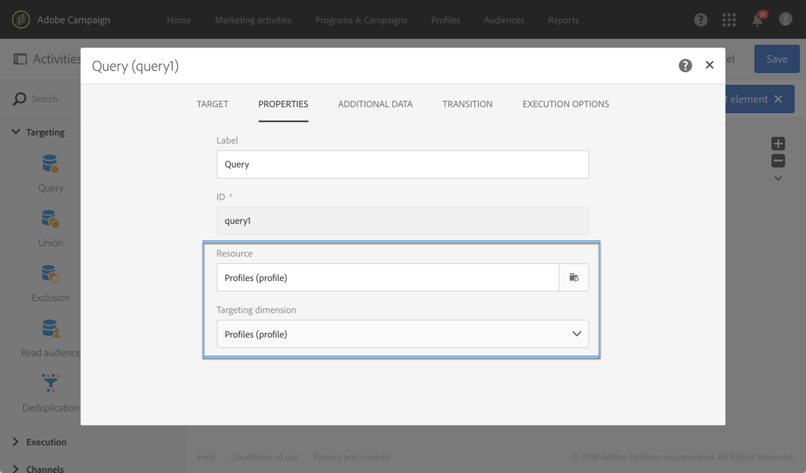

# クエリ{#query}

## 説明 {#description}

「**[!UICONTROL Query]**」アクティビティを使用すると、Adobe Campaign データベースから要素の母集団をフィルタリングして抽出できます。該当するタブを使用して、ターゲット母集団の **[!UICONTROL Additional data]** を定義できます。このデータは追加の列に格納され、進行中のワークフローでのみ使用できます。

このアクティビティではクエリエディターツールを使用します。このツールについては、[該当する節](../../automating/using/editing-queries.md#about-query-editor)で詳しく説明します。

**関連トピック：**

* [クエリのサンプル](../../automating/using/query-samples.md)
* [ユースケース：リターゲティングワークフローで開封者以外に新しい配信を送信する](../../automating/using/workflow-cross-channel-retargeting.md)

## 使用コンテキスト {#context-of-use}

「**[!UICONTROL Query]**」アクティビティは、次のような様々な用途に使用できます。

* 個人をセグメント化して、メッセージやオーディエンスなどのターゲットを定義する。
* Adobe Campaign データベーステーブル全体のデータをエンリッチメントする。
* データをエクスポートする。

## 設定 {#configuration}

1. ワークフローに「**[!UICONTROL Query]**」アクティビティをドラッグ＆ドロップします。
1. アクティビティを選択し、表示されるクイックアクションの  ボタンを使用して開きます。デフォルトでは、このアクティビティはプロファイルを検索するように事前設定されています。
1. プロファイルリソース以外のリソースに対してクエリを実行する場合は、アクティビティの「**[!UICONTROL Properties]**」タブに移動し、「**[!UICONTROL Resource]**」と「**[!UICONTROL Targeting dimension]**」を選択します。

   「**[!UICONTROL Resource]**」では、パレットに表示されるフィルターを絞り込むことができます。これに対して、「**[!UICONTROL Targeting dimension]**」は、選択されたリソースに応じて異なり、取得する母集団のタイプ（特定されたプロファイル、配信、選択されたリソースにリンクしているデータなど）に対応しています。

   詳しくは、[ターゲティングディメンションとリソース](#targeting-dimensions-and-resources)を参照してください。

1. 「**[!UICONTROL Target]**」タブで、ルールを定義して組み合わせ、クエリを実行します。

   >[!NOTE]
   >
   >オーディエンスをターゲティングする場合、オーディエンスの定義は参照されず、クエリに **コピー** されます。 クエリのターゲットにした後にオーディエンスに変更を加える場合は、新しい定義を考慮してクエリを再度設定してください。

1. 該当するタブを使用して、ターゲット母集団の **[!UICONTROL Additional data]** を定義できます。このデータは追加の列に格納され、進行中のワークフローでのみ使用できます。特に、クエリのターゲティングディメンションにリンクされた Adobe Campaign データベースのテーブルからデータを追加できます。[データのエンリッチメント](#enriching-data)の節を参照してください。

   >[!NOTE]
   >
   >デフォルトでは、クエリの「**[!UICONTROL Additional data]**」タブの「**[!UICONTROL Advanced options]**」で「**[!UICONTROL Remove duplicate rows (DISTINCT)]**」オプションがオンになっています。パフォーマンス上の理由から、追加のデータが「**[!UICONTROL Query]**」アクティビティに多数（100 以上）含まれている場合は、このオプションをオフにすることをお勧めします。このオプションをオフにすると、クエリされたデータに応じて重複が取得される可能性があるので注意してください。

1. 「**[!UICONTROL Transition]**」タブの「**[!UICONTROL Enable an outbound transition]**」オプションを使用すると、クエリアクティビティがデータを取得しない場合でも、このアクティビティの後にアウトバウンドトランジションを追加できます。

   アウトバウンドトランジションのセグメントコードは、標準式とイベント変数を使用してパーソナライズできます（[ このページ ](../../automating/using/customizing-workflow-external-parameters.md) を参照）。

1. アクティビティの設定を確認し、ワークフローを保存します。

## ターゲティングディメンションとリソース {#targeting-dimensions-and-resources}

ターゲティングディメンションとリソースを使用すると、配信のターゲットを指定するためにクエリで使用する要素を定義できます。

[ ターゲットマッピング ](../../administration/using/target-mappings-in-campaign.md) で設定し、ワークフローの作成時にクエリアクティビティの「**[!UICONTROL Properties]**」タブで定義します。

>[!NOTE]
>
>ターゲティングディメンションは、オーディエンスの作成時にも定義できます（[この節](../../audiences/using/creating-audiences.md)を参照）。

ターゲティングディメンションとリソースはリンクされています。したがって、使用可能なターゲティングディメンションは、選択したリソースによって異なります。

例えば、**[!UICONTROL Profiles (profile)]** リソースの場合、次のターゲティングディメンションを使用できます。

**[!UICONTROL Deliveries (delivery)]** の場合、リストには次のターゲティングディメンションが含まれます。

ターゲティングディメンションとリソースを指定すると、クエリで様々なフィルターを使用できるようになります。

**[!UICONTROL Profiles (profile)]** リソースに使用できるフィルターの例：

**[!UICONTROL Deliveries (delivery)]** リソースに使用できるフィルターの例：

デフォルトでは、プロファイルをターゲットにするために、ターゲティングディメンションとリソースが設定されます。 ただし、距離テーブル内の特定のレコードを検索する場合は、ターゲティングディメンションとは別のリソースを使用すると便利です。

詳しくは、次のユースケースを参照してください。[ ターゲティングディメンションとは異なるリソースの使用 ](../../automating/using/using-resources-different-from-targeting-dimensions.md)

## データのエンリッチメント {#enriching-data}

「**[!UICONTROL Query]**」アクティビティ、「**[!UICONTROL Incremental query]**」アクティビティ、「**[!UICONTROL Enrichment]**」アクティビティの「**[!UICONTROL Additional data]**」タブを使用すると、ターゲットとなるデータをエンリッチメントし、このデータを次のワークフローアクティビティに転送して利用できるようになります。特に、以下を追加できます。

* シンプルなデータ
* 集計
* コレクション

集計とコレクションの場合は、複雑な式に技術的識別子を付与するために **[!UICONTROL Alias]** が自動的に定義されます。このエイリアスは一意である必要があり、後で集計とコレクションを容易に検索することができます。エイリアスをわかりやすい名前に変更することができます。

>[!NOTE]
>
>エイリアスは、次の構文規則に従う必要があります。英数字と「_」文字のみを利用できます。エイリアスでは、大文字と小文字が区別されます。エイリアスは「@」文字で開始する必要があります。「@」の直後に数字を挿入できません。例：@myAlias_1 と @_1Alias は正しいですが、@myAlias#1 と @1Alias は正しくありません。

データを追加した後、定義した追加のデータに基づいて条件を作成することで、最初にターゲットしたデータに追加のフィルターレベルを適用できます。

>[!NOTE]
>
>デフォルトでは、クエリの「**[!UICONTROL Additional data]**」タブの「**[!UICONTROL Advanced options]**」で「**[!UICONTROL Remove duplicate rows (DISTINCT)]**」オプションがオンになっています。パフォーマンス上の理由から、追加のデータが「**[!UICONTROL Query]**」アクティビティに多数（100 以上）含まれている場合は、このオプションをオフにすることをお勧めします。このオプションをオフにすると、クエリされたデータに応じて重複が取得される可能性があるので注意してください。

追加データでメールをパーソナライズする方法のユースケースについては、[ この節 ](../../automating/using/personalizing-email-with-additional-data.md) を参照してください。

### シンプルなフィールドの追加 {#adding-a-simple-field}

シンプルなフィールドをデータとして追加すると、そのフィールドはアクティビティのアウトバウンドトランジションに直接表示されます。これにより、例えば、クエリのデータが適切なデータであるかを確認できます。

1. 「**[!UICONTROL Additional data]**」タブから、新しい要素を追加します。
1. 開いたウィンドウの「**[!UICONTROL Expression]**」フィールドで、ターゲティングディメンションまたはリンクされたディメンションの 1 つで直接使用できるフィールドの 1 つを選択します。式を編集し、ディメンションフィールドから関数やシンプルな計算（集計を除く）を使用できます。

   シンプルな XPATH パスではない式を編集すると、**[!UICONTROL Alias]** が自動的に作成されます（例：「Year(&lt;@birthDate>)」）。必要に応じて、変更を加えることができます。1 つのフィールドのみを選択する場合（例：「@age」）、**[!UICONTROL Alias]** を定義する必要はありません。

1. 追加データへのフィールドの追加を確定するには、「**[!UICONTROL Add]**」を選択します。クエリを実行すると、追加されたフィールドに対応する追加の列が、アクティビティのアウトバウンドトランジションに表示されます。

### 集計の追加 {#adding-an-aggregate}

集計を使用すると、ターゲティングディメンションのフィールドまたはターゲティングディメンションにリンクされたディメンションのフィールドから値を計算できます。例：プロファイルの平均購入金額。
クエリで集計を使用する場合、関数は 0 に戻り、NULL と見なされます。クエリの「**[!UICONTROL Output filtering]**」タブを使用して、集計値をフィルターします。

* ゼロの値が必要な場合は、**[!UICONTROL is null]** にフィルターを適用します。
* ゼロの値を除外したい場合は、**[!UICONTROL is not null]** にフィルターを適用します。

集計に並べ替えを適用する必要がある場合は、ゼロの値を除外する必要があります。そうしないと、NULL 値が最大値として表示されます。

1. 「**[!UICONTROL Additional data]**」タブから、新しい要素を追加します。
1. 開いたウィンドウで、集計の作成に使用するコレクションを「**[!UICONTROL Expression]**」フィールドで選択します。

   **[!UICONTROL Alias]** が自動的に作成されます。必要に応じて、クエリの「**[!UICONTROL Additional data]**」タブに戻って変更をおこないます。

   集計定義ウィンドウが開きます。

1. 「**[!UICONTROL Data]**」タブで集計を定義します。選択した集計の種類に応じて、互換性のあるデータを持つ要素のみが「**[!UICONTROL Expression]**」フィールドで使用できます。例えば、合計は数値データでのみ計算できます。

   

   選択したコレクションのフィールドに複数の集計を追加できます。アクティビティのアウトバウンドデータの詳細において異なる列を区別するために、明示的なラベルを定義してください。

   また、各集計に対して自動的に定義されるエイリアスを変更することもできます。

   

1. 必要に応じて、フィルターを追加し、考慮するデータを制限できます。

   [追加されたデータのフィルター](#filtering-added-data)の節を参照してください。

1. 「**[!UICONTROL Confirm]**」を選択して集計を追加します。

>[!NOTE]
>
>集計を含む式は、**[!UICONTROL New additional data]** ウィンドウの「**[!UICONTROL Expression]**」フィールドから直接作成できません。

### コレクションの追加 {#adding-a-collection}

1. 「**[!UICONTROL Additional data]**」タブから、新しい要素を追加します。
1. 開いたウィンドウで、「**[!UICONTROL Expression]**」フィールドに追加するコレクションを選択します。**[!UICONTROL Alias]** が自動的に作成されます。必要に応じて、クエリの「**[!UICONTROL Additional data]**」タブに戻って変更をおこないます。
1. 「**[!UICONTROL Add]**」を選択します。新しいウィンドウが開き、表示するコレクションデータを絞り込むことができます。
1. 「**[!UICONTROL Parameters]**」タブで、「**[!UICONTROL Collection]**」を選択して追加するコレクションの行数を定義します。例えば、各プロファイルが最近おこなった 3 回の購入を取得する場合は、「**[!UICONTROL Number of lines to return]**」フィールドに「3」と入力します。

   >[!NOTE]
   >
   >1 以上の数値を入力する必要があります。

1. 「**[!UICONTROL Data]**」タブで、各行に表示するコレクションのフィールドを定義します。

   

1. 必要に応じて、フィルターを追加し、考慮するコレクション行を制限できます。

   [追加されたデータのフィルター](#filtering-added-data)の節を参照してください。

1. 必要に応じて、データの並べ替えを定義できます。

   例えば、「**[!UICONTROL Parameters]**」タブで返す行を 3 行と選択し、最近の購入を 3 回特定する場合、トランザクションに対応するコレクションの「日付」フィールドで並べ替えを降順に指定できます。

1. [追加データの並べ替え](#sorting-additional-data)の節を参照してください。
1. 「**[!UICONTROL Confirm]**」を選択してコレクションを追加します。

### 追加されたデータのフィルタリング {#filtering-added-data}

集計またはコレクションを追加する場合は、追加のフィルターを指定して、表示するデータを制限できます。

例えば、金額が 50 ドル以上のトランザクションのコレクション行のみを処理する場合は、「**[!UICONTROL Filter]**」タブからトランザクション金額に対応するフィールドに条件を追加できます。

### 追加データの並べ替え {#sorting-additional-data}

集計またはコレクションをクエリのデータに追加する場合、フィールドの値や定義した式に基づいて、昇順と降順のどちらの並べ替えを適用するかを指定できます。

例えば、プロファイルが最近実行したトランザクションのみを保存する場合は、「**[!UICONTROL Parameters]**」タブの「**[!UICONTROL Number of lines to return]**」フィールドに「1」と入力し、「**[!UICONTROL Sort]**」タブを介してトランザクション日に対応するフィールドに降順の並べ替えを適用します。

### 追加データに従ったターゲットデータのフィルタリング {#filtering-the-targeted-data-according-to-additional-data}

データを追加すると、**[!UICONTROL Query]** に新しい「**[!UICONTROL Output filtering]**」タブが表示されます。このタブでは、追加されたデータを考慮して、最初に「**[!UICONTROL Target]**」タブでターゲット設定されたデータに追加のフィルターを適用できます。

例えば、少なくとも 1 つのトランザクションを実行したすべてのプロファイルをターゲットに設定し、プロファイルの平均トランザクション金額を計算する集計を **[!UICONTROL Additional data]** に追加した場合、この平均値を使用して最初に計算した母集団を絞り込むことができます。

これをおこなうには、「**[!UICONTROL Output filtering]**」タブで、この追加データに条件を追加します。

