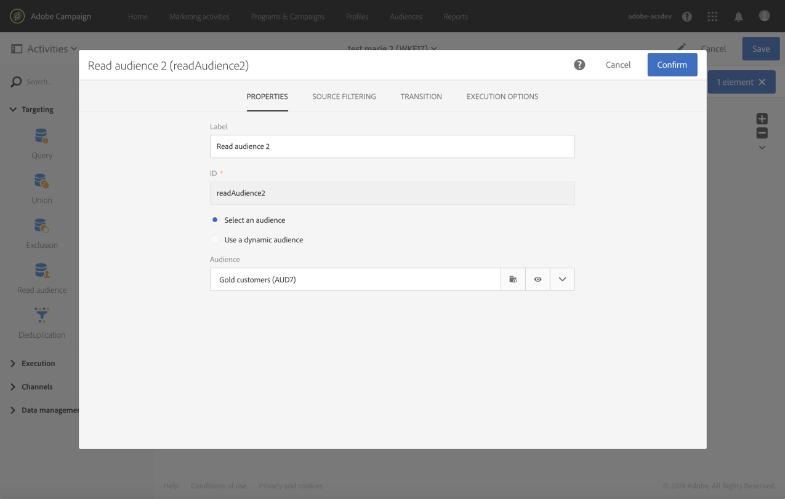

# オーディエンスを読み取り{#read-audience}

## 説明 {#description}

「**[!UICONTROL Read audience]**」アクティビティを使用すると、既存のオーディエンスを取得し、追加のフィルター条件を適用してそのオーディエンスを絞り込むことができます。

## Context of use {#context-of-use}

「**[!UICONTROL Read audience]**」アクティビティは「**[!UICONTROL Query]**」アクティビティを単純にしたもので、既存のオーディエンスの選択だけが必要な場合に使用します。

**関連トピック**

* [ユースケース：ふたつの洗練されたオーディエンスで統合](../../automating/using/union-on-two-refined-audiences.md)
* [ユースケース：ファイルオーディエンスとデータベースの紐付け](../../automating/using/reconcile-file-audience-with-database.md)

## 設定 {#configuration}

1. ワークフローに「**[!UICONTROL Read audience]**」アクティビティをドロップします。
1. アクティビティを選択し、表示されるクイックアクションの  ボタンを使用して開きます。
1. 「**[!UICONTROL Properties]**」タブから取得するオーディエンスを選択します。

   取得できるオーディエンスのタイプは **[!UICONTROL List]**、**[!UICONTROL Query]**、**[!UICONTROL File]**、**[!UICONTROL Experience Cloud]** です。 オーディエンスのタイプの詳細については、[オーディエンス](../../audiences/using/about-audiences.md)のドキュメントを参照してください。

   「**[!UICONTROL Use a dynamic audience]**」オプションを使用すると、ワークフローのイベント変数に基づいて、ターゲットにするオーディエンスの名前を定義できます。 詳しくは、[このページ &#x200B;](../../automating/using/customizing-workflow-external-parameters.md)の節を参照してください。

   

1. 選択したオーディエンスに追加のフィルターを適用する場合は、アクティビティの「**[!UICONTROL Source filtering]**」タブで条件を追加します。

   フィルター条件の作成について詳しくは、[クエリの作成](../../automating/using/editing-queries.md#creating-queries)のドキュメントを参照してください。

1. アクティビティの設定を確認し、ワークフローを保存します。
