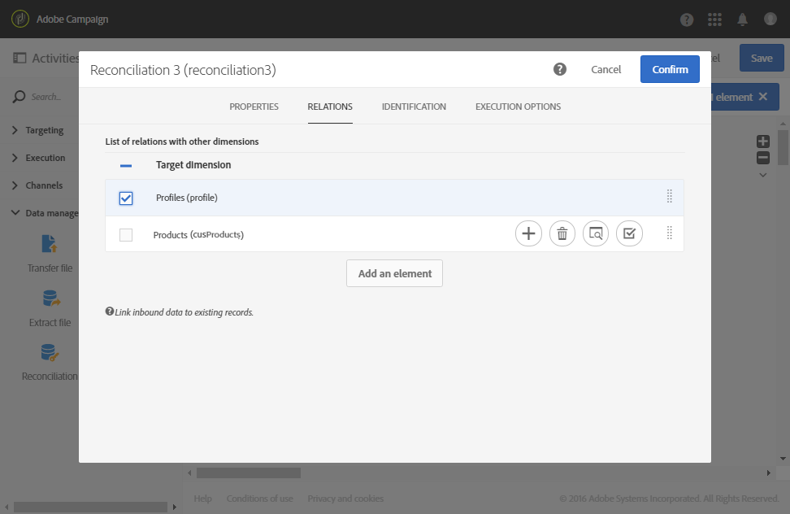

# 関係を使用したデータの紐付け {#reconciliation-relations}

次の例は、ファイル内の購入データを使用してデータベースを更新するワークフローを示しています。購入データには、クライアントの E メールや商品コードなど、他のディメンションからの要素を参照するデータが含まれます。

>[!NOTE]
>
>この例で使用される **Transactions** リソースと **Products** リソースは、デフォルトでは Adobe Campaign データベースに存在しません。これらは、[Custom resources](../../developing/using/data-model-concepts.md) 関数を使用してあらかじめ作成されたものです。インポートされたファイルの E メールアドレスに対応するプロファイルと商品は、事前にデータベースに読み込まれていたものです。

ワークフローは、次のアクティビティで構成されています。


* A [Load file](../../automating/using/load-file.md) activity, which loads and detects the data of the file to import. インポートされたファイルには、次のデータが含まれています。

   * トランザクション日
   * クライアントの E メールアドレス
   * 購入した商品のコード

   ```
   date;client;product
   2015-05-19 09:00:00;mail1@email.com;ZZ1
   2015-05-19 09:01:00;mail2@email.com;ZZ2
   2015-05-19 09:01:01;mail3@email.com;ZZ2
   2015-05-19 09:01:02;mail4@email.com;ZZ2
   2015-05-19 09:02:00;mail5@email.com;ZZ3
   2015-05-19 09:03:00;mail6@email.com;ZZ4
   2015-05-19 09:04:00;mail7@email.com;ZZ5
   2015-05-19 09:05:00;mail8@email.com;ZZ7
   2015-05-19 09:06:00;mail9@email.com;ZZ6
   ```

* A [Reconciliation](../../automating/using/reconciliation.md) activity to bind purchasing data to database profiles as well as products. ファイルデータ、プロファイルテーブル、および商品テーブルの間のリレーションを定義する必要があります。この設定は、アクティビティの「**[!UICONTROL Relations]**」タブで実行されます。

   * **Profiles** とのリレーション：ファイルの&#x200B;**クライアント**&#x200B;列は、**Profiles** ディメンションの **E メール**&#x200B;フィールドにリンクされています。
   * **Products** との関係：ファイルの&#x200B;**商品**&#x200B;列は、**Profiles** ディメンションの&#x200B;**商品コード**&#x200B;フィールドにリンクされています。

   列は、リンクされたディメンションの外部キーを参照するために、インバウンドデータに追加されます。

   

* An [Update data](../../automating/using/update-data.md) activity allows you to define the database fields to update using the imported data. 前のアクティビティで **Transactions** ディメンションに属するデータが既に識別されているので、**[!UICONTROL Directly using the targeting dimension]** 識別オプションを使用できます。

   更新するフィールドを自動的に検出するオプションを使用すると、前のアクティビティで設定したリンク（プロファイルや商品へのリンク）が **[!UICONTROL Fields to update]** のリストに追加されます。また、トランザクション日に対応するフィールドがこのリストに正しく追加されていることを確認する必要があります。

   

   
