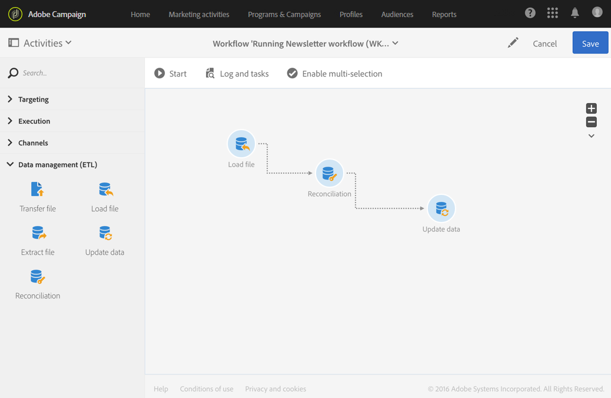

# Reconciliation{#reconciliation}

## 説明 {#description}


**[!UICONTROL Reconciliation]** アクティビティによって、特定されていないデータを既存のリソースにリンクできます。

## Context of use {#context-of-use}

**[!UICONTROL Reconciliation]** このアクティビティは、基本的にデータ管理の目的で使用され、2つの異なる用途を意味します。

* Adding relations: a **[!UICONTROL Links]** tab allows you to add links between the inbound data and several other Adobe Campaign database dimensions.

   例えば、購入データを含むファイルには、購入した製品と購入者を識別する情報を含めることもできます。Two additional dimensions (besides that of **Purchases**) are therefore concerned by the file data: the **Products** and **Profiles** dimensions. Relations then need to be created between these and the **Purchases** dimension (refer to the following example).

   関係を定義する場合、リンクされたディメンションの外部キーを参照するために、列が受信データに追加されます。

   >[!NOTE]
   >
   >この操作は、リンクされたディメンションのデータがデータベースに既に存在することを意味します。例えば、購入された製品を表示する購入のファイルをインポートした場合、どの時点でクライアントなどがデータベースに存在するか、およびクライアントが既にデータベースに存在する必要があります。

* Data identification: an **[!UICONTROL Identification]** tab allows you to simply link inbound data to columns of an existing dimension in the Adobe Campaign database. アクティビティの後、データは定義されたディメンションに属するものとして識別されます。

   例えば、保存オーディエンス、データベースの更新などを実行できます。

**[!UICONTROL Reconciliation]** 例えば、非標準データをデータベースにインポートすることを目的として、アクティビティの読み込み後にアクティビティを配置できます。

## Configuration {#configuration}

1. Drag and drop a **[!UICONTROL Reconciliation]** activity into your workflow, following a transition containing a population whose targeting dimension does not directly come from Adobe Campaign. For more on this, referr to [Targeting dimensions and resources](../../automating/using/query.md#targeting-dimensions-and-resources).
1. Select the activity, then open it using the  button from the quick actions that appear.
1. If you would like to define links between the inbound data and other database dimensions, go to the **[!UICONTROL Links]** tab.

   必要な数の関係を追加します。それぞれの関係について、リンクされたディメンションを選択し、リンクの詳細で対応するフィールドを指定します。

1. If you would like to simply identify the inbound data, go to the **[!UICONTROL Identification]** tab and check the **[!UICONTROL Identify the document from the working data]** box.

   受信データを調整するターゲットディメンションを選択します。

   紐付け条件を追加して、インバウンドトランジションレコードを選択したターゲットディメンションレコードにリンクします。いくつかの条件が指定されている場合、すべてのデータの間のリンクを有効にするために、すべて検証する必要があります。

   **[!UICONTROL Processing unidentified source lines]** モードを選択します。

   * **[!UICONTROL Ignore them]**:特定のデータのみがアクティビティのアウトバウンドトランジションに保持されます。
   * **[!UICONTROL Keep in the outbound population]**:インバウンドトランジションのすべてのデータは、アクティビティのアウトバウンドトランジションに保持されます。

1. アクティビティの設定を確認し、ワークフローを保存します。

## Example 1: Relation definition {#example-1--relation-definition}

次の例は、ファイル内の購入データを使用してデータベースを更新するワークフローを示しています。購入データには、クライアントの電子メールや製品コードなど、他のディメンションからの要素を参照するデータが含まれています。

>[!NOTE]
>
>The **Transactions** and **Products** resources used in this example do not exist in the Adobe Campaign database by default. They were therefore created beforehand using the [Custom resources](../../developing/using/data-model-concepts.md) function. 読み込まれたファイル内の電子メールアドレスに対応するプロファイルと製品が、事前にデータベースに読み込まれていました。

ワークフローは次のアクティビティで構成されています。



* A **[!UICONTROL Load file]** activity, which loads and detects the data of the file to import. インポートされたファイルには、次のデータが含まれています。

   * トランザクション日
   * クライアントの電子メールアドレス
   * 購入された製品のコード
   ```
   date;client;product
   2015-05-19 09:00:00;mail1@email.com;ZZ1
   2015-05-19 09:01:00;mail2@email.com;ZZ2
   2015-05-19 09:01:01;mail3@email.com;ZZ2
   2015-05-19 09:01:02;mail4@email.com;ZZ2
   2015-05-19 09:02:00;mail5@email.com;ZZ3
   2015-05-19 09:03:00;mail6@email.com;ZZ4
   2015-05-19 09:04:00;mail7@email.com;ZZ5
   2015-05-19 09:05:00;mail8@email.com;ZZ7
   2015-05-19 09:06:00;mail9@email.com;ZZ6
   ```

* A **[!UICONTROL Reconciliation]** activity to bind purchasing data to database profiles as well as products. したがって、ファイルデータとプロファイルテーブルとの間の関係を定義する必要があります。This configuration is carried out in the activity's **[!UICONTROL Relations]** tab:

   * **プロファイルとの関係**:ファイルの **クライアント** 列は、Profilesディメンションの **電子メール** フィールド **にリンク** されています。
   * **製品との関係**:ファイル **の製品** 列は、Profilesディメンションの **productCode** フィールドに **リンク** されています。
   リンクされたディメンションの外部キーを参照するために、列が受信データに追加されます。

   

* **[!UICONTROL Update data]** アクティビティでは、インポートしたデータを使用して更新するデータベースフィールドを定義できます。As the data was already identified as belonging to the **Transactions** dimension in the previous activity, here you can use the **[!UICONTROL Directly using the targeting dimension]** identification option.

   By using the option that automatically detects fields to update, the links configured in the previous activity (to profiles and products) are added to the list of **[!UICONTROL Fields to update]**. また、トランザクション日に対応するフィールドがこのリストに正しく追加されていることを確認する必要があります。

   

   

## Example 2: Identification {#example-2--identification}

次の例は、新しいクライアントを含むインポートファイルから直接プロファイルのオーディエンスを作成するワークフローを示しています。次のアクティビティで構成されています。


* A **[!UICONTROL Load file]** activity, which loads and detects the data of the file to import. インポートされたファイルには、次のデータが含まれています。

   ```
   lastname;firstname;email;dateofbirth
   jackman;megan;megan.jackman@testmail.com;07/08/1975
   phillips;edward;phillips@testmail.com;09/03/1986
   weaver;justin;justin_w@testmail.com;11/15/1990
   martin;babeth;babeth_martin@testmail.net;11/25/1964
   reese;richard;rreese@testmail.com;02/08/1987
   cage;nathalie;cage.nathalie227@testmail.com;07/03/1989
   xiuxiu;andrea;andrea.xiuxiu@testmail.com;09/12/1992
   grimes;daryl;daryl_890@testmail.com;12/06/1979
   tycoon;tyreese;tyreese_t@testmail.net;10/08/1971
   ```

* **[!UICONTROL Reconciliation]** アクティビティ。読み込まれたファイルの各列をプロファイルディメンション列にリンクします。特定できないファイルレコード（データ、互換性のないデータタイプなど）は、最終オーディエンスデータの整合性を保持するために無視されます。

   

* A **[!UICONTROL Save audience]** activity, which saves the audience of profiles.

   

