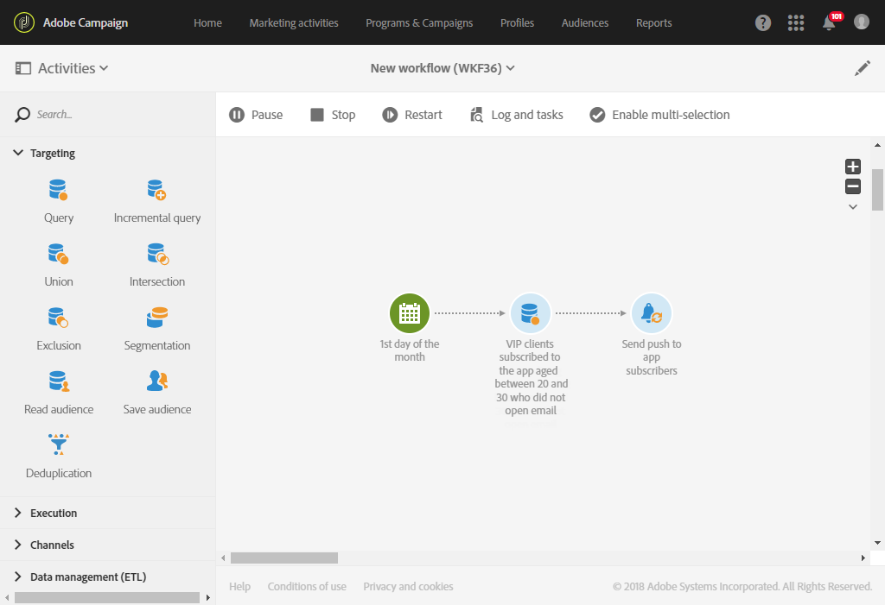

# ワークフロー{#sending-a-recurring-push-notification-with-a-workflow}を使用したプッシュ通知の繰り返し送信

この例では、パーソナライズされたプッシュ通知が月の初日の午後8時に、タイムゾーンに応じてモバイルアプリの購読者に送信されます。

ワークフローを構築するには、次の手順に従います。

1. [スケジューラー](../../automating/using/scheduler.md)アクティビティを使用すると、配信の開始が特定のタイムゾーンの午後8時にすべての加入者に通知を送信できるように、ワークフローの日数を開始できます。

   * **[!UICONTROL Execution frequency]**&#x200B;フィールドで、「毎月」を選択します。
   * **[!UICONTROL Time]**&#x200B;フィールドで[午後8時]を選択します。
   * 配信を毎月送信する日を選択します。
   * ワークフローの開始日を、配信の開始の少なくとも1日前に選択します。 そうしないと、選択した時間が既にタイムゾーンを超えている場合、一部の受信者は1日後にメッセージを受け取る可能性があります。
   * **[!UICONTROL Execution options]**&#x200B;タブの&#x200B;**[!UICONTROL Time zone]**&#x200B;フィールドで、ワークフローが開始するタイムゾーンを選択します。 例えば、太平洋標準時の午後8時、月の最初の日の1週間前に開始され、該当するすべてのタイムゾーンに対して配信を作成できる時間が与えられます。

   >[!NOTE]
   >
   >デフォルトで選択されるタイムゾーンは、ワークフローのプロパティで定義されたタイムゾーンです（[ワークフローの作成](../../automating/using/building-a-workflow.md)を参照）。

   

1. [クエリ](../../automating/using/query.md)アクティビティを使用すると、20 ～ 30歳のVIPユーザーをターゲットできます。このお客様は、モバイルアプリケーションを購読しており、送信した電子メールを開いていないユーザーです。

   * オーディエンス(VIPのお客様)を選択し、年齢に基づいてフィルターします。
   * **要素を購読**&#x200B;要素にドラッグ&amp;ドロップしてワークスペースに入れます。 「**存在する**」を選択し、使用するモバイルアプリケーションを選択します。
   * 顧客に送信した電子メールを選択します。
   * **配信ログ(logs)**&#x200B;要素をワークスペースにドラッグ&amp;ドロップし、「**存在する**」を選択して、電子メールを受信したすべての顧客をターゲットします。
   * **トラッキングログ（追跡）**&#x200B;要素をワークスペースにドラッグ&amp;ドロップし、「**存在しない**」を選択して、電子メールを開かなかったすべての顧客をターゲットします。

      

1. [プッシュ通知配信](../../automating/using/push-notification-delivery.md)アクティビティを使用すると、メッセージの内容を入力し、使用するパーソナライゼーションフィールドを選択できます。

   * **[!UICONTROL Recurring notification]**&#x200B;オプションを選択します。
   * プッシュ通知の内容を定義します。 プッシュ通知の内容について詳しくは、を参照してください。
   * **[!UICONTROL Schedule]**&#x200B;ブロックで&#x200B;**[!UICONTROL Messages to be sent automatically on the time zone specified below]**&#x200B;を選択します。 ここでは、ワークフロー&#x200B;**[!UICONTROL Scheduler]**&#x200B;と同様に&#x200B;**[!UICONTROL Time zone of the contact date]**&#x200B;太平洋を選択します。
   * 「**[!UICONTROL Optimize the sending time per recipient]**」フィールドで「**[!UICONTROL Send at the recipient's time zone]**」を選択します。

      

1. **[!UICONTROL Start]**&#x200B;ボタンをクリックして、定期的なワークフローを開始します。

   

ワークフローが実行中です。 太平洋標準時の&#x200B;**[!UICONTROL Scheduler]**&#x200B;の開始日の午後8時に開始し、お客様のタイムゾーンに応じて、毎月初日の午後8時に繰り返しプッシュ通知が送信されます。
