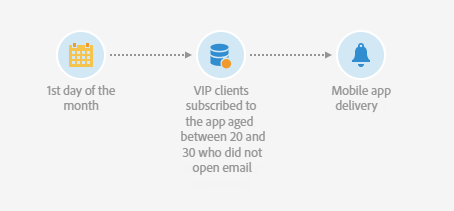
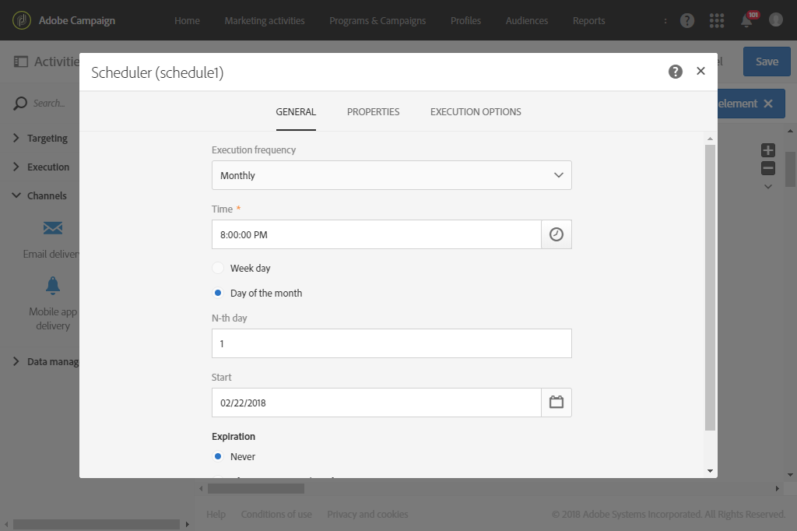
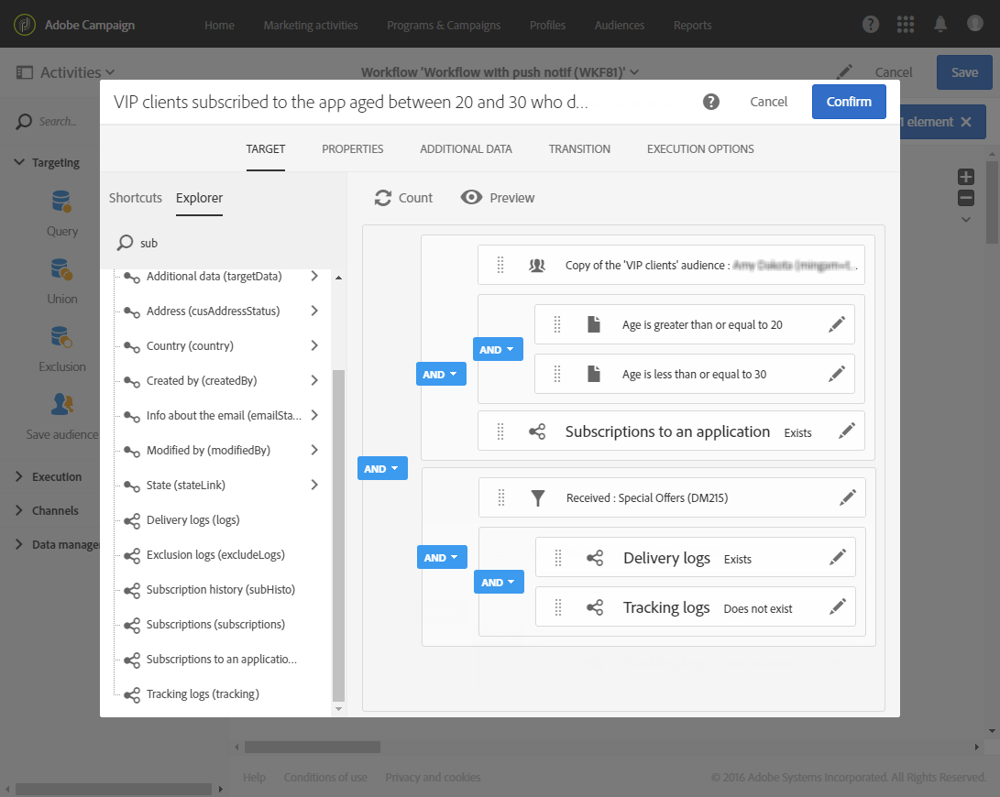
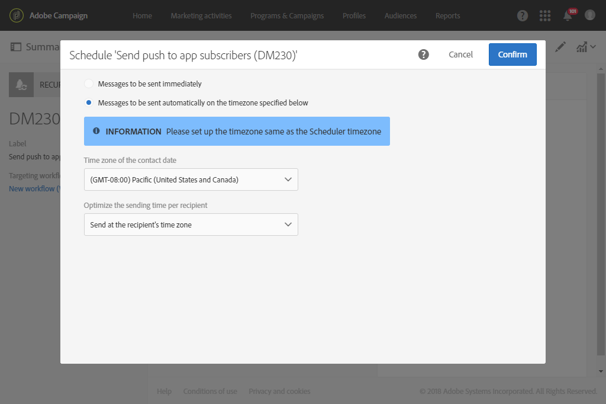
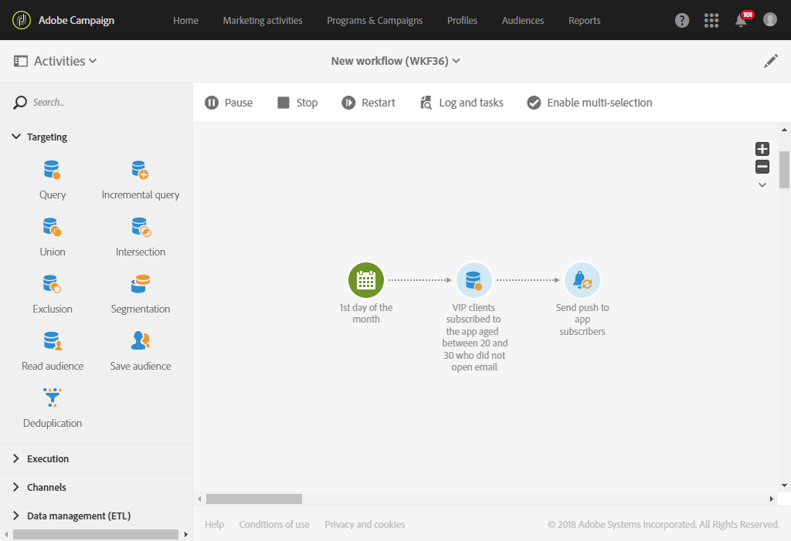

# ワークフローを使用した定期的なプッシュ通知の送信 {#sending-a-recurring-push-notification-with-a-workflow}

この例では、パーソナライズされたプッシュ通知が、1か月の初日の午後8時に、タイムゾーンに応じてモバイルアプリケーションの加入者に送信されます。

ワークフローを構築するには、次の手順に従います。

1. [ スケジューラー](../../automating/using/scheduler.md) アクティビティを使用すると、配信の開始の数日前にワークフローを開始して、特定のタイムゾーンの午後8時にすべての購読者に通知を送信できます。

   * **[!UICONTROL Execution frequency]** フィールドで、「月単位」を選択します。
   * **[!UICONTROL Time]** フィールドで「午後8:00」を選択します。
   * 配信が毎月送信される日付を選択します。
   * ワークフローの開始日（配信の開始の少なくとも1日前）を選択します。 そうでない場合、選択した時間が既にタイムゾーンを通過している場合、1日後にメッセージを受け取る受信者もいます。
   * 「**[!UICONTROL Execution options]**」タブで、**[!UICONTROL Time zone]** フィールドでワークフローを開始するタイムゾーンを選択します。 ここでは、例えば、ワークフローは太平洋標準時の午後8時（月の最初の日の1週間前）に開始され、該当するすべてのタイムゾーンに対して配信を作成する時間が確保されます。

   >[!NOTE]
   >
   >デフォルトで選択されるタイムゾーンは、ワークフローのプロパティで定義されたタイムゾーンです（[ワークフローの作成](../../automating/using/building-a-workflow.md)を参照）。

   

1. [ クエリ ](../../automating/using/query.md) アクティビティを使用すると、モバイルアプリケーションを購読し、送信したメールを開かなかった20 ～ 30歳のVIPのお客様をターゲットにできます。

   * オーディエンス（VIPのお客様）を選択し、その年齢でフィルタリングします。
   * **サブスクリプションをアプリケーション**&#x200B;要素にドラッグ&amp;ドロップします。 「**存在する**」を選択し、使用するモバイルアプリケーションを選択します。
   * 顧客に送信したメールを選択します。
   * **配信ログ （ログ）**&#x200B;要素をワークスペースにドラッグ&amp;ドロップし、**存在**&#x200B;を選択して、メールを受信したすべての顧客をターゲットにします。
   * **トラッキングログ（トラッキング）**&#x200B;要素をワークスペースにドラッグ&amp;ドロップし、**存在しない**&#x200B;を選択して、電子メールを開いていないすべての顧客をターゲットにします。

     

1. [ プッシュ通知配信](../../automating/using/push-notification-delivery.md) アクティビティを使用すると、メッセージのコンテンツを入力し、使用するパーソナライゼーションフィールドを選択できます。

   * 「**[!UICONTROL Recurring notification]**」オプションを選択します。
   * プッシュ通知のコンテンツを定義します。 プッシュ通知コンテンツについて詳しくは、この[節](../../channels/using/preparing-and-sending-a-push-notification.md)を参照してください。
   * **[!UICONTROL Schedule]** ブロックで、**[!UICONTROL Messages to be sent automatically on the time zone specified below]**&#x200B;を選択します。 ここでは、ワークフロー&#x200B;**[!UICONTROL Scheduler]**&#x200B;で選択した&#x200B;**[!UICONTROL Time zone of the contact date]**&#x200B;太平洋を使用します。
   * 「**[!UICONTROL Optimize the sending time per recipient]**」フィールドで「**[!UICONTROL Send at the recipient's time zone]**」を選択します。

     

1. 繰り返しワークフローを開始するには、**[!UICONTROL Start]** ボタンをクリックします。

   

ワークフローは実行中です。 太平洋標準時の午後8時に&#x200B;**[!UICONTROL Scheduler]**&#x200B;の開始日に開始し、顧客のタイムゾーンに応じて、月の最初の日の午後8時に定期的なプッシュが送信されます。
