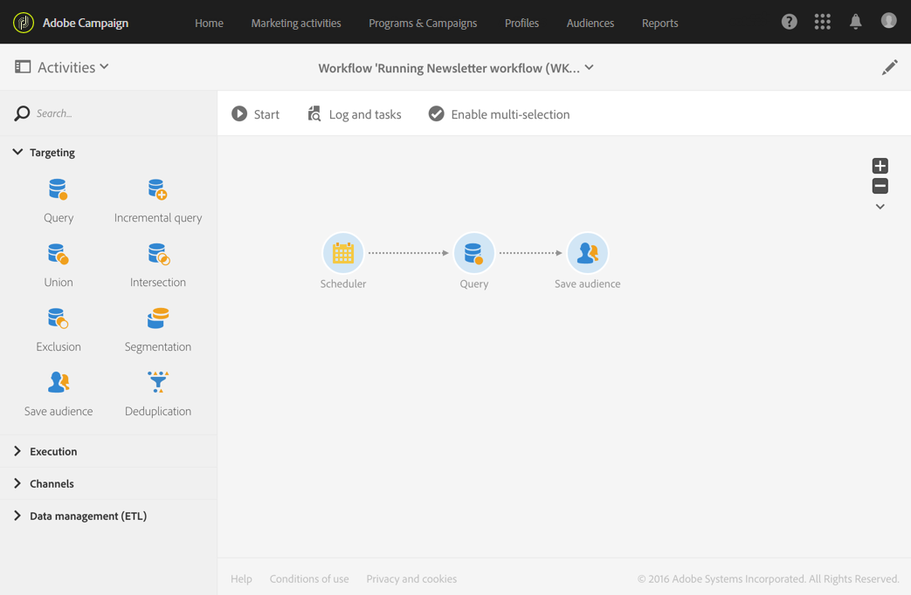

# オーディエンスの保存{#save-audience}

## 説明 {#description}

アクティビティ **[!UICONTROL Save audience]** を使用すると、既存のオーディエンスを更新したり、ワークフローの上流で計算された訪問者から新しいオーディエンスを作成したりできます。 このアクティビティから作成または更新されるオーディエンスは **リスト** または **ファイル** オーディエンスです。 アプリのオーディエンスのリストに追加され、メニューから使用できるようにな **[!UICONTROL Audiences]** ります。

>[!NOTE]
>
>アクティビティを通じて作成されたオーディエ **[!UICONTROL Save audience]** ンスが追加データで強化された場合、これらのデータを使用してスタンドアロン配信をパーソナライズすることはできません。 ワークフローで実行された配信からのみ使用できます。

また、このアクティビティでは、プロファイルをAdobe Experience cloudオーディエンス/セグメントとしてエクスポートできます。 これにより、他のAdobe Experience cloudソリューションでこれらのオーディエンスを活用できます。 共有オーディエンスの詳細については、「キャンペーンと [人物コアサービスの操作」を参照してください](../../integrating/using/about-campaign-audience-manager-or-people-core-service-integration.md)。

## 使用状況 {#context-of-use}

アクティビティ **[!UICONTROL Save audience]** は、基本的に、再利用可能なオーディエンスに変換することで、訪問者グループを同じワークフローで計算した状態に保つために使用されます。

## 設定 {#configuration}

1. アクティビティをワ **[!UICONTROL Save audience]** ークフローにドロップします。
1. クエリ、交差、ユニオン、除外など、他のターゲティングアクティビティの後に接続します。
1. アクティビティを選択し、表示されるクイックアクシ  ョンのボタンを使用して開きます。
1. 実行するアクションを選択します。

   * **[!UICONTROL Update an existing audience]**:既存のオーディエンスを選択し、更新のタイプを選択します。

      * **[!UICONTROL Replace audience content with new data]**:オーディエンスコンテンツ全体が置き換えられます。 古いデータが失われます。 オーディエンス保存アクティビティの受信トランジションからのデータのみが保持されます。
      * **[!UICONTROL Complete audience with new data]**:古いオーディエンスデータが保持され、オーディエンス保存アクティビティのインバウンドトランジションのデータが追加されます。
   * **[!UICONTROL Create then update an audience]**:オーディエンスの名前を入力し、更新タイプを選択します。 オーディエンスが存在しない場合は、作成されます。 既に存在する場合は、選択したモードに従って更新されます。

      * **[!UICONTROL Replace audience content with new data]**:オーディエンスコンテンツ全体が置き換えられます。 古いデータが失われます。 オーディエンス保存アクティビティの受信トランジションからのデータのみが保持されます。

         警告。このオプションを選択すると、更新されたオーディエンスのオーディエンスタイプとターゲットディメンションが削除されます。

      * **[!UICONTROL Complete audience with new data]**:古いオーディエンスデータが保持され、オーディエンス保存アクティビティのインバウンドトランジションのデータが追加されます。

         警告。このオプションは、更新されたオーディエンスのオーディエンスタイプまたはターゲットディメンションが、ワークフローの現在の設定と互換性がない場合にエラーを発生させます。 例えば、クエリーから取得したプロファイルを含むファイルタイプオーディエンスを完了することはできません。
   * **[!UICONTROL Create a new audience]**:作成するオーディエンスの名前を入力します。 オーディエンスが作成された日時が、オーディエンス名に自動的に追加されます。 これにより、ワークフローが実行されるたびにオーディエンスが一意になります。
   * **[!UICONTROL Share in Adobe Experience Cloud]**:プロファイルをターゲット設定し、オーディエンスをAdobe Experience cloudに書き出す場合は、このオプションを選択し、既存の共有オーディエンスを選択するか、新しいオーディエンスを作成します。

      また、Adobe Experience cloudで **[!UICONTROL Shared Data source]** データを正しく調整できるように、オーディエンスに含まれるデータのリソースに対応するデータを選択します。

      このオプションを使用すると、共有オーディエンスは、メニューから使用できるAdobe Campaignオーディエンスのリストに追加され **[!UICONTROL Audiences]** ません。

      >[!NOTE]
      >
      >このオプションは、Adobe Experience cloudで共有オーディエンス機能が管理者によって設定されている場合にのみ使用できます。 詳しくは、「キャンペーンと人物コ [アサービスの操作」を参照してください](../../integrating/using/about-campaign-audience-manager-or-people-core-service-integration.md)。
   更新中に保存または使用できるオーディエンスのタイプは、ワークフローの上流に配置されたアクティビティによって異なります。

   オーディエンスのターゲットディメンションが保存されたときに不明な場合（読み込んだファイルからの場合など）、オーディエンスはタイプオーディエンスとして作成または更新 **[!UICONTROL File]** されます。

   保存済みのオーディエンスのターゲットディメンションが、保存時に既に定義されている場合（例えば、ターゲット設定からのディメンション、クエリの後など）、オーディエンスはタイプオーディエンスとして保存または更新さ **[!UICONTROL List]** れます。

   保存したオーディエンスのコンテンツがオーディエンスの詳細ビューで利用でき、メニューからアクセスでき **[!UICONTROL Audiences]** ます。 このビューで使用できる列は、ワークフローのオーディエンス保存アクティビティのインバウンドトランジションの列に対応します。 例：インポートしたファイルの列、およびクエリーから追加された追加データ。

1. アクティビティの設定を確認し、ワークフローを保存します。

## 例 ：{#example}

この例で定義したワークフローは、ターゲティングからの定期的なオーディエンスの更新を示しています。

* 1か月に1回、を使用して自動的に実行されま **[!UICONTROL Scheduler]**&#x200B;す。
* を使用して、使用可能な様々 **[!UICONTROL Query]** なアプリケーションサービスにサブスクライブされているすべてのプロファイルを回復できます。
* アクティビティ **[!UICONTROL Save audience]** は、前回のワークフロー実行以降にサービスから登録解除されたプロファイルを削除し、新しく登録されたプロファイルを追加することで、オーディエンスを更新します。

アクティビテ **[!UICONTROL Save audience]** ィは次のように設定します。

