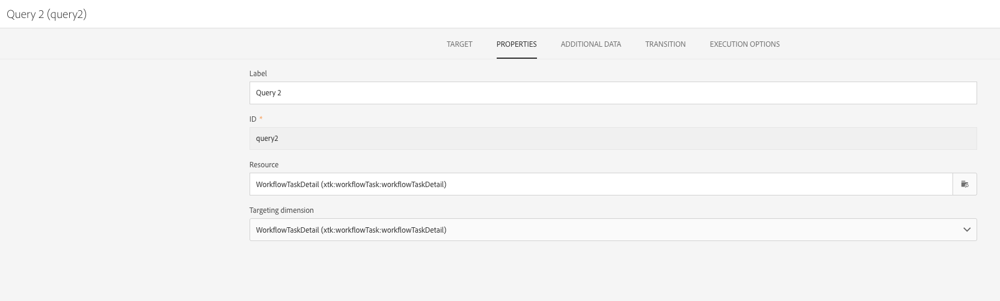
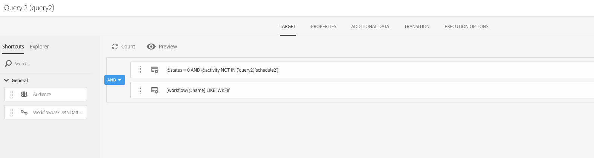
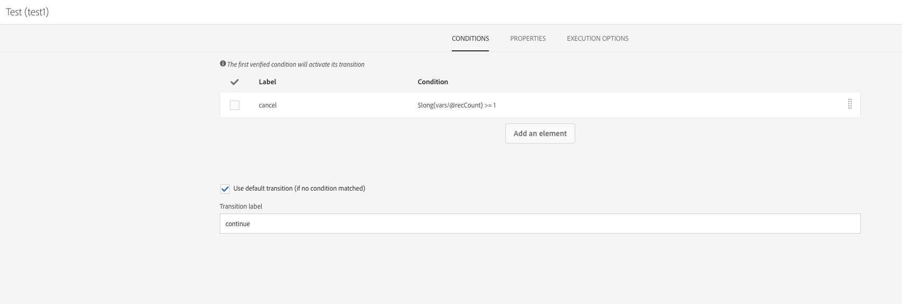
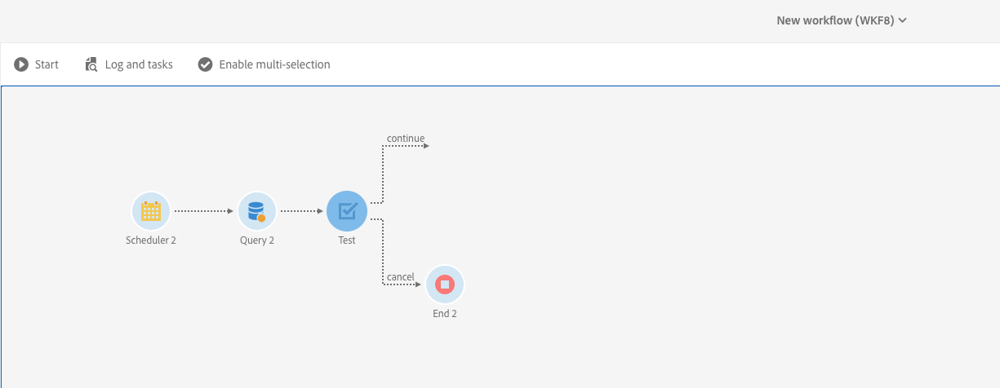

# スケジュールされたワークフローの重複実行{#preventing-overlapping-execution-of-scheduled-workflows}

## スケジュールされたワークフローの実行について

Campaign Standardでは、ワークフローエンジンは、ワークフローインスタンスが1つのプロセスのみで実行されることを保証します。 インポート、長時間実行中のクエリ、データベースへの書き込みなどのアクティビティをブロックすると、実行中に他のタスクが実行されるのを防ぐことができます。

一方、非ブロッキングアクティビティは、他のタスク（通常、**[!UICONTROL Scheduler]** アクティビティなどのイベントを待機しているアクティビティ）の実行をブロックしません。

これにより、スケジュールベースのワークフローの以前の実行がまだ完了していなくても、スケジュールベースのワークフローの実行を開始できるシナリオが発生し、予期しないデータの問題につながる可能性があります。

したがって、複数のアクティビティを含むスケジュール済みワークフローを設計する場合は、ワークフローが完了するまでスケジュールが変更されないようにする必要があります。 これを行うには、以前の実行から1つ以上のタスクがまだ保留中である場合に、その実行を防ぐためにワークフローを設定する必要があります。

## ワークフローの設定

前のワークフロー実行の1つ以上のタスクがまだ保留中かどうかを確認するには、**[!UICONTROL Query]**&#x200B;と&#x200B;**[!UICONTROL Test]** アクティビティを使用する必要があります。

1. **[!UICONTROL Scheduler]** アクティビティの後に&#x200B;**[!UICONTROL Query]** アクティビティを追加し、次のように設定します。

1. アクティビティのリソースを&#x200B;**[!UICONTROL WorkflowTaskDetail]**&#x200B;に変更します。つまり、ワークフローの現在のタスクがターゲットになります。

   

1. 次のルールを使用してクエリを設定します。

   

   * 最初のルールは、現在のワークフローに属する現在のタスク（query2）と次のスケジュール タスク（schedule2）をフィルタリングします。

     >[!NOTE]
     >
     >**[!UICONTROL Scheduler]** アクティビティが開始されると、次にスケジュールされた時間に実行する別のスケジュール タスクがすぐに追加され、ワークフローが開始されます。 したがって、前回の実行から保留中のタスクを探す場合は、クエリとスケジュール タスクの両方をフィルタリングすることが重要です。

   * 2つ目のルールは、ワークフローの以前の実行のタスクがまだアクティブ（保留中）であるかどうかを決定します。これは、実行ステータス 0に対応します。

1. **[!UICONTROL Query]** アクティビティから返された保留中のタスク数を確認するには、**[!UICONTROL Test]** アクティビティを追加します。 これには、2つのアウトバウンドトランジションを設定します。

   

   * 保留中のタスクがない場合、最初の移行はワークフローの実行を続けます，
   * 保留中のタスクがある場合、2番目のトランジションはワークフローの実行をキャンセルします。

   

必要に応じて、残りのワークフローを設定できるようになりました。 保留中のタスクが原因でワークフローの実行がキャンセルされた場合、スケジュールに従ってワークフローが再度実行されると、次の手順を実行できます。 これにより、ワークフローの実行は、以前の実行からアクティブな（保留中の）タスクがない場合にのみ続行されます。
