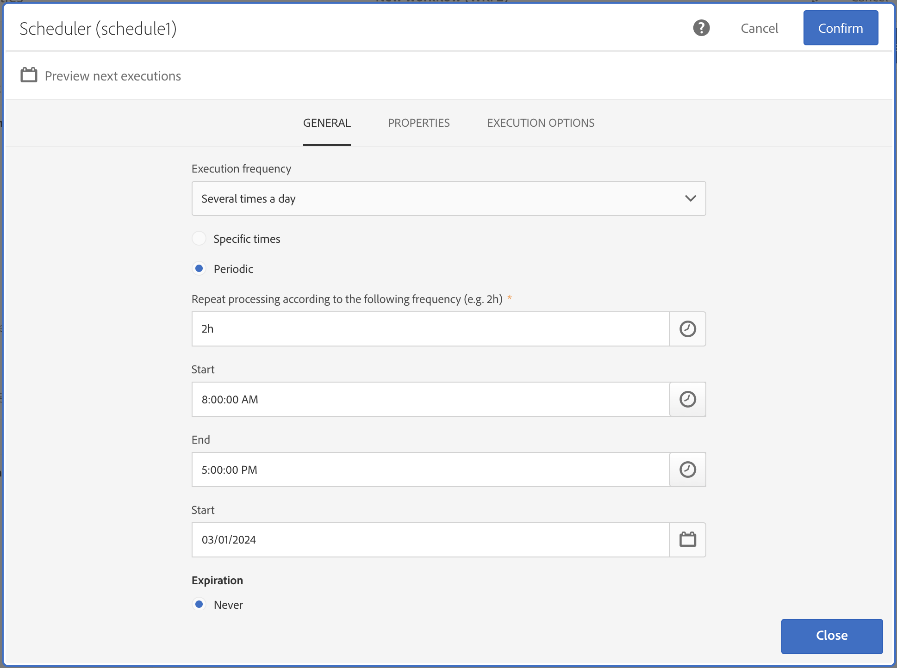

# スケジューラー{#scheduler}

## 説明 {#description}

「**[!UICONTROL Scheduler]**」アクティビティを使用すると、ワークフローまたはアクティビティの開始日時を指定できます。

## 使用状況 {#context-of-use}

「**[!UICONTROL Scheduler]**」アクティビティは、予約済みの開始とみなされます。アクティビティのグラフ内の配置ルールは、「**[!UICONTROL Start]**」アクティビティのルールと同じものです。このアクティビティはインバウンドトランジションを持つことはできません。

ワークフローを作成する場合は、ブランチごとに 1 つの「**[!UICONTROL Scheduler]**」アクティビティのみを使用し、タイムゾーンの設定をおこなってください。これにより、特定のタイムゾーンでワークフローを開始できます。それ以外の場合は、ワークフローのプロパティで定義されたタイムゾーンでワークフローが実行されます（[ワークフローの作成](../../automating/using/building-a-workflow.md)を参照）。

>[!CAUTION]
>
>アクティビティの **[!UICONTROL Repetition frequency]** は 10 分以上にする必要があります。つまり、1 つのワークフローを 10 分に1 回以上自動的に実行することはできません。

複数のアクティビティを含むスケジュール済みワークフローをデザインする場合は、ワークフローが終了するまで再スケジュールされないようにする必要があります。 これをおこなうには、以前の実行の 1 つ以上のタスクがまだ保留中の場合に、実行を防ぐようにワークフローを設定する必要があります。 詳しくは、[このページ](../../automating/using/scheduled-workflows-execution.md)を参照してください。

**関連トピック：**

* [ユースケース：プロファイルの作成日に配信を作成する](../../automating/using/workflow-creation-date-query.md)
* [使用例：毎週火曜日に E メール配信を作成する](../../automating/using/workflow-weekly-offer.md)

## 設定 {#configuration}

1. ワークフローに「**[!UICONTROL Scheduler]**」アクティビティをドラッグ＆ドロップします。
1. アクティビティを選択し、表示されるクイックアクションの  ボタンを使用して開きます。
1. **[!UICONTROL Execution frequency]** を指定します。

   * **[!UICONTROL Once]**：ワークフローは 1 回実行されます。
   * **[!UICONTROL Several times a day]**：ワークフローは、1 日に数回定期的に実行されます。
   * **[!UICONTROL Daily]**：ワークフローは、特定の時間（1 日 1 回）に実行されます。
   * **[!UICONTROL Weekly]**：ワークフローは、指定された日時（週に 1 回または数回）に実行されます。
   * **[!UICONTROL Monthly]**：ワークフローは、指定された日時（月に 1 回または数回）に実行されます。ワークフローを実行する月を選択できます。月の第 2 火曜日など、月の特定の曜日に実行を設定することもできます。
   * **[!UICONTROL Yearly]**：ワークフローは、指定された日時（年に 1 回または数回）に実行されます。

1. 必要に応じて、実行設定を指定します。 使用可能なオプションは、選択した実行頻度（実行時間または日、繰り返し頻度など）に応じて異なります。

   >[!NOTE]
   >
   >The **[!UICONTROL Repetition frequency]** 「日別」および「月別」の実行頻度に対して使用できるフィールドを使用すると、ワークフローがトリガーされる時間を空けることができます。 例えば、実行期間を「Daily」に指定し、繰り返し頻度を **2**（日）に設定すると、ワークフローは 2 日ごとにトリガーされます。10 分を下回ることはできません。繰り返し頻度が **0** （また、デフォルト値）の場合、このオプションは考慮されず、指定された実行頻度に従ってワークフローが実行されます。

   実行頻度を **[!UICONTROL Several times a day]**&#x200B;を使用すると、1 日の特定の時間にワークフローを実行するか、1 日を通じて定期的にワークフローを実行するかを柔軟に選択できます。

+++ 設定方法を学ぶ **[!UICONTROL "Several times a day"]** 実行頻度

   * 1 日のうち特定の時間に複数回ワークフローを実行するには、 **[!UICONTROL Specific times]** オプションを選択してから、 **[!UICONTROL Add an element]** をクリックして、目的の実行時間を指定します。 要件に合わせて必要な回数だけ追加します。

   * 1 日を通してワークフローを実行するには、「 **[!UICONTROL Periodic]** 次に、実行の頻度を設定します。

      1. Adobe Analytics の **[!UICONTROL Repeat processing according to the following frequency (e.g. 2h)]** 「 」フィールドで、ワークフローを実行する間隔を指定します（30 分ごと、2 時間ごとなど）。

         >[!NOTE]
         >
         >また、日別、月別、年別の繰り返し頻度も設定できます。 この場合、ワークフローは 1 日に複数回実行されるのではなく、このフィールドで指定した頻度に従って実行されます。
         >
         > 1 日に複数回の実行が必要なく、毎日、毎月または毎年実行する必要がある場合は、 **[!UICONTROL Daily]**, **[!UICONTROL Monthly]** または **[!UICONTROL Yearly]** オプション **[!UICONTROL Execution frequency]** 」ドロップダウンリストから選択できます。

      1. Adobe Analytics の **[!UICONTROL Start]**/**[!UICONTROL End]** 「時間」フィールドで、ワークフロー実行の開始時刻と終了時刻を定義します。

         終了時間が指定されていない場合、実行は午前 0 時に終了します。:00:00 時間で、次回の実行は翌日、指定された開始時刻に開始されます。

      1. Adobe Analytics の **[!UICONTROL Start]** 日付フィールドで、最初の実行を開始する日付を選択します。

   次の例では、「 」アクティビティは、3 月 1 日 (PT) から午前 8 時～午後 5 時の 2 時間ごとにワークフローを実行するように設定されています。

   

+++

1. 実行の有効期限を指定します。

   * **[!UICONTROL Never]**：ワークフローは、指定された頻度に従って実行され、時間枠や反復回数に制限はありません。
   * **[!UICONTROL After a certain number of iterations]**：ワークフローは、**X** の制限に達するまで、指定された頻度に従って実行されます。**[!UICONTROL Number of iterations]** を指定する必要があります。
   * **[!UICONTROL On a specific date]**：ワークフローは、指定された頻度に従って、指定された日付まで実行されます。実行期限を指定する必要があります。

1. 「**[!UICONTROL Preview next executions]**」をクリックして、ワークフローの実行スケジュール（次の 10 回）を確認します。

1. 「**[!UICONTROL Execution options]**」タブの「**[!UICONTROL Time zone]**」フィールドで、スケジューラーのタイムゾーンを設定します。

   受信者のタイムゾーンに応じた配信の送信について詳しくは、この[節](../../sending/using/sending-messages-at-the-recipient-s-time-zone.md)または繰り返しワークフローの[例](../../automating/using/recurring-push-notifications.md)を参照してください。

1. アクティビティの設定を確認し、ワークフローを保存します。

## 例 {#example}

次の例では、アクティビティは、毎週月曜日の午前 7 時に、未定の期間、ワークフローを週単位で開始するように設定されています。

