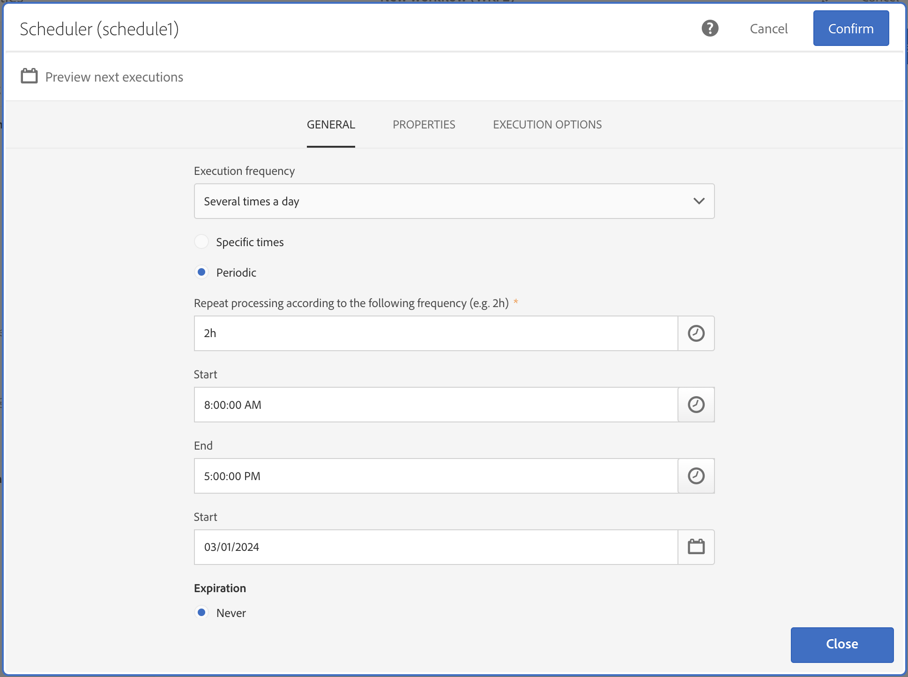

# スケジューラー{#scheduler}

## 説明 {#description}

「**[!UICONTROL Scheduler]**」アクティビティを使用すると、ワークフローまたはアクティビティの開始日時を指定できます。

## Context of use {#context-of-use}

「**[!UICONTROL Scheduler]**」アクティビティは、スケジュール済みの開始とみなされます。 アクティビティのグラフ内の配置ルールは、「**[!UICONTROL Start]**」アクティビティのルールと同じものです。 このアクティビティはインバウンドトランジションを持つことはできません。

ワークフローを作成する場合は、ブランチごとに 1 つの「**[!UICONTROL Scheduler]**」アクティビティのみを使用し、タイムゾーンの設定をおこなってください。 これにより、特定のタイムゾーンでワークフローを開始できます。それ以外の場合は、ワークフローのプロパティで定義されたタイムゾーンでワークフローが実行されます（[ワークフローの作成](../../automating/using/building-a-workflow.md)を参照）。

>[!CAUTION]
>
>アクティビティの **[!UICONTROL Repetition frequency]** は 10 分以上にする必要があります。 つまり、1 つのワークフローを 10 分に1 回以上自動的に実行することはできません。

複数のアクティビティを含むスケジュール済みワークフローを設計する場合は、ワークフローが完了するまでスケジュールが変更されないようにする必要があります。 これを行うには、以前の実行から1つ以上のタスクがまだ保留中である場合に、その実行を防ぐためにワークフローを設定する必要があります。 詳しくは、[このページ](../../automating/using/scheduled-workflows-execution.md)を参照してください。

**関連トピック：**

* [ユースケース：プロファイルの作成日に配信を作成する](../../automating/using/workflow-creation-date-query.md)
* [ユースケース：毎週火曜日にメール配信を作成する](../../automating/using/workflow-weekly-offer.md)

## 設定 {#configuration}

1. ワークフローに「**[!UICONTROL Scheduler]**」アクティビティをドラッグ＆ドロップします。
1. アクティビティを選択し、表示されるクイックアクションの  ボタンを使用して開きます。
1. **[!UICONTROL Execution frequency]** を指定します。

   * **[!UICONTROL Once]**：ワークフローは 1 回実行されます。
   * **[!UICONTROL Several times a day]**: ワークフローは1日に数回定期的に実行されます。
   * **[!UICONTROL Daily]**：ワークフローは、特定の時間（1 日 1 回）に実行されます。
   * **[!UICONTROL Weekly]**：ワークフローは、指定された日時（週に 1 回または数回）に実行されます。
   * **[!UICONTROL Monthly]**：ワークフローは、指定された日時（月に 1 回または数回）に実行されます。 ワークフローを実行する月を選択できます。 月の第 2 火曜日など、月の特定の曜日に実行を設定することもできます。
   * **[!UICONTROL Yearly]**：ワークフローは、指定された日時（年に 1 回または数回）に実行されます。

1. ニーズに合わせて実行設定を行います。 使用可能なオプションは、選択した実行頻度（実行時間または日数、繰り返し頻度など）によって異なります。

   >[!NOTE]
   >
   >日次および月次の実行頻度に使用できる&#x200B;**[!UICONTROL Repetition frequency]** フィールドを使用すると、ワークフローがトリガーされる時間を空にすることができます。 例えば、実行期間を「Daily」に指定し、繰り返し頻度を **2**（日）に設定すると、ワークフローは 2 日ごとにトリガーされます。 10 分を下回ることはできません。 繰り返し頻度が&#x200B;**0** （デフォルト値も）に設定されている場合、このオプションは考慮されず、ワークフローは指定された実行頻度に従って実行されます。

   実行頻度を&#x200B;**[!UICONTROL Several times a day]**&#x200B;に設定する場合、ワークフローを特定の時間帯に実行するか、1日を通して定期的に実行するかを柔軟に選択できます。

   +++ **[!UICONTROL "Several times a day"]**&#x200B;実行頻度の設定方法を説明します

   * ワークフローを特定の時間帯に複数回実行するには、**[!UICONTROL Specific times]** オプションをオンにし、**[!UICONTROL Add an element]**&#x200B;をクリックして目的の実行時間を指定します。 要件に合わせて必要な回数を追加します。

   * ワークフローを一日中定期的に実行するには、**[!UICONTROL Periodic]** オプションを切り替え、実行期間を設定します。

      1. 「**[!UICONTROL Repeat processing according to the following frequency (e.g. 2h)]**」フィールドで、ワークフローを実行する間隔（30分ごと、2時間ごと）を指定します。

         >[!NOTE]
         >
         >このオプションを使用すると、毎日、毎月、または毎年の繰り返し頻度も可能になります。 この場合、ワークフローは1日に数回実行するのではなく、このフィールドで指定した頻度に従って実行されます。
         >
         > ワークフローで1日以内に複数の実行を必要とせず、代わりに日単位、月単位、年単位で実行する必要がある場合は、**[!UICONTROL Execution frequency]** ドロップダウンリストで利用可能な&#x200B;**[!UICONTROL Daily]**、**[!UICONTROL Monthly]**&#x200B;または&#x200B;**[!UICONTROL Yearly]** オプションを使用することをお勧めします。

      1. **[!UICONTROL Start]**/**[!UICONTROL End]**&#x200B;時間フィールドで、ワークフローの実行を開始および終了する時間を定義します。

         終了時間が指定されていない場合、実行は00:00:00時間深夜に終了し、次の実行は指定された開始時間に翌日に開始されます。

      1. **[!UICONTROL Start]**&#x200B;日付フィールドで、最初の実行を開始する日付を選択します。

   次の例では、3月1日から午前8時から午後5時の間に2時間ごとにワークフローを実行するようにアクティビティが設定されています。

   

   +++

1. 実行の有効期限を指定します。

   * **[!UICONTROL Never]**：ワークフローは、指定された頻度に従って実行され、時間枠や反復回数に制限はありません。
   * **[!UICONTROL After a certain number of iterations]**：ワークフローは、**X** の制限に達するまで、指定された頻度に従って実行されます。 **[!UICONTROL Number of iterations]** を指定する必要があります。
   * **[!UICONTROL On a specific date]**：ワークフローは、指定された頻度に従って、指定された日付まで実行されます。 実行期限を指定する必要があります。

1. 「**[!UICONTROL Preview next executions]**」をクリックして、ワークフローの実行スケジュール（次の 10 回）を確認します。

1. 「**[!UICONTROL Execution options]**」タブの「**[!UICONTROL Time zone]**」フィールドで、スケジューラーのタイムゾーンを設定します。

   受信者のタイムゾーンに応じた配信の送信について詳しくは、この[節](../../sending/using/sending-messages-at-the-recipient-s-time-zone.md)または繰り返しワークフローの[例](../../automating/using/recurring-push-notifications.md)を参照してください。

1. アクティビティの設定を確認し、ワークフローを保存します。

## 例 {#example}

次の例では、アクティビティは、毎週月曜日の午前 7 時に、未定の期間、ワークフローを週単位で開始するように設定されています。

