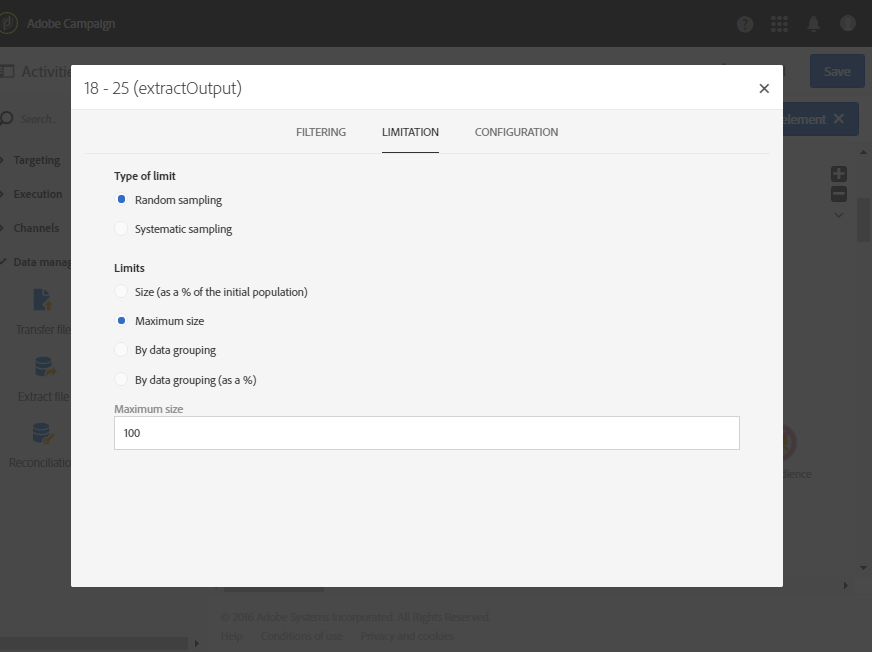

# 年齢層別のセグメント化 {#segmentation-age-groups}

次の例は、年齢グループに基づくデータベースプロファイルのセグメント化を示しています。

このワークフローの目的は、各年齢グループに対して特定の E メールを送信することです。このワークフローがテストキャンペーンの一部であることを考慮し、各セグメントには、制限された代表的なオーディエンスを同時に使用するためにランダムに選択された最大 100 人のプロファイルのみを含めることができます。

ワークフローは、次の要素で構成されています。

* A [Scheduler activity](../../automating/using/segmentation.md) to specify the workflow&#39;s execution date.
* A [Query](../../automating/using/query.md) activity to target profiles of people whose birthday and email address have been entered.
* A [Segmentation](../../automating/using/segmentation.md) activity to create 3 segments divided into different outbound transitions: 18-25-year old, 26-32-year old and profiles that are over 32 years old. セグメントは、次のパラメーターに従って定義されます。

   

   * セグメントの年齢グループを定義する年齢に関するフィルター

      

   * **[!UICONTROL Maximum size]** の上限（100）にリンクされた **[!UICONTROL Random sampling]** タイプ制限

      

* セグメントごとの [電子メール配信](../../automating/using/email-delivery.md) アクティビティ。
