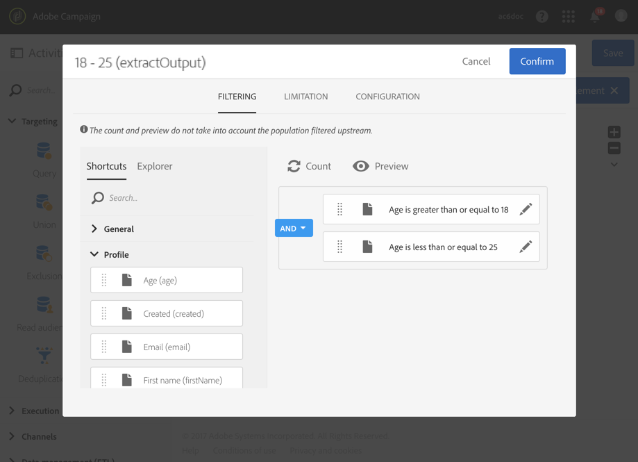

# 年齢層によるセグメント化 {#segmentation-age-groups}

次の例は、年齢グループに基づくデータベースプロファイルのセグメント化を示しています。

このワークフローの目的は、各年齢グループに対して特定の E メールを送信することです。このワークフローがテストキャンペーンの一部であることを考慮し、各セグメントには、制限された代表的なオーディエンスを同時に使用するためにランダムに選択された最大 100 人のプロファイルのみを含めることができます。

ワークフローは、次の要素で構成されています。

* A [スケジューラーアクティビティ](../../automating/using/segmentation.md) をクリックして、ワークフローの実行日を指定します。
* A [クエリ](../../automating/using/query.md) 「 」アクティビティを使用して、誕生日と E メールアドレスが入力されたユーザーのプロファイルをターゲット設定します。
* A [セグメント化](../../automating/using/segmentation.md) アクティビティを使用して、異なるアウトバウンドトランジションに分割された 3 つのセグメントを作成します。18-25-year歳、26-32-year歳、32 歳を超えるプロファイル。 セグメントは、次のパラメーターに従って定義されます。

   

   * セグメントの年齢グループを定義する年齢に関するフィルター

      

   * **[!UICONTROL Maximum size]** の上限（100）にリンクされた **[!UICONTROL Random sampling]** タイプ制限

      

* An [E メール配信](../../automating/using/email-delivery.md) セグメントごとのアクティビティ。
