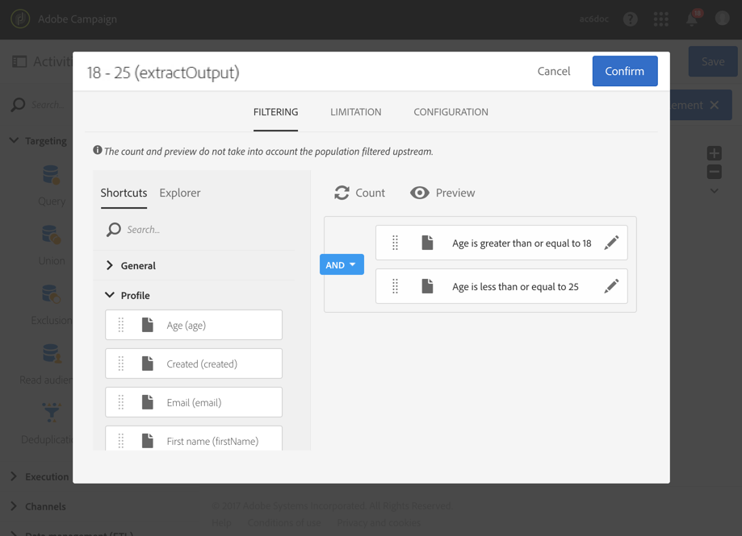
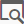
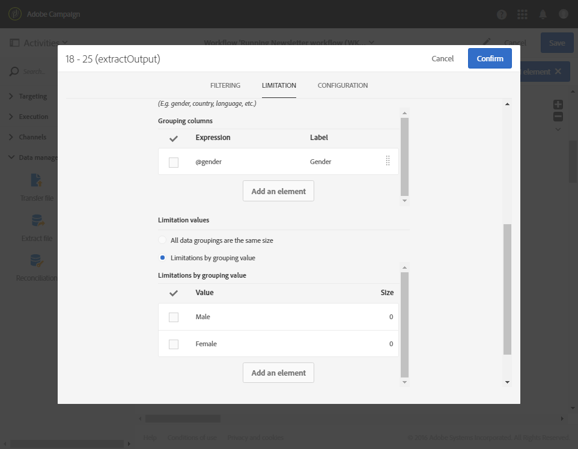

# セグメント化{#segmentation}

## 説明 {#description}

「**[!UICONTROL Segmentation]**」アクティビティを使用すると、ワークフローで既に配置されているアクティビティによって計算された母集団から、1 つまたは複数のセグメントを作成できます。 アクティビティの最後に、1 つのトランジションまたは複数のトランジションで処理できます。

>[!NOTE]
>
>デフォルトでは、インバウンド母集団のメンバーは 1 つのセグメントにのみ属することができます。 フィルターは、アクティビティのセグメントの順序に従って適用されます。

**関連トピック：**
* [ユースケース：場所に関するセグメンテーション](../../automating/using/workflow-segmentation-location.md)
* [ユースケース：年齢グループ別のセグメンテーション](../../automating/using/segmentation-age-groups.md)

## Context of use {#context-of-use}

**[!UICONTROL Segmentation]** アクティビティは、一般的に、ターゲティングアクティビティ （クエリ、積集合、和集合、除外など）の後に配置されます。 セグメントが形成される標準母集団を定義するために。

**関連トピック**

* [使用例：年齢グループに応じたプロファイルのセグメント化](../../automating/using/segmentation-age-groups.md)。

## 設定 {#configuration}

1. ワークフローに「**[!UICONTROL Segmentation]**」アクティビティをドラッグ＆ドロップします。
1. アクティビティを選択し、表示されるクイックアクションの  ボタンを使用して開きます。
1. 「**[!UICONTROL General]**」タブで、セグメント化を実行する必要がある&#x200B;**[!UICONTROL Resource type]**&#x200B;を選択します。

   * データベースに既に存在するデータに対してセグメント化が実行される場合は **[!UICONTROL Database resource]** を選択します。 セグメント化するデータに応じて、**[!UICONTROL Filtering dimension]** を選択します。 デフォルトでは、セグメント化は&#x200B;**プロファイル**&#x200B;で実行されます。
   * ワークフローの一時データでセグメント化が実行される場合は **[!UICONTROL Temporary resource]** を選択します。セグメント化するデータを含む **[!UICONTROL Targeted set]** を選択します。 この使用例は、ファイルのインポート後、またはデータベース内のデータがエンリッチメントされた場合に発生する可能性があります。

1. 使用するアウトバウンドトランジションの種類を選択します。

   * **[!UICONTROL Generate one transition per segment]**：アクティビティの最後に、設定済みのセグメントごとに 1 つのアウトバウンドトランジションが追加されます。
   * **[!UICONTROL Generate all segments in one transition]**：設定済みのすべてのセグメントは、1 つのアウトバウンドトランジションに再グループ化されます。 トランジションのラベルを指定します。 各セグメントのメンバーは、割り当てられたセグメントコードを保持します。

1.  または「**[!UICONTROL Add an element]**」ボタンを使用してセグメントを追加し、標準プロパティを指定します。

   * **[!UICONTROL Do not activate the transition if the population is empty]**：セグメントは、データが取得された場合にのみ有効になります。
   * **[!UICONTROL Filter initial population (query)]**：このセグメントの母集団をフィルターできます。
   * **[!UICONTROL Limit segment population]**：セグメントのサイズを制限できます。
   * **[!UICONTROL Filter and limit segment population]**：セグメント母集団をフィルターしてサイズを制限できます。
   * **[!UICONTROL Label]**：セグメントラベル。
   * **[!UICONTROL Segment code]**: セグメント母集団に割り当てられたコード。セグメントコードは、標準式とイベント変数を使用してパーソナライズできます（[このページ ](../../automating/using/customizing-workflow-external-parameters.md)を参照）。
   * **[!UICONTROL Exclude segment from population]**：指定したセグメントをアクティビティのアウトバウンド母集団から除外できます。 このオプションは、「**[!UICONTROL Generate all segments in the same transition]**」オプションが選択されている場合にのみ使用できます。

   

1. セグメントの詳細表示を開き、後者の設定オプションにアクセスします。 これをおこなうには、アクティビティのセグメントリストの関連するチェックボックスをオンにして、 を選択します。
1. 初期母集団をフィルターするオプションがオンになっている場合は、「**[!UICONTROL Filter]**」タブを開き、セグメントの母集団を指定します。 フィルターは、手順 4 で選択したフィルタリングディメンションに基づきます。 母集団のフィルタリングについて詳しくは、[クエリの編集](../../automating/using/editing-queries.md)の節を参照してください。

   一時的なリソースに対してセグメント化を実行する場合、このタブでは母集団の数とプレビューは使用できません。

1. セグメントサイズを制限するオプションがオンになっている場合は、「**[!UICONTROL Limitation]**」タブを開きます。

   まず、使用する **[!UICONTROL Type of limit]** を選択します。

   * **[!UICONTROL Random sampling]**：必要に応じて、セグメントの母集団が「**[!UICONTROL Filter]**」タブの設定を考慮してランダムに選択されます。
   * **[!UICONTROL Ordered sampling]**：セグメントの母集団は、順序に従って選択されます。 したがって、考慮する列と適用する並べ替えの種類を指定する必要があります。 例えば、「**Age**」フィールドを並べ替え列として選択して **[!UICONTROL Descending sort]** を適用し、制限値を 100 に設定した場合、最年長の上位 100 人のプロファイルのみが保持されます。

   次に、セグメントのサイズ **[!UICONTROL Limit]** を指定します。

   * **[!UICONTROL Size (as a % of the initial population)]**：アクティビティの初期母集団に対する割合を使用して、セグメントのサイズを指定します。
   * **[!UICONTROL Maximum size]**：セグメント母集団の最大メンバー数を指定します。
   * **[!UICONTROL By data grouping]**：インバウンド母集団の特定のフィールドの値に従って、セグメント母集団を制限できます。 グループ化するフィールドを選択し、使用する値を指定します。
   * **[!UICONTROL By data grouping (as a %)]**：割合を使用して、インバウンド母集団の特定のフィールドの値に従って、セグメント母集団を制限できます。 グループ化を適用するフィールドを選択し、使用する値を指定します。

     >[!NOTE]
     >
     >値ごとに異なる制限を使用できます。 例えば、「**[!UICONTROL Gender]**」フィールドのグループを指定して、**[!UICONTROL Male]** メンバーを含む母集団を 10 人に制限し、**[!UICONTROL Female]** メンバーを含む母集団を 30 人に制限することができます。 複数のデータグループ化フィールドを使用する場合は、すべてのグループのサイズを同じにする必要があります。

   

1. セグメントの設定を確認します。
1. 手順 6～10 を繰り返して、必要な数のセグメントを追加します。
1. 必要に応じて、「**[!UICONTROL Advanced options]**」タブのパラメーターを編集します。

   * **[!UICONTROL Enable overlapping of outbound populations]** オプションは、複数のセグメントに属するプロファイルを管理する方法を定義します。
      * このオプションが有効になっていない場合、**[!UICONTROL Segmentation]** アクティビティは、このプロファイルが複数のサブセットの条件を満たしている場合でも、プロファイルが複数の出力遷移に存在しないことを確認します。
      * このオプションを有効にすると、フィルター条件を満たすプロファイルが複数のサブセットに見つかります。
   * インバウンド母集団に保持するセグメント コードが既に割り当てられている場合は、**[!UICONTROL Concatenate the code of each segment]** オプションを確認してください。 アクティビティで指定されたセグメントコードが、最初のセグメントコードに追加されます。
   * 残りの母集団を活用する必要がある場合は、**[!UICONTROL Generate complement]** オプションを確認してください。 [ ユースケース：補集合を含む配信の作成](../../automating/using/workflow-created-query-with-complement.md)を参照してください。

1. アクティビティの設定を確認し、ワークフローを保存します。
