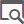

# Segmentation{#segmentation}

## 説明 {#description}

**[!UICONTROL Segmentation]** アクティビティにより、ワークフローの前に配置したアクティビティによって計算された訪問者のセグメントを1つまたは複数作成できます。アクティビティの最後に、1つのトランジションまたは異なるトランジションで処理できます。

>[!NOTE]
>
>デフォルトでは、インバウンド母集団のメンバーは1つのセグメントにしか属していません。フィルターは、アクティビティのセグメントの順序に従って適用されます。

## Context of use {#context-of-use}

**[!UICONTROL Segmentation]** アクティビティは一般にターゲティングアクティビティ（クエリ、交差、統合、除外など）の後に配置されます。を参照してください。

## Configuration {#configuration}

1. Drag and drop a **[!UICONTROL Segmentation]** activity into your workflow.
1. Select the activity, then open it using the  button from the quick actions that appear.
1. Select the **[!UICONTROL Resource type]** on which the segmentation has to be carried out:

   * **[!UICONTROL Database resource]** セグメントがデータベースに既に存在するデータで実行されます。Select the **[!UICONTROL Filtering dimension]** depending on the data that you want to segment. By default, segmentation is carried out on the **profiles**.
   * **[!UICONTROL Temporary resource]** ワークフローの一時データでセグメント化が実行された場合:セグメントに含めるデータ **[!UICONTROL Targeted set]** を選択します。この使用例は、ファイルを読み込んだ後、またはデータベース内のデータが強化された場合に発生します。

1. 使用するアウトバウンドトランジションタイプを選択します。

   * **[!UICONTROL Generate one transition per segment]**:アクティビティの最後に、設定済みのセグメントごとに1つのアウトバウンドトランジションが追加されます。
   * **[!UICONTROL Generate all segments in one transition]**:すべての設定済みセグメントは、1つのアウトバウンドトランジションに再グループ化されます。トランジションラベルを指定します。各セグメントのメンバーは、割り当てられているセグメントコードを保持します。

1. Add a segment by using the  or **[!UICONTROL Add an element]** button and specify the standard properties:

   * **[!UICONTROL Do not activate the transition if the population is empty]**:セグメントは、データが取得された場合のみ有効になります。
   * **[!UICONTROL Filter initial population (query)]**:を使用すると、このセグメントの母集団をフィルターできます。
   * **[!UICONTROL Limit segment population]**:を使用すると、セグメントサイズを制限できます。
   * **[!UICONTROL Filter and limit segment population]**:を使用すると、セグメントの母集団をフィルターして、そのサイズを制限できます。
   * **[!UICONTROL Label]**:セグメントラベルを使用します。
   * **[!UICONTROL Segment code]**:セグメントの母集団に割り当てられます。セグメントコードは、標準の式およびイベント変数を使用してパーソナライズできます（イベント変数を使用したアクティビティ [のカスタマイズを参照](../../automating/using/calling-a-workflow-with-external-parameters.md#customizing-activities-with-events-variables)）。
   * **[!UICONTROL Exclude segment from population]**:を使用すると、アクティビティのアウトバウンド母集団から指定したセグメントを除外できます。This option can only be used if the **[!UICONTROL Generate all segments in the same transition]** option is selected.
   

1. セグメントの詳細ビューを開いて、後者の設定オプションにアクセスします。To do this, check the relevant box in the activity's segment list, then select .
1. If the option to filter the initial population is checked, open the **[!UICONTROL Filter]** tab and specify your segment's population. フィルターは、手順4で選択したフィルタリングディメンションに基づいています。Consult the [Query editing](../../automating/using/editing-queries.md) section for further information on population filtering.

   セグメントが一時リソースで実行されている場合、このタブで訪問者のカウントとプレビューは使用できません。

1. If the option to limit the segment size is checked, open the **[!UICONTROL Limitation]** tab.

   First, select the **[!UICONTROL Type of limit]** that you would like to use:

   * **[!UICONTROL Random sampling]**:セグメント母集団は、必要に応じて、タブの **[!UICONTROL Filter]** 設定をランダムに考慮して選択されます。
   * **[!UICONTROL Ordered sampling]**:セグメント母集団は、順序付けられた方法で選択されます。その結果、考慮する列と、適用する並べ替えのタイプを指定する必要があります。For example, if you select the **Age** field as the sort column while applying a **[!UICONTROL Descending sort]** and setting a limit of 100, only the profiles of the top 100 oldest people will be kept.
   Now specify the size **[!UICONTROL Limit]** of the segment:

   * **[!UICONTROL Size (as a % of the initial population)]**:セグメントサイズを指定します。
   * **[!UICONTROL Maximum size]**:セグメント母集団の最大メンバー数を指定します。
   * **[!UICONTROL By data grouping]**:インバウンド母集団の特定のフィールドの値に従って、セグメント母集団を制限できます。グループ化するフィールドを選択し、使用する値を指定します。
   * **[!UICONTROL By data grouping (as a %)]**:割合を使用して、特定のインバウンド母集団フィールドの値に従ってセグメント母集団を制限できます。グループを適用するフィールドを選択し、使用する値を指定します。

      >[!NOTE]
      >
      >各値ごとに異なる制限を使用できます。**[!UICONTROL Gender]** 例えば、フィールドのグループを指定し、メンバーを **[!UICONTROL Male]** 10人に制限し、メンバーを **[!UICONTROL Female]** 30人に持つ母集団を制限できます。複数のデータグループフィールドを使用する場合、すべてのグループのサイズを同じにする必要があります。
   

1. セグメントの設定を確認します。
1. 手順6~10を繰り返して、必要な数のセグメントを追加します。
1. If necessary, edit the parameters in the **[!UICONTROL Advanced options]** tab:

   * Check the **[!UICONTROL Enable overlapping of outbound populations]** option if you want a member of the inbound population to belong to several segments at the same time. アクティビティのアウトバウンド母集団は、インバウンド母集団を超える可能性があります。
   * Check the **[!UICONTROL Concatenate the code of each segment]** option if the inbound population has already been assigned a segment code that you want to keep. アクティビティで指定されたセグメントコードが最初のセグメントコードに追加されます。
   * Check the **[!UICONTROL Generate complement]** option if you would like to exploit the remaining population.

1. アクティビティの設定を確認し、ワークフローを保存します。

## Example {#example}

次の例は、年齢層に従ってデータベースプロファイルのセグメント化を示しています。ワークフローの目的は、年齢層ごとに特定の電子メールを送信することです。このワークフローはテストキャンペーンの一部であることを考慮して、各セグメントにはランダムに選択された最大100個のプロファイルを含めることができます。これらのプロファイルには、制限されたものと担当者のものがあります。

ワークフローは次の要素で構成されます。

* A **[!UICONTROL Scheduler]** activity to specify the workflow's execution date. [「スケジューラー](../../automating/using/scheduler.md) 」セクションを参照してください。
* A **[!UICONTROL Query]** activity to target profiles of people whose birthday and email address have been entered. [「クエリ](../../automating/using/query.md) 」セクションを参照してください。
* **[!UICONTROL Segmentation]** 3つのセグメントを別々のアウトバウンドトランジションに分割するアクティビティ。18~25年前、32年以上前の26~32歳のプロファイル。セグメントは、次のパラメーターに従って定義されます。

   

   * セグメントの年齢グループを定義する年齢のフィルター

      

   * A **[!UICONTROL Random sampling]** type limit that is linked to a **[!UICONTROL Maximum size]** limit of 100

      

* An **[!UICONTROL Email delivery]** activity per segment. [「電子メール配信](../../automating/using/email-delivery.md) 」セクションを参照してください。

