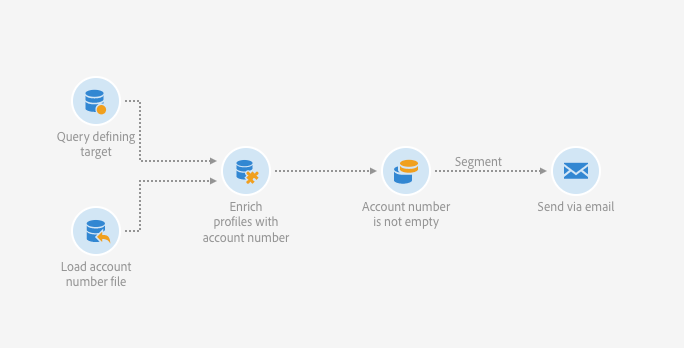
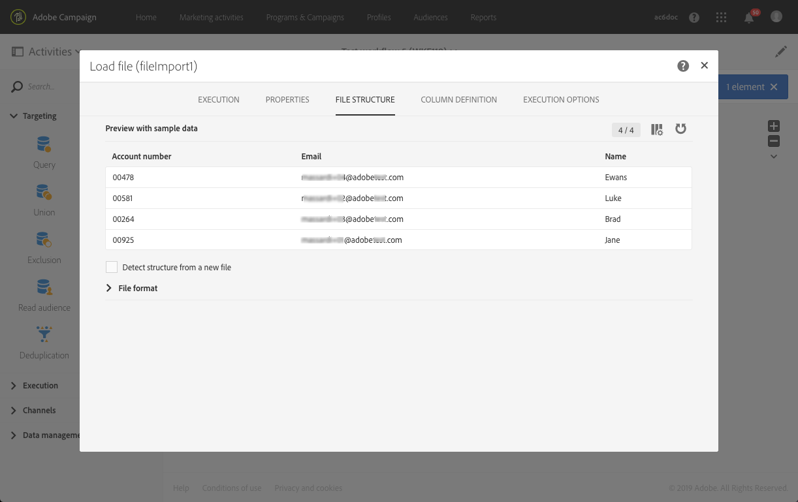
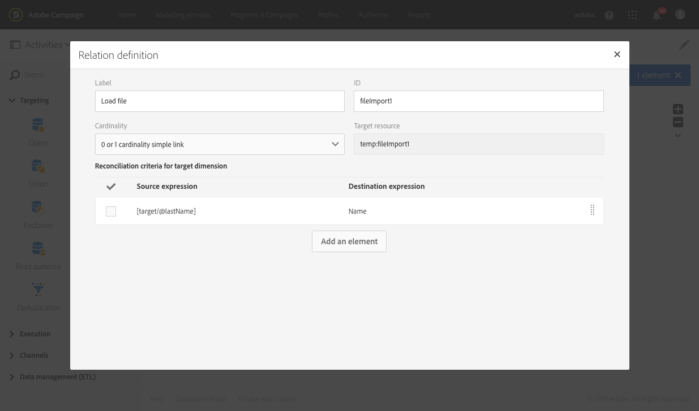
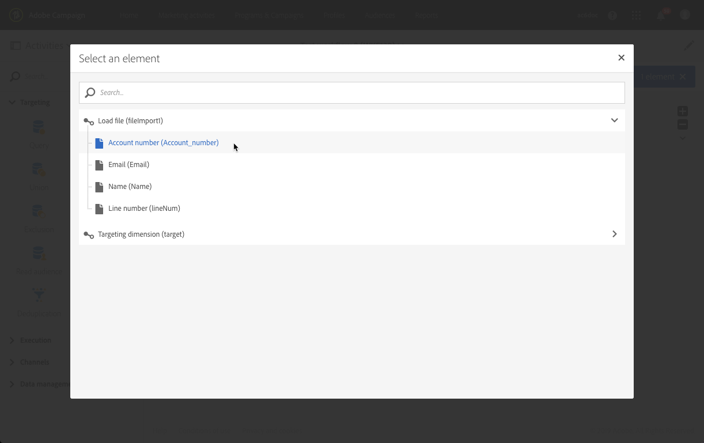
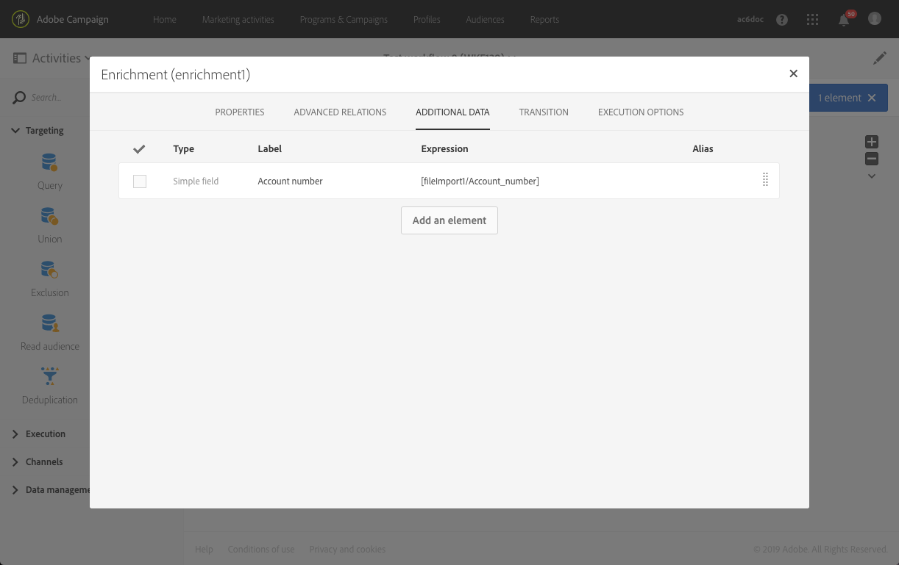
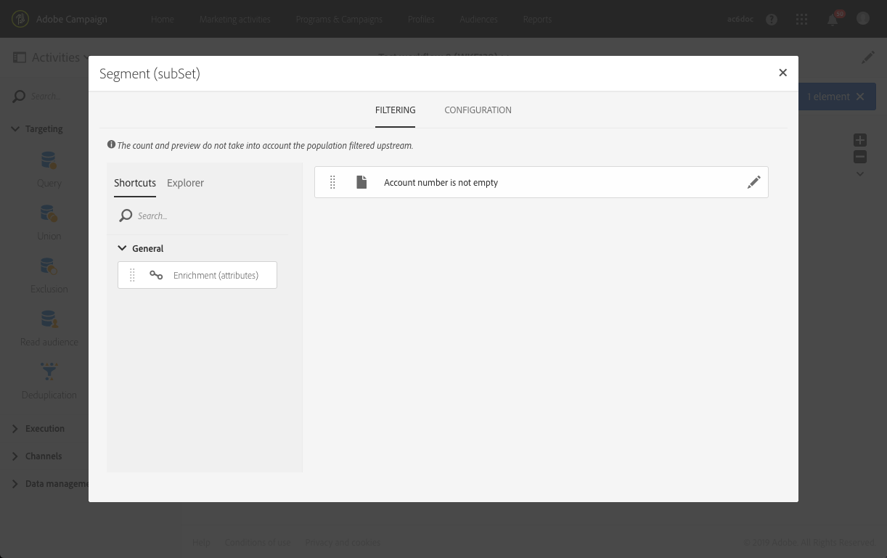
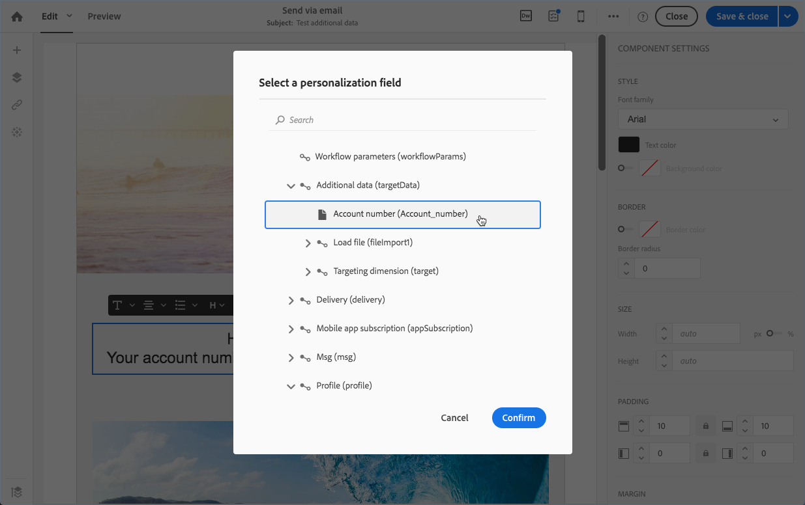
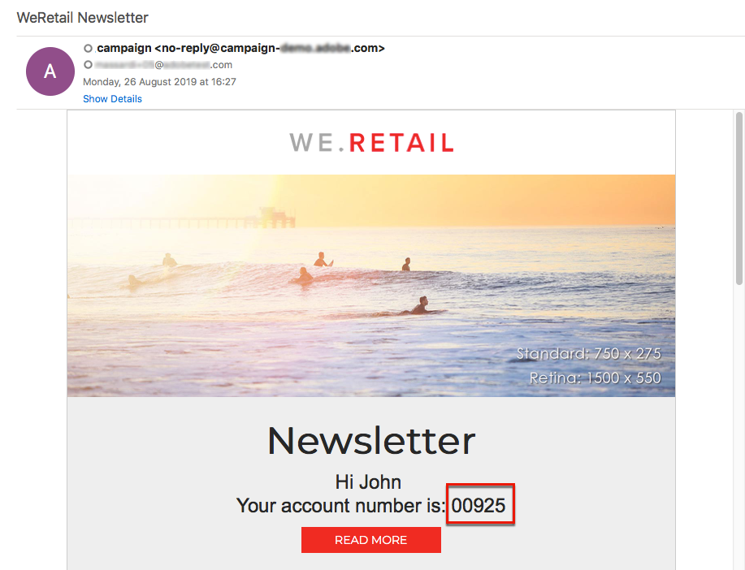

# フィールドがエンリッチメントされたメールの送信 {#sending-email-enriched-fields}

<!--A new example showing how to send an email containing additional data retrieved from a load file activity has been added. [Read more](example-2-email-with-enriched-fields)-->

「ファイル読み込み」アクティビティを使用すると、同じワークフロー内の外部ファイルからの追加データを使用して、強化されたメールを送信することもできます。

次の例は、「ファイル読み込み」アクティビティで外部ファイルから取得した追加データを使用してメールを送信する方法を示しています。 この例では、プロファイルと、関連付けられているアカウント番号のリストが、外部ファイルに格納されています。 このデータをインポートして、各プロファイルに、アカウント番号を通知するメールを送信します。

ワークフローを構築するには、次の手順に従います。

1. [&#x200B; クエリ &#x200B;](../../automating/using/query.md) アクティビティをワークフローにドラッグ&amp;ドロップし、それを開いてメイン ターゲットを定義します。

   <!--The Query activity is presented in the [Query](../../automating/using/query.md) section.-->

1. [&#x200B; ファイルを読み込み](../../automating/using/load-file.md) アクティビティをドラッグ&amp;ドロップして、一部のデータをプロファイルに割り当てます。 この例では、データベースの一部のプロファイルに対応するアカウント番号が含まれているファイルを読み込みます。

   

1. [Enrichment](../../automating/using/enrichment.md) アクティビティをワークフローにドラッグ&amp;ドロップし、読み込みファイルとクエリアクティビティをそれにリンクします。

1. エンリッチメントアクティビティの「**[!UICONTROL Advanced relations]**」タブで、「**[!UICONTROL 0 or 1 cardinality simple link]**」を選択し、紐付けに使用するフィールドを定義します。 ここでは、姓を使用してデータをデータベースプロファイルに紐付けします。

   

1. 「**[!UICONTROL Additional data]**」タブで、メールに使用する要素を選択します。 次に、アカウント番号（「ファイル読み込み」アクティビティから取得したファイルの列）を選択します。

   

   <!---->

   詳しくは、[エンリッチメント](../../automating/using/enrichment.md)の節を参照してください。

1. [&#x200B; セグメント化](../../automating/using/segmentation.md) アクティビティをワークフローにドラッグ&amp;ドロップし、それを開いてメインターゲットを調整します。

   

   詳しくは、[セグメント化](../../automating/using/segmentation.md)の節を参照してください。

1. [&#x200B; メール配信](../../automating/using/email-delivery.md) アクティビティをワークフローにドラッグ&amp;ドロップして開きます。

   <!--The Email delivery activity is presented in the [Email delivery](../../automating/using/email-delivery.md) section.-->

1. パーソナライゼーションフィールドを追加し、エンリッチメントアクティビティで定義した追加データ（ここでは「アカウント番号」）を「**[!UICONTROL Additional data (targetData)]**」ノードから選択します。 これにより、メールコンテンツ内の各プロファイルのアカウント番号を動的に取得できます。

   

1. メールを保存し、ワークフローを開始します。

メールがターゲットに送信されます。 各プロファイルは、該当するアカウント番号が記載されたメールを受信します。

