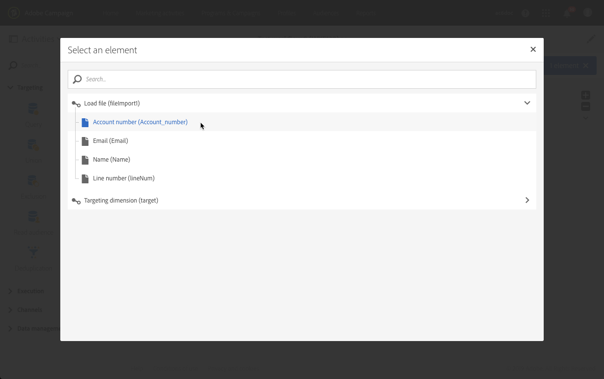

# フィールドがエンリッチメントされた E メールの送信 {#sending-email-enriched-fields}

<!--A new example showing how to send an email containing additional data retrieved from a load file activity has been added. [Read more](example-2-email-with-enriched-fields)-->

「ファイル読み込み」アクティビティを使用すると、同じワークフロー内の外部ファイルからの追加データを使用して、強化された電子メールを送信することもできます。

次の例は、「ファイル読み込み」アクティビティで外部ファイルから取得した追加データを使用して電子メールを送信する方法を示しています。この例では、プロファイルと、関連付けられているアカウント番号のリストが、外部ファイルに格納されています。このデータをインポートして、各プロファイルに、アカウント番号を通知する E メールを送信します。

ワークフローを構築するには、次の手順に従います。

1. Drag and drop a [Query](../../automating/using/query.md) activity into your workflow and open it to define the main target.

   <!--The Query activity is presented in the [Query](../../automating/using/query.md) section.-->

1. Drag and drop a [Load file](../../automating/using/load-file.md) activity to assign some data to a profile. この例では、データベースの一部のプロファイルに対応するアカウント番号が含まれているファイルを読み込みます。

   

1. Drag and drop an [Enrichment](../../automating/using/enrichment.md) activity into your workflow and link the load file and query activities to it.

1. エンリッチメントアクティビティの「**[!UICONTROL Advanced relations]**」タブで、「**[!UICONTROL 0 or 1 cardinality simple link]**」を選択し、紐付けに使用するフィールドを定義します。ここでは、姓を使用してデータをデータベースプロファイルに紐付けします。

   

1. 「**[!UICONTROL Additional data]**」タブで、E メールに使用する要素を選択します。次に、アカウント番号（「ファイル読み込み」アクティビティから取得したファイルの列）を選択します。

   

   <!---->

   詳しくは、[エンリッチメント](../../automating/using/enrichment.md)の節を参照してください。

1. Drag and drop a [Segmentation](../../automating/using/segmentation.md) activity into your workflow and open it to refine the main target.

   

   詳しくは、[セグメント化](../../automating/using/segmentation.md)の節を参照してください。

1. Drag and drop an [Email delivery](../../automating/using/email-delivery.md) activity into your workflow and open it.

   <!--The Email delivery activity is presented in the [Email delivery](../../automating/using/email-delivery.md) section.-->

1. パーソナライゼーションフィールドを追加し、エンリッチメントアクティビティで定義した追加データ（ここでは「アカウント番号」）を「**[!UICONTROL Additional data (targetData)]**」ノードから選択します。これにより、E メールコンテンツ内の各プロファイルのアカウント番号を動的に取得できます。

   

1. E メールを保存し、ワークフローを開始します。

E メールがターゲットに送信されます。各プロファイルは、該当するアカウント番号が記載された E メールを受信します。

