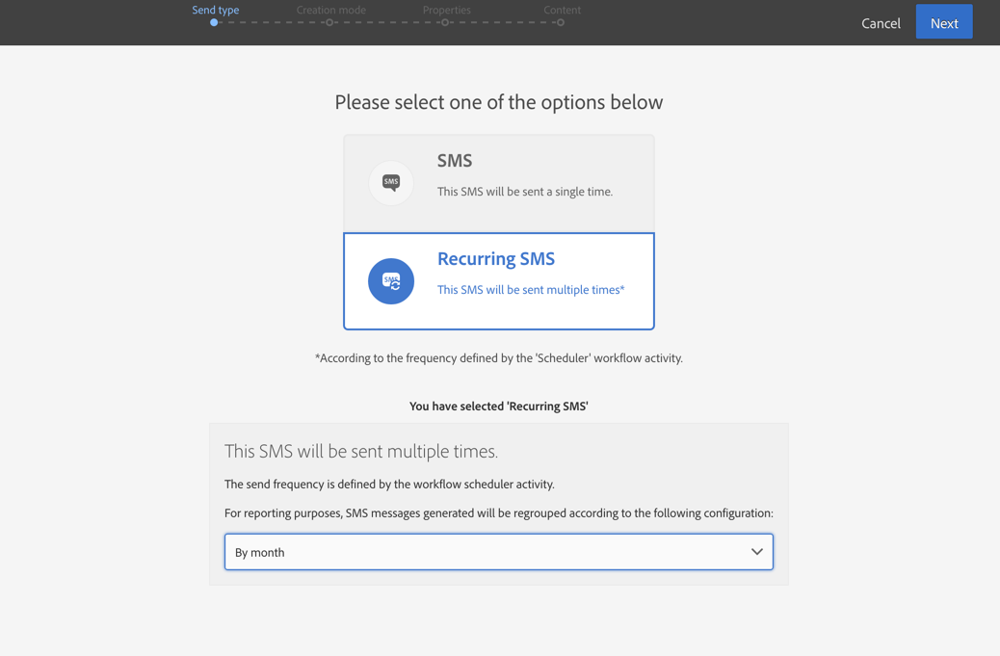

# SMS配信{#sms-delivery}

## 説明 {#description}

**[!UICONTROL SMS delivery]** アクティビティを使用すると、ワークフローでSMSを送信できます。**1回の送信** SMSで送信することも、1回だけ送信することも、 **繰り返し** SMSを送信することもできます。

単一送信SMSメッセージは標準SMSで、一度送信されます。

定期的なSMSメッセージを使用すると、定義された期間にわたって同じSMSを異なるターゲットに複数回送信できます。必要に応じたレポートを取得するには、期間ごとの搬送を集計できます。

## 使用状況 {#context-of-use}

**[!UICONTROL SMS delivery]** このアクティビティは通常、同じワークフローで計算されたターゲットへのSMSの送信を自動化するために使用されます。

スケジューラにリンクすると、定期的なSMSメッセージを定義できます。

SMS受信者は、クエリ、交差などのターゲットアクティビティを介して、同じワークフロー内のアクティビティの上流に定義されます。

メッセージ準備は、ワークフロー実行パラメーターに従ってトリガーされます。メッセージ・ダッシュボードから、メッセージを送信するかどうかを手動で確認するかどうかを選択できます（デフォルトでは必須）。ワークフローを手動で開始するか、ワークフローにスケジューラアクティビティを配置して実行を自動化できます。

## 構成 {#configuration}

1. **[!UICONTROL SMS delivery]** アクティビティをワークフローにドラッグアンドドロップします。
1. アクティビティを選択し、表示されるクイックアクションの  ボタンを使用して開きます。

   >[!NOTE]
   >
   >ワークフローのアクションバーの  ボタンを使用して、アクティビティの全般的なプロパティおよび詳細オプションにアクセスできます。このボタンは **[!UICONTROL SMS delivery]** アクティビティに固有です。SMSのプロパティには、SMSダッシュボードのアクションバーを介してアクセスできます。

1. SMS送信モードを選択します:

   * **[!UICONTROL SMS]**:SMSは1回送信されます。ここでは、アクティビティに送信遷移を追加するかどうかを指定できます。異なる遷移タイプについては、手順7で詳しく説明します。
   * **[!UICONTROL Recurring SMS]**: **[!UICONTROL Scheduler]** アクティビティで定義された頻度に従って、SMSが数回送信されます。送信の集計期間を選択します。これにより、定義された期間中に発生したすべての送信を1つのビューに再グループ化して **、「定期的な実行** 」とも呼ばれ、アプリケーションのマーケティング活動リストからアクセスできます。

      たとえば、定期的な誕生日SMSを毎日送信する場合は、毎月送信するように選択できます。これにより、SMSは毎日送信されるのに対し、毎月の配信に関するレポートを毎月受け取ることができます。

1. SMSタイプを選択します。SMSの種類は、&gt; **[!UICONTROL Resources]****[!UICONTROL Templates]** &gt; **[!UICONTROL Delivery templates]** メニューで定義されたSMSテンプレートから取得されます。
1. SMSの全般的なプロパティを入力します。既存のキャンペーンにアタッチすることもできます。ワークフローの配信アクティビティのラベルがSMSラベルで更新されます。
1. SMSコンテンツを定義します。SMSメッセージ [の作成に関するセクションを](../../channels/using/creating-an-sms-message.md)参照してください。
1. 既定では、アクティビティ **[!UICONTROL SMS delivery]** には送信遷移は含まれません。**[!UICONTROL SMS delivery]** アクティビティに送信遷移を追加する場合は、詳細アクティビティ **[!UICONTROL General]** のオプション（アクティビティのクイックアクションの  ボタン）のタブに移動し、次のいずれかのオプションを確認します。

   * **[!UICONTROL Add outbound transition without the population]**:これにより、着信遷移とまったく同じ人口を含む送信遷移を生成できます。
   * **[!UICONTROL Add outbound transition with the population]**:これにより、SMSが送信された人口を含む送信遷移を生成できます。搬送準備中に除外されたターゲットのメンバー（検疫、無効な番号など）この遷移から除外されます。

1. アクティビティの構成を確認し、ワークフローを保存します。

アクティビティを再度開くと、SMSダッシュボードに直接移動します。編集できるのはそのコンテンツだけです。

既定では、配信ワークフローを開始するとメッセージの準備のみがトリガーされます。ワークフローから作成されたメッセージの送信は、ワークフローの開始後も確認する必要があります。メッセージのダッシュボードから、メッセージがワークフローから作成された場合にのみ、オプション **[!UICONTROL Request confirmation before sending messages]** を無効にできます。このオプションをオフにすると、準備が完了するとメッセージが送信されなくなります。

## 解説 {#remarks}

ワークフロー内で作成された搬送は、アプリケーションのマーケティング活動リストでアクセスできます。ダッシュボードを使用して、ワークフローの実行ステータスを表示できます。SMS概要ペインのリンクでは、リンクされた要素（ワークフロー、キャンペーン、定期的なSMSの場合は親の配信）に直接アクセスできます。

ただし、定期的な搬送の実行はデフォルトでマスクされます。これらを表示するには、マーケティング活動の「検索パネル」の **[!UICONTROL Show recurring executions]** オプションを確認します。

マーケティング活動リストからアクセス可能な親搬送の場合、または関連する定期実行を介して直接実行できる場合は、処理された送信の合計数（ **[!UICONTROL SMS delivery]** アクティビティの構成時に指定した集計期間に従って）を表示できます。これを行うには、親配送の **[!UICONTROL Deployment]** ブロックの詳細ビューを選択して開き ます。

## 例 {#example}

この例は、誕生日ワークフローです。毎日、その日に誕生日があるプロフィールにSMSが送られます。これを行うには:

* では **[!UICONTROL Scheduler]** 、毎日8mでワークフローを開始できます。

   

* **[!UICONTROL Query]** このアクティビティでは、ワークフローを実行するたびに、携帯電話番号を提供し、現在の日に誕生日があるプロファイルを計算できます。誕生日の計算は、クエリ編集ツールのパレットで使用可能な定義済みフィルターを使用して実行されます。

   

* 繰り返し **[!UICONTROL SMS]** ます。送信は月単位で集計されます。したがって、1か月で送信されるすべてのSMSメッセージは単一のビューに集約されます。1年間で365の配信が実行されますが、Adobe Campaignインターフェイスでは12ビュー（ **定期的な実行**&#x200B;とも呼ばれます）に再グループ化されます。履歴およびレポートの詳細は毎月表示され、送信ごとには表示されません。

   

ワークフローでのSMS配信の別の例については、ユースケースを参照 [してください。新しい配信を非公開者に送信するワークフローを再ターゲット](../../automating/using/workflow-cross-channel-retargeting.md)します。
