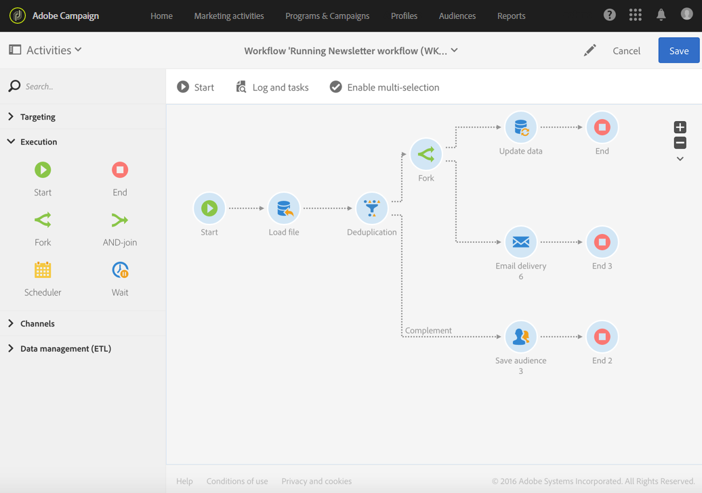

# 開始および終了{#start-and-end}

## 説明 {#description}

およびア **[!UICONTROL Start]** クティビティ **[!UICONTROL End]** を使用すると、ワークフローの開始と終了を明確に示すことができます。

## 使用状況 {#context-of-use}

ワークフローの実行は、受信の移行を行わないアクティビティで開始され、進行中のタスクがなくなると停止します。 ただし、ワークフローの開始 **[!UICONTROL Start]** 点と終了点 **[!UICONTROL End]** を明確に示すアクティビティを追加することはできます。 これは、比較的複雑なワークフローで特に役立ちます。

ワークフローが正しく終了するように、ワ **[!UICONTROL End]** ークフローの最後の移行を独自に残す代わりに、アクティビティを使用することをお勧めします。

## 設定 {#configuration}

1. またはアクティビティをワークフ **[!UICONTROL Start]** ローに **[!UICONTROL End]** ドラッグ&amp;ドロップします。
1. クエリーな **[!UICONTROL Start]** どの他のアクティビティの前にアクティビティを配置し、一連のアクティビティ **[!UICONTROL End]** の後にアクティビティを配置します。
1. アクティビティを選択し、表示されるクイックアクシ  ョンのボタンを使用して開きます。
1. Endオブジェクトを設 **定して** 、完了していないワークフローのタスクを含む、進行中のタスクをすべて中断するようにすることができます。 これを行うには、対応するオプションを選択します。
1. アクティビティの設定を確認し、ワークフローを保存します。

## 別のワークフローのトリガー {#triggering-another-workflow}

アクティビティ **[!UICONTROL External signal]** のタブを使用し **[!UICONTROL End]** て、別のワークフローをトリガーできます。 「外部シグナル [」の項を参照](../../automating/using/external-signal.md) 。

## 例 ：{#example}

次の例は、1つのアクティビティと複数のアクティビティで複雑なワークフローを実 **[!UICONTROL Start]** 行する方法を示して **[!UICONTROL End]** います。 このボッ **[!UICONTROL Stop all tasks in progress]** クスは、最初のアクティビティに対してチェックさ **[!UICONTROL End]** れています。 対応するタスクが完了すると、ワークフロー全体が停止します。ボタンが選択されている場合と同じ効  果が得られます(アクションバーの [節を参照](../../automating/using/workflow-interface.md#action-bar) )。

