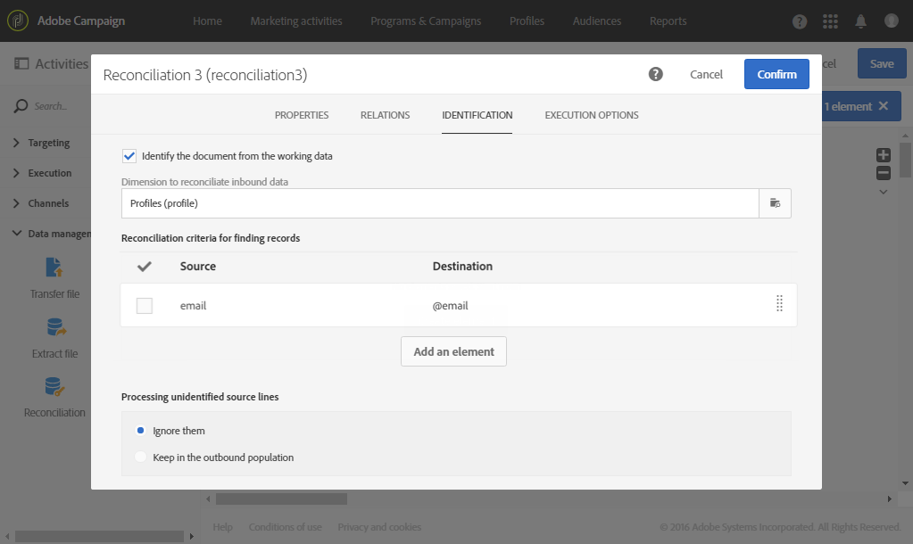

# ファイルのインポート後に特定のサービスにプロファイルを購読登録する {#subscribing-profiles-to-a-specific-service-after-importing-a-file}

次の例では、プロファイルを含んだファイルをインポートし、これらのプロファイルを既存のサービスに購読登録する方法を示します。ファイルをインポートした後で、インポートしたデータをプロファイルとして識別できるように紐付けをおこなう必要があります。ファイルに重複が含まれていないことを確認するために、データに対して「重複排除 - 重複」アクティビティが実行されます。

ワークフローは次のとおりです。


* A [ファイルを読み込み](../../automating/using/load-file.md) 「 」アクティビティは、プロファイルファイルを読み込み、インポートした列の構造を定義します。

  この例では、読み込まれるファイルは .csv 形式で、次のデータが含まれています。

  ```
  lastname;firstname;email;birthdate;subdate
  jackman;megan;megan.jackman@testmail.com;07/08/1975;10/08/2017
  phillips;edward;phillips@testmail.com;09/03/1986;10/08/2017
  weaver;justin;justin_w@testmail.com;11/15/1990;10/08/2017
  martin;babeth;babeth_martin@testmail.net;11/25/1964;10/08/2017
  reese;richard;rreese@testmail.com;02/08/1987;11/08/2017
  cage;nathalie;cage.nathalie227@testmail.com;07/03/1989;11/08/2017
  xiuxiu;andrea;andrea.xiuxiu@testmail.com;09/12/1992;11/08/2017
  grimes;daryl;daryl_890@testmail.com;12/06/1979;12/08/2017
  tycoon;tyreese;tyreese_t@testmail.net;10/08/1971;12/08/2017
  ```

  

* A [紐づけ](../../automating/using/reconciliation.md) 「 」アクティビティで、ファイルのデータを、Adobe Campaignデータベースのプロファイルディメンションに属するものとして識別します。 「**[!UICONTROL Identification]**」タブのみ設定します。プロファイルのメールアドレスに従って、ファイルデータを識別します。

  

* A [重複排除](../../automating/using/deduplication.md) 基準： **電子メール** （紐付けの結果生成される）一時リソースのフィールドで、すべての重複を識別します。 ファイルからインポートしたデータに重複が含まれている場合、サービスへの購読登録はすべてのデータで失敗します。

  

* A [購読サービス](../../automating/using/subscription-services.md) 「 」アクティビティでは、プロファイルの購読登録先のサービス、購読登録日に対応するフィールド、購読登録の接触チャネルを選択できます。

  
