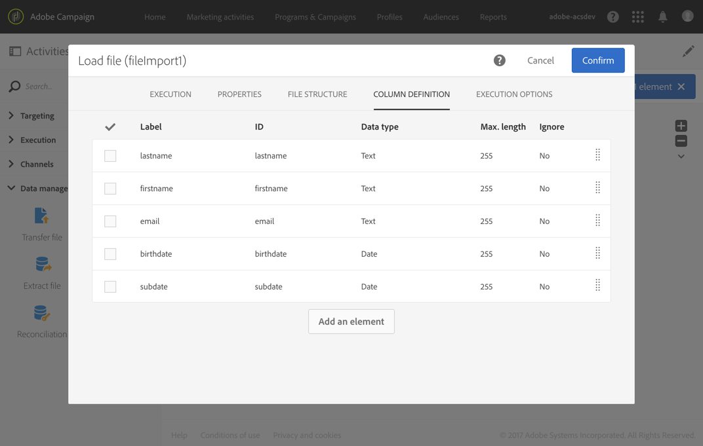

# Subscription Services{#subscription-services}

## 説明 {#description}


**[!UICONTROL Subscription Services]** このアクティビティにより、プロファイルを一括で取得してサービスにサブスクライブしたり、サービスから登録解除したりできます。

>[!CAUTION]
>
>ワークフローのコンテキストで管理される購読の場合、購読プロファイルまたは購読解除プロファイルはサービスプロパティで定義されている異なる確認電子メールを受信しません。

## Context of use {#context-of-use}

**[!UICONTROL Subscription Services]** アクティビティはAdobe Campaignの唯一の機能です。これにより、1つのアクションで複数のプロファイルをサブスクライブしたり、サービスから登録解除したりできます。

ターゲット設定を実行した後、または特定のデータを含むファイルをインポートした後で、このアクティビティを使用できます。

特定の列を介してファイルに指定した場合、このアクティビティではアクション（サブスクライブまたはサブスクライブ解除）およびアクションを実行するサービスを選択することもできます。

## Configuration {#configuration}

1. Drag and drop a **[!UICONTROL Subscription Services]** activity into your workflow.
1. クエリやインポートの後の紐付けなど、他のターゲットアクティビティの後に接続します。
1. Select the activity, then open it using the  button from the quick actions that appear.
1. Select the **[!UICONTROL Service]** for which you would like to manage the subscriptions using one of the following options:

   * **[!UICONTROL Select a specific service]**:サービスを手動で選択します。
   * **[!UICONTROL Select services from the inbound transition]**:サービスは、インバウンドトランジションで指定します。例えば、各行で管理するサービスを指定するファイルを読み込むことができます。If you choose this option, make sure a link has been created beforehand between the data and the **Service** resource, as shown in [this example](../../automating/using/subscription-services.md#example--updating-multiple-subscription-statuses-from-a-file).

      操作を実行するサービスが、レコードごとに動的に選択されます。

1. Select the **[!UICONTROL Operation type]** to execute using one of the following options:

   * **[!UICONTROL Select a specific operation type]**: **[!UICONTROL Subscribe]** を手動で選択します。**[!UICONTROL Unsubscribe]**
   * **[!UICONTROL Select an operation type from a path of inbound transition]**:各レコードに対して実行する操作を指定する受信データの列を選択します。

      この列では、演算はブール値または整数値として指定する必要があります。Use **0** to unsubscribe a record and **1** to subscribe.

      In case the values contained in an imported file do not match the above requirements, you can still use the [Remapping of values](../../automating/using/load-file.md#column-format) option available in the **[!UICONTROL Load file]** activity

1. 受信データにサービスへのプロファイルの購読日に対応する列が含まれている場合は、それを選択します。ワークフローの実行時には、空のままにしておくことができますが、購読日は設定できません。
1. 購読の起源を定義します。You can set it to one of the fields of the inbound data or to a constant value of your choice by checking the **[!UICONTROL Set a constant as origin]** option. ワークフローの実行時には、空のままにしておくことができますが、元のままにすることはできません。
1. 必要に応じて、アウトバウンドトランジションを生成できます。このトランジションには、受信アクティビティとまったく同じデータが含まれます。
1. アクティビティの設定を確認し、ワークフローを保存します。

   これで実行できるようになりました。実行後、サービスの詳細に登録または登録解除したプロファイルを表示できます。

## Example: Subscribing profiles to a specific service after importing a file {#example--subscribing-profiles-to-a-specific-service-after-importing-a-file}

この例では、プロファイルを含むファイルを読み込み、それらを既存のサービスにサブスクライブする方法を示します。ファイルをインポートした後、インポートしたデータをプロファイルとして識別できるように、紐付けを実行する必要があります。ファイルに重複がないことを確認するために、重複除外アクティビティがデータで実行されます。

ワークフローは次のように表示されます。


* **[!UICONTROL Load file]** アクティビティは、プロファイルファイルを読み込み、インポートされた列の構造を定義します。

   この例では、読み込まれたファイルは. csv形式で、次のデータが含まれています。

   ```
   lastname;firstname;email;birthdate;subdate
   jackman;megan;megan.jackman@testmail.com;07/08/1975;10/08/2017
   phillips;edward;phillips@testmail.com;09/03/1986;10/08/2017
   weaver;justin;justin_w@testmail.com;11/15/1990;10/08/2017
   martin;babeth;babeth_martin@testmail.net;11/25/1964;10/08/2017
   reese;richard;rreese@testmail.com;02/08/1987;11/08/2017
   cage;nathalie;cage.nathalie227@testmail.com;07/03/1989;11/08/2017
   xiuxiu;andrea;andrea.xiuxiu@testmail.com;09/12/1992;11/08/2017
   grimes;daryl;daryl_890@testmail.com;12/06/1979;12/08/2017
   tycoon;tyreese;tyreese_t@testmail.net;10/08/1971;12/08/2017
   ```

   

* **[!UICONTROL Reconciliation]** アクティビティは、Adobe Campaignデータベースのプロファイルディメンションに属するファイルからデータを識別します。Only the **[!UICONTROL Identification]** tab is configured. プロファイルの電子メールアドレスに従ってファイルデータを識別します。

   

* **[!UICONTROL Deduplication]** 一時リソースの **電子メール** フィールドに基づいて（紐付けによって生じる）すべての複製が識別されます。ファイルからインポートしたデータに重複が含まれている場合、サービスの購読はすべてのデータに対して失敗します。

   

* **[!UICONTROL Subscription Services]** アクティビティを使用すると、プロファイルを購読するサービス、購読日に対応するフィールド、購読の出典を選択できます。

   

## Example: Updating multiple subscription statuses from a file {#example--updating-multiple-subscription-statuses-from-a-file}

この例では、プロファイルを含むファイルを読み込む方法と、ファイルで指定されているいくつかのサービスのサブスクリプションを更新する方法について説明します。ファイルをインポートした後、インポートしたデータをサービスへのリンクとして識別できるように、紐付けを実行する必要があります。ファイルに重複がないことを確認するために、重複除外アクティビティがデータで実行されます。

ワークフローは次のように表示されます。


* **[!UICONTROL Load file]** アクティビティは、プロファイルファイルを読み込み、インポートされた列の構造を定義します。

   この例では、読み込まれたファイルは. csv形式で、次のデータが含まれています。

   ```
   lastname;firstname;email;birthdate;service;operation
   jackman;megan;megan.jackman@testmail.com;07/08/1975;SVC2;sub
   phillips;edward;phillips@testmail.com;09/03/1986;SVC3;unsub
   weaver;justin;justin_w@testmail.com;11/15/1990;SVC3;sub
   martin;babeth;babeth_martin@testmail.net;11/25/1964;SVC3;unsub
   reese;richard;rreese@testmail.com;02/08/1987;SVC3;sub
   cage;nathalie;cage.nathalie227@testmail.com;07/03/1989;SVC3;sub
   xiuxiu;andrea;andrea.xiuxiu@testmail.com;09/12/1992;SVC4;sub
   grimes;daryl;daryl_890@testmail.com;12/06/1979;SVC3;unsub
   tycoon;tyreese;tyreese_t@testmail.net;10/08/1971;SVC2;sub
   ```

   

   この操作が認識されている場合は、ファイル内の操作が"sub"または"unsub"として指定されています。The system expects a **Boolean** or **Integer** value to recognize the operation to perform: "0" to unsubscribe and "1" to subscribe. この要件を満たすために、値の再マッピングが「操作」列の詳細で実行されます。

   

   ファイルで既に"0"と"1"を使用して操作を識別する場合、これらの値を再マッピングする必要はありません。Only make sure that the column is processed as a **Boolean** or **Integer** in the **[!UICONTROL Column definition]** tab.

* **[!UICONTROL Reconciliation]** アクティビティは、Adobe Campaignデータベースのプロファイルディメンションに属するファイルからデータを識別します。**[!UICONTROL Identification]** このタブから、ファイルの **電子メール** フィールドがプロファイルリソースの **電子メール** フィールドに一致します。

   

   **[!UICONTROL Relations]** タブでは、サービスリソースを使用してリンクが作成され、ファイルの **サービス** フィールドが認識されます。In this example, the values match the **name** field of the service resource.

   

* **[!UICONTROL Deduplication]** 一時リソースの **電子メール** フィールドに基づいて（紐付けによって生じる）は、重複を識別します。重複の場合、サービスの購読はすべてのデータに対して失敗するので、重複を排除することが重要です。

   

* A **[!UICONTROL Subscription Services]** identifies the services to update as coming from the transition, through the link created in the **[!UICONTROL Reconciliation]** activity.

   The **[!UICONTROL Operation type]** is identified as coming from the **operation** field of the file. ここで選択できるのは、ブール値または整数フィールドのみです。If the column of your file that contains the operation to perform does not appear in the list, make sure that you have correctly set your column format in the **[!UICONTROL Load file]** activity, as explained earlier in this example.

   

