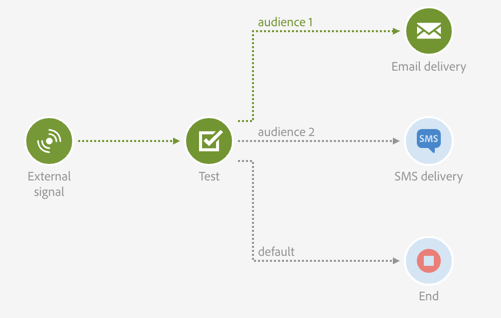

# テスト{#test}

## 説明 {#description}

「**[!UICONTROL Test]**」アクティビティは、テスト結果に基づくトランジションを有効にします。

## Context of use {#context-of-use}

「**Test**」アクティビティは、自身に関連付けられている条件を最初に満たしたトランジションを有効化します。

条件が 1 つも満たされず、「**Use default transition**」オプションが有効化されている場合、デフォルトのトランジションが有効化されます。

条件は、**関数**&#x200B;または&#x200B;**変数**（ワークフローの「**[!UICONTROL External signal]**」アクティビティに宣言されたイベント変数など）に基づくことができます。

**関連トピック：**

* [関数のリスト](../../automating/using/list-of-functions.md)
* [外部パラメーターを使用したワークフローの呼び出し](../../automating/using/calling-a-workflow-with-external-parameters.md)

## 設定 {#configuration}

1. ワークフローに「**[!UICONTROL Test]**」アクティビティをドラッグ＆ドロップします。
1. アクティビティを選択し、表示されるクイックアクションの  ボタンを使用して開きます。
1. 各条件の属性を定義します。

   「**[!UICONTROL Condition]**」フィールドの編集時に、2 つのボタンを使用してイベント変数を呼び出し、変数と関数を組み合わせた式を編集できます。

   * : ワークフローで使用可能なすべての変数の中からイベント変数を選択します（[このページ &#x200B;](../../automating/using/customizing-workflow-external-parameters.md)を参照）。

     例えば、**[!UICONTROL filesCount]**&#x200B;変数を使用して、[&#x200B; ファイル転送](../../automating/using/transfer-file.md) アクティビティの後にダウンロードされたファイルの数を確認できます。

     

   * ：変数と関数を組み合わせた式を編集します。 式エディターについて詳しくは、[この節](../../automating/using/advanced-expression-editing.md)を参照してください。

     
