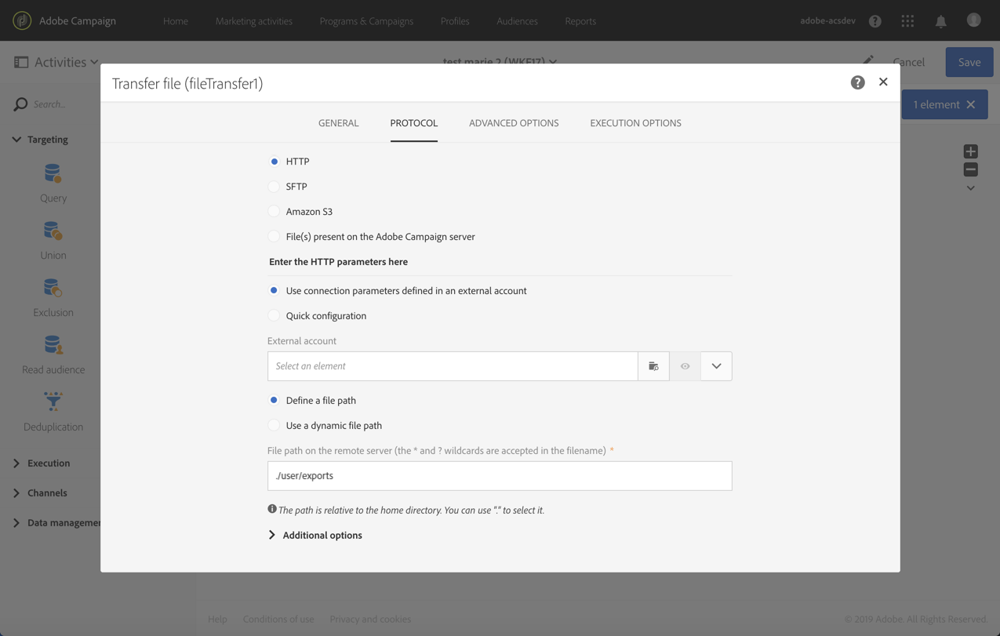

# ファイルを転送{#transfer-file}

## 説明 {#description}

「**[!UICONTROL Transfer file]**」アクティビティを使用すると、ファイルの送受信、ファイルの有無のテスト、Adobe Campaign 内のファイルの一覧表示ができます。

## 使用状況 {#context-of-use}

データの抽出方法は、アクティビティの設定時に定義されます。読み込むファイルとしては、例えば連絡先のリストなどがあります。

このアクティビティを使用すると、データが回復され、「**[!UICONTROL Load file]**」アクティビティで構造化されます。

**関連トピック：**

* [使用例：ファイルの自動ダウンロードに基づくデータの更新](../../automating/using/update-data-automatic-download.md)

## 設定 {#configuration}

1. ワークフローに「**[!UICONTROL Transfer file]**」アクティビティをドロップします。
1. アクティビティを選択し、表示されるクイックアクションの  ボタンを使用して開きます。
1. 「**[!UICONTROL Action]**」フィールドのドロップダウンリストを使用して、次のアクティビティアクションのいずれかを選択します。

   

   * **ファイルのダウンロード**：ファイルをダウンロードできます。
   * **ファイルのアップロード**：ファイルをアップロードできます。Adobe Campaign ファイルからファイルをアップロードすると、**[!UICONTROL Export audits]** メニューにログエントリが生成されます。エクスポートの監査について詳しくは、[エクスポートの監査](../../administration/using/auditing-export-logs.md)の節を参照してください。
   * **テストによりファイルの存在を確認**：ファイルが存在するかどうかを確認できます。
   * **ファイルリスト**：「**[!UICONTROL Protocol]**」タブで定義されたサーバーに存在するファイルをリストできます。このアクションは主にデバッグ目的で使用され、リモートサーバーからファイルをダウンロードする前に、要件を満たすようにアクティビティが設定されているかどうかを確認します。

1. 使用するプロトコルを選択します。
   * [HTTP](#HTTP-configuration-wf)
   * [SFTP](#SFTP-configuration-wf)
   * [Amazon S3](#S3-configuration-wf)
   * [Microsoft Azure Blob Storage](#azure-blob-configuration-wf)
   * [Adobe Campaign サーバーに存在するファイル](#files-server-configuration-wf)

1. 選択したプロトコルによっては「**[!UICONTROL Additional options]**」セクションが使用できます。このセクションではプロトコルにパラメータを追加できます。

   以下を行うことができます。

   * **[!UICONTROL Delete the source files after transfer]**：リモートサーバー上のファイルを消去します。 このオプションを選択しない場合は、SFTP ディレクトリにあるアーカイブ済みコンテンツのサイズを手動で監視するようにしてください。

   * **[!UICONTROL Sorting files]**：ファイルを英数字で並べ替えることができます。 このオプションはデフォルトでは無効です。

     <!--**[!UICONTROL Disable passive mode]**: allows you to specify the connection port to be used for data transfer.-->

   * **[!UICONTROL List all files]**：このオプションは、 **[!UICONTROL File listing]** アクション **[!UICONTROL General]** タブをクリックします。 サーバー上に存在するすべてのファイルのインデックスを **vars.filenames** イベント変数に作成できます。この変数では、ファイル名が **&#39;n&#39;** 文字で区切られています。

1. 「**[!UICONTROL Advanced options]**」タブの「**[!UICONTROL If no files are found]**」セクションでは、アクティビティの起動時にエラーや存在しないファイルが検出された場合の特定のアクションを設定できます。

   また、再試行も定義できます。ワークフローの実行ログに各種の再試行が表示されます。

   

1. アクティビティの設定を確認し、ワークフローを保存します。

### HTTP を使用した設定 {#HTTP-configuration-wf}

HTTP プロトコルを使用すると、外部アカウントまたは URL からファイルをダウンロードできます。

このプロトコルを使用すると、 **[!UICONTROL Use connection parameters defined in an external account]** オプション。 この場合、目的のアカウントを選択し、ダウンロードするファイルのパスを指定します。

また、「**[!UICONTROL Quick configuration]**」オプションを選択することもできます。必要なのは「URL」フィールドに URL を入力することだけです。

**[!UICONTROL Follow redirections]**, **[!UICONTROL Ignore the HTTP return code]**、および **[!UICONTROL Add received HTTP headers to the file]** は、HTTP プロトコルを選択した場合に使用できる追加のオプションです。

### SFTP を使用した設定 {#SFTP-configuration-wf}

SFTP プロトコルを使用すると、URL または外部アカウントからファイルをダウンロードできます。

このプロトコルを使用すると、 **[!UICONTROL Use connection parameters defined in an external account]** 」オプションを選択し、目的のアカウントを選択して、ダウンロードするファイルのパスを指定します。

>[!CAUTION]
>
>ワイルドカードを使用できます。

また、「**[!UICONTROL Quick configuration]**」オプションを選択することもできます。必要なのは「URL」フィールドに URL を入力することだけです。

### Amazon S3 を使用した設定 {#S3-configuration-wf}

Amazon S3 プロトコルを使用すると、Amazon Simple Storage Service（S3）を使用して URL または外部アカウントからファイルをダウンロードできます。

1. Amazon S3 外部アカウントを選択します。詳しくは、この[ページ](../../administration/using/external-accounts.md#amazon-s3-external-account)を参照してください。

2. 「**[!UICONTROL Define a file path]**」または「**[!UICONTROL Use a dynamic file path]**」を選択します。

3. ダウンロードするファイルのパスを指定します。

   

   >[!CAUTION]
   >
   > ワイルドカードはAmazon S3 ではサポートされていません。
   >
   > 複数のファイル ( `my_file_02` および `my _file_3433`に値を入力する場合は、次の構文を使用できます。 `acs-myawsbucket.s3.amazonaws.com/object-path/my_file_`.

4. 転送の完了時にソースファイルを削除する場合は、「**[!UICONTROL Delete the source files after transfer]**」をオンにします。

### Microsoft Azure Blob Storage を使用した設定 {#azure-blob-configuration-wf}

Microsoft Azure Blob プロトコルを使用すると、Microsoft Azure Blob Storage アカウントにある BLOB にアクセスできます。

1. **[!UICONTROL Microsoft Azure Blob]** 外部アカウントを選択します。詳しくは、この[ページ](../../administration/using/external-accounts.md#microsoft-azure-external-account)を参照してください。

1. 「**[!UICONTROL Define a file path]**」または「**[!UICONTROL Use a dynamic file path]**」を選択します。

   

1. ダウンロードするファイルのパスを指定します。複数の BLOB と一致する場合があります。この場合、「**[!UICONTROL File transfer]**」アクティビティは、BLOB が見つかるたびに送信トランジションをアクティブ化します。その後、アルファベット順に処理されます。

   >[!CAUTION]
   >
   >ワイルドカードを使用して複数のファイル名と一致させることはできません。代わりに、プレフィックスを入力する必要があります。そのプレフィックスに一致するすべての BLOB 名が対象です。

   以下のリストはファイルのパスの例です。

   * **&quot;campaign/&quot;**：コンテナのルートにある Campaign フォルダー内のすべての BLOB と一致します。
   * **&quot;campaign/new-&quot;**：ファイル名が「new-」で始まり、Campaign フォルダーの下にあるすべての BLOB と一致します。
   * **&quot;&quot;**：空のパスを追加すると、コンテナで使用可能なすべての BLOB と一致します。

### Adobe Campaign サーバー上に存在するファイルを使用した設定 {#files-server-configuration-wf}

「**[!UICONTROL File(s) present on the Adobe Campaign server]**」プロトコルは、回復するファイルを含むリポジトリに対応します。
メタ文字、ワイルドカード（例： ） &#42; または？) を使用して、ファイルをフィルターできます。

必要に応じて「**[!UICONTROL Define a file path]**」または「**[!UICONTROL Use a dynamic file path]**」を選択します。
「**[!UICONTROL Use a dynamic file path]**」オプションを選択すると、標準の式やイベント変数を使用して、転送するファイルの名前をパーソナライズできます。詳しくは、[このページ](../../automating/using/customizing-workflow-external-parameters.md)を参照してください。

パスは、Adobe Campaign サーバーのストレージスペースディレクトリを基準とした相対パスである必要があります。ファイルは、**sftp&lt;インスタンス名>/** ディレクトリにあります。また、ストレージ領域より上のディレクトリを参照することもできません。

例：

`user&lt;yourinstancename>/my_recipients.csv` が正しい。

`../hello/my_recipients.csv` が正しくありません。

`//myserver/hello/myrecipients.csv` が正しくありません。

## 履歴化設定 {#historization-settings}

「**[!UICONTROL Transfer file]**」アクティビティが実行されるたびに、アップロードされたファイルまたはダウンロードされたファイルが専用のフォルダーに保存されます。ワークフローの「**[!UICONTROL Transfer file]**」アクティビティごとに 1 つのフォルダーが作成されます。したがって、サーバー上の物理領域を保持するために、このフォルダーのサイズを制限できるようにする必要があります。

そのためには、「**[!UICONTROL Transfer File]**」アクティビティの **[!UICONTROL Advanced options]** で「**[!UICONTROL Historization settings]**」を定義します。

「**[!UICONTROL Historization settings]**」では、アクティビティのフォルダーのファイルの最大数または合計サイズを定義できます。デフォルトで許可されている値はそれぞれ 100 個と 50 MB です。

このアクティビティを実行するたびに、次のようにフォルダーがチェックされます。

* アクティビティ実行の 24 時間前までに作成されたファイルのみが対象です。
* 対象となるファイルの数が「**[!UICONTROL Maximum number of files]**」パラメーターの値より大きい場合、許可されている「**[!UICONTROL Maximum number of files]**」の値におさまるまで、古いファイルから順に削除されます。
* 対象となるファイルの合計サイズが「**[!UICONTROL Maximum size (in MB)]**」パラメーターの値より大きい場合、許可されている「**[!UICONTROL Maximum size (in MB)]**」の値におさまるまで、古いファイルから順に削除されます。

>[!NOTE]
>
>アクティビティを再実行しない限り、フォルダーはチェックされず、消去もされません。そのため、大きなファイルを転送する場合は注意してください。

## 出力変数 {#output-variables}

The **[!UICONTROL Transfer file]** 「 」アクティビティでは、出力としてイベント変数が生成されます。これは、他のアクティビティで使用できます。例えば、 [テスト](../../automating/using/test.md) アクティビティ。

イベント変数は、外部シグナルを使用して別のワークフローに渡すこともできます ( [外部パラメーターを使用したワークフローのカスタマイズ](../../automating/using/customizing-workflow-external-parameters.md)) をクリックします。

使用可能な出力変数は次のとおりです。

* **[!UICONTROL fileName]**：転送したファイルの名前。
* **[!UICONTROL filesCount]**：転送されたファイルの数。
