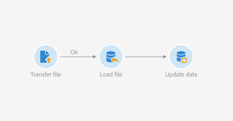

# ファイルの自動ダウンロードに基づくデータの更新 {#updating-data-automatic-file-download}

ロードファイルアクティビティは、転送ファイルアクティビティからのデータを主に構成し、既存のデータに統合する。

次の例は、転送ファイルアクティビティを介して自動的にダウンロードされたファイルの読み込みアクティビティの後に、更新データアクティビティが続く結果を示しています。 このワークフローでは、Adobe Campaignデータベースを新しいプロファイルで拡張したり、読み込んだファイルから回復したデータを使用して既存のプロファイルを更新したりします。

ワークフローを構築するには、次の手順に従います。

1. 「 [転送ファイル](../../automating/using/transfer-file.md) 」アクティビティをワークフローにドラッグ&amp;ドロップします。
1. アクティビティを選択し、表示されるクイックアクションの  ボタンを使用して開きます。
1. アクティビティを設定し、希望のファイルが回復されるようにします。 タブで「 **[!UICONTROL Protocol]** SFTP ****」を選択します。
1. 「外部アカウントで定義された接続パラメータを **使用** 」オプションを選択します。
1. 外部アカウントの名前を入力します。
1. リモートサーバーの **ファイルパスを入力します**。

   

1. アクティビティを確認します。
1. 「ファイルを [読み込み](../../automating/using/load-file.md) 」アクティビティをワークフローにドラッグ&amp;ドロップし、 **[!UICONTROL Transfer file]** アクティビティの後に配置します。
1. アクティビティを選択し、表示されるクイックアクションの  ボタンを使用して開きます。
1. タブの **[!UICONTROL File to load]** セクションで、オプションをオンにし **[!UICONTROL Execution]** ま **[!UICONTROL Use the file specified in the inbound transition]** す。

   

1. 前の手順に従って、アクティビティを設定します。
1. 「 [更新データ](../../automating/using/update-data.md) 」アクティビティをワークフローにドラッグ&amp;ドロップし、 **[!UICONTROL Load file]** アクティビティの後に配置して設定します。

ワークフローが開始されると、アップロードされたファイルのデータが抽出され、Adobe Campaignデータベースの拡張に使用されます。
