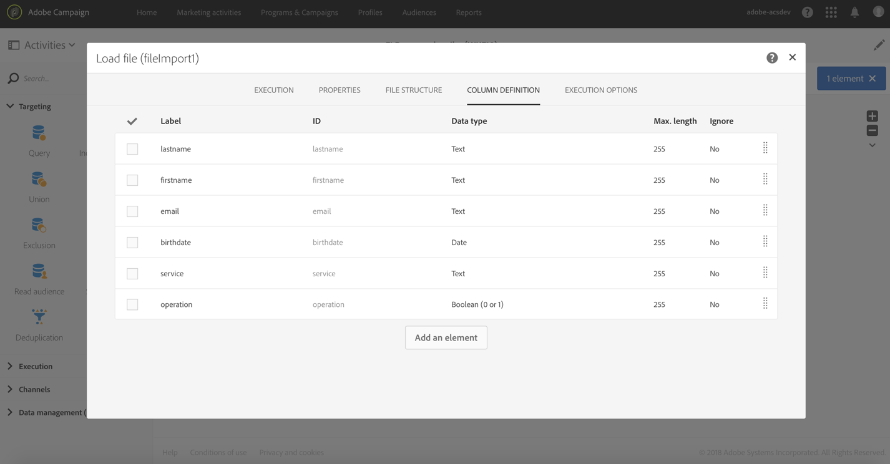
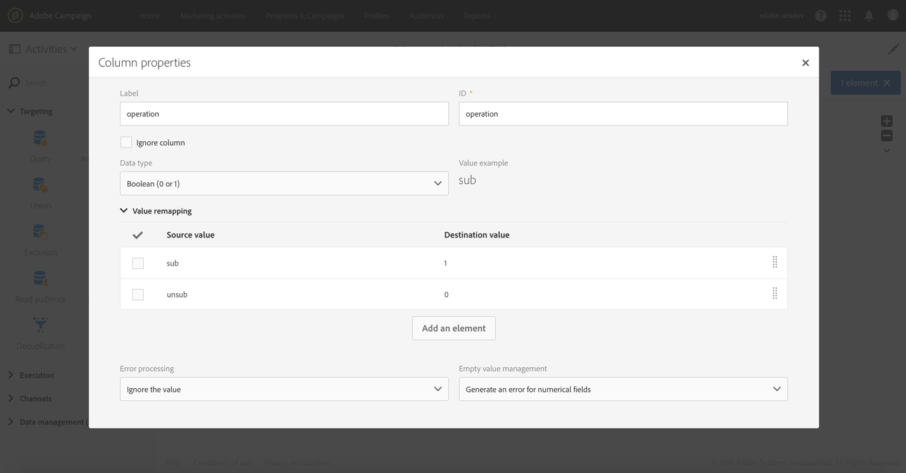
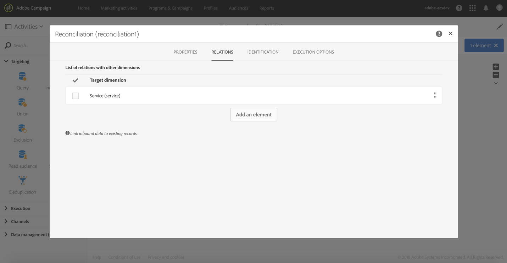
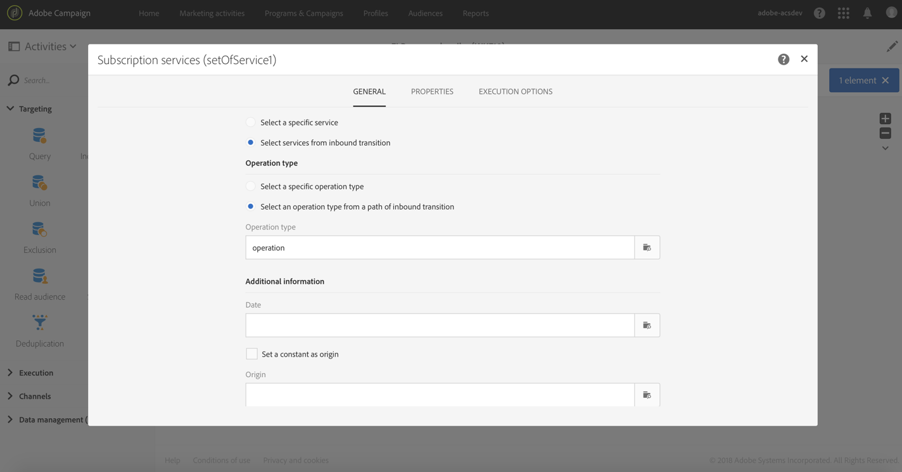

# ファイルからの複数の購読ステータスの更新 {#updating-multiple-subscription-statuses-from-a-file}

次の例では、プロファイルを含んだファイルをインポートして、プロファイルの購読登録先を、ファイルで指定されたいくつかのサービスに更新する方法を示します。 ファイルをインポートした後で、インポートしたデータを、サービスにリンクされたプロファイルとして識別できるように紐付けをおこなう必要があります。 ファイルに重複が含まれていないことを確認するために、データに対して「重複排除 - 重複」アクティビティが実行されます。

ワークフローは次のとおりです。


* [&#x200B; ファイルの読み込み](../../automating/using/load-file.md) アクティビティは、プロファイルファイルを読み込み、読み込まれた列の構造を定義します。

  この例では、読み込まれるファイルは .csv 形式で、次のデータが含まれています。

  ```
  lastname;firstname;email;birthdate;service;operation
  jackman;megan;megan.jackman@testmail.com;07/08/1975;SVC2;sub
  phillips;edward;phillips@testmail.com;09/03/1986;SVC3;unsub
  weaver;justin;justin_w@testmail.com;11/15/1990;SVC3;sub
  martin;babeth;babeth_martin@testmail.net;11/25/1964;SVC3;unsub
  reese;richard;rreese@testmail.com;02/08/1987;SVC3;sub
  cage;nathalie;cage.nathalie227@testmail.com;07/03/1989;SVC3;sub
  xiuxiu;andrea;andrea.xiuxiu@testmail.com;09/12/1992;SVC4;sub
  grimes;daryl;daryl_890@testmail.com;12/06/1979;SVC3;unsub
  tycoon;tyreese;tyreese_t@testmail.net;10/08/1971;SVC2;sub
  ```

  

  この操作は、ファイル内で「sub」または「unsub」と指定されています。 実行する操作を認識するために、**ブール値**&#x200B;または&#x200B;**整数**&#x200B;値が必要です。「0」が購読登録解除、「1」が購読登録です。 この要件を満たすために、値の再マッピングが「operation」列の詳細で実行されます。

  

  「0」と「1」が既に操作の識別に使用されているファイルでは、再マッピングの必要はありません。 列が&#x200B;**ブール値**&#x200B;または&#x200B;**整数**&#x200B;として処理されていることを「**[!UICONTROL Column definition]**」タブで確認してください。

* [紐付け](../../automating/using/reconciliation.md)アクティビティでは、Adobe Campaign データベースのプロファイルディメンションに属するものとして、ファイルのデータが識別されます。 「**[!UICONTROL Identification]**」タブでは、ファイルの **email** フィールドと、プロファイルリソースの **email** フィールドが照合されます。

  

  「**[!UICONTROL Relations]**」タブでは、サービスリソースとのリンクが作成されて、ファイルの **service** フィールドを認識できるようになります。 この例では、値はサービスリソースの **name** フィールドと一致します。

  

* 一時リソースの&#x200B;**電子メール** フィールドに基づく[重複排除](../../automating/using/deduplication.md)は、（紐付けの結果として）重複を識別します。 重複がある場合、サービスへの購読登録はすべてのデータで失敗するので、重複を排除することが重要です。

  

* [&#x200B; サブスクリプションサービス &#x200B;](../../automating/using/subscription-services.md) アクティビティは、**[!UICONTROL Reconciliation]** アクティビティで作成されたリンクを使用して、移行から更新するサービスを特定します。

  「**[!UICONTROL Operation type]**」は、ファイルの **operation** フィールドに由来するものとして識別されます。 ここで選択できるのは、ブール値フィールドまたは整数フィールドのみです。 実行する操作を記述しているファイル列がリストに表示されない場合は、前述のように、「**[!UICONTROL Load file]**」アクティビティで列の形式が正しく設定されていることを確認してください。

  
