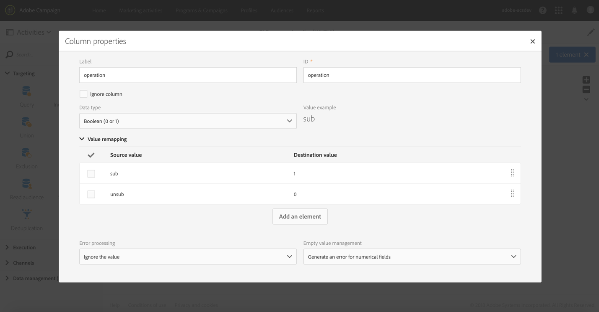

# ファイルからの複数の購読ステータスの更新 {#updating-multiple-subscription-statuses-from-a-file}

次の例は、プロファイルを含むファイルを読み込み、その購読を、ファイルで指定されたいくつかのサービスに更新する方法を示しています。 ファイルをインポートした後、インポートしたデータがサービスへのリンクを持つプロファイルとして識別できるように調整を行う必要があります。 ファイルに重複が含まれていないことを確認するために、重複排除 - 重複アクティビティがデータに対して実行されます。

ワークフローは次のとおりです。


* ファイルの [ロード](../../automating/using/load-file.md) アクティビティは、プロファイルファイルをロードし、インポートされた列の構造を定義します。

   この例では、読み込まれるファイルは.csv形式で、次のデータが含まれています。

   ```
   lastname;firstname;email;birthdate;service;operation
   jackman;megan;megan.jackman@testmail.com;07/08/1975;SVC2;sub
   phillips;edward;phillips@testmail.com;09/03/1986;SVC3;unsub
   weaver;justin;justin_w@testmail.com;11/15/1990;SVC3;sub
   martin;babeth;babeth_martin@testmail.net;11/25/1964;SVC3;unsub
   reese;richard;rreese@testmail.com;02/08/1987;SVC3;sub
   cage;nathalie;cage.nathalie227@testmail.com;07/03/1989;SVC3;sub
   xiuxiu;andrea;andrea.xiuxiu@testmail.com;09/12/1992;SVC4;sub
   grimes;daryl;daryl_890@testmail.com;12/06/1979;SVC3;unsub
   tycoon;tyreese;tyreese_t@testmail.net;10/08/1971;SVC2;sub
   ```

   

   この操作は、ファイル内で「sub」または「unsub」として指定されています。 実行する操作を認識する **Boolean** 値または **Integer** 値が必要です。 「0」を登録解除し、「1」をサブスクライブに送信します。 この要件を満たすために、値の再マッピングは「operation」列の詳細で実行されます。

   

   ファイルで、操作の識別に「0」と「1」が既に使用されている場合は、これらの値を再マップする必要はありません。 列が **Boolean** または **Integer****[!UICONTROL Column definition]** （整数）としてタブで処理されていることを確認してください。

* 「 [調整](../../automating/using/reconciliation.md) 」アクティビティは、ファイルのデータをAdobe Campaignデータベースのプロファイルディメンションに属するものとして識別します。 この **[!UICONTROL Identification]** タブを使用して、ファイルの **電子メールフィールドとプロファイルリソースの** 電子メール **** フィールドとが一致します。

   

   このタブでは、サービスリソースを使用してリンクが作成され、ファイルの **[!UICONTROL Relations]** サービス **** ・フィールドを認識できるようになります。 この例では、値はサービスリソースの **名前** フィールドに一致します。

   

* （調整の結果生じる）一時的なリソースの [電子メール](../../automating/using/deduplication.md) ・フィールドに基づく **重複排除 - 重複** は、重複を識別します。 サービスへの購読が重複の場合はすべてのデータで失敗するので、重複を排除することが重要です。

   

* 購読サービス [アクティビティは、](../../automating/using/subscription-services.md)**[!UICONTROL Reconciliation]** アクティビティで作成されたリンクを介して、トランジションからのアクセスとして更新するサービスを識別します。

   は、ファイル **[!UICONTROL Operation type]** の **操作** フィールドからの値として識別されます。 ここで選択できるのは、ブール値フィールドまたは整数フィールドのみです。 実行する操作を含むファイルの列がリストに表示されない場合は、この例で前述したように、 **[!UICONTROL Load file]** アクティビティで列の形式が正しく設定されていることを確認してください。

   
