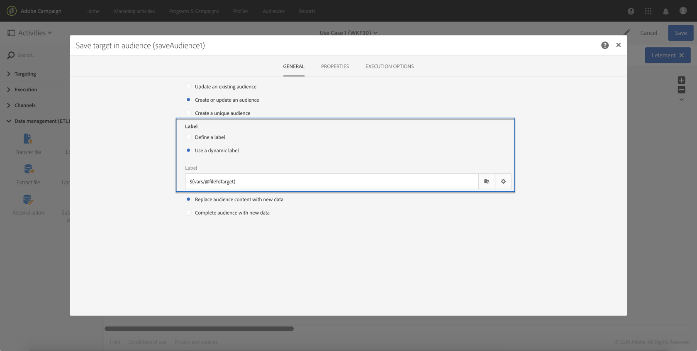

# ユースケース {#use-case}

以下のユースケースに、ワークフロー内のパラメーターを使用して workflow を呼び出す方法を示します。

目的は、外部パラメーターを使用して、API 呼び出しからワークフローをトリガーすることです。 このワークフローでは、ファイルからデータベースにデータを読み込み、関連するオーディエンスを作成します。 オーディエンスが作成されると、2 つ目のワークフローがトリガーされ、API 呼び出しで定義された外部パラメーターを使用してパーソナライズされたメッセージを送信します。

このユースケースを実行するには、以下のアクションを実行する必要があります。

1. 外部パラメーターを使用して、ワークフロー 1 をトリガーにする **API 呼び出しを実行**。 [&#x200B; 手順 1:API 呼び出しの設定 &#x200B;](../../automating/using/use-case-calling-workflow.md#step-1--configuring-the-api-call) を参照してください。
1. **ビルドワークフロー 1**：ワークフローでファイルが転送され、データベースに読み込まれます。 次に、データが空かどうかをテストし、最終的にプロファイルをオーディエンスに保存します。 最後に、ワークフロー 2 がトリガーされます。 [&#x200B; 手順 2：ワークフローの設定 1](../../automating/using/use-case-calling-workflow.md#step-2--configuring-workflow-1) を参照してください。
1. **ビルドワークフロー 2**：ワークフローは、ワークフロー 1 で作成されたオーディエンスを読み取り、パラメーターでカスタマイズされたセグメントコードを使用して、パーソナライズされたメッセージをプロファイルに送信します。 [&#x200B; 手順 3：ワークフローの設定 2](../../automating/using/use-case-calling-workflow.md#step-3--configuring-workflow-2) を参照してください。


## 前提条件 {#prerequisites}

ワークフローを設定する前に、ワークフロー 1 とワークフロー 2 のそれぞれに **[!UICONTROL External signal]** アクティビティを作成する必要があります。 これにより、ワークフローを呼び出す際に、これらのシグナルアクティビティをターゲットにすることができます。

## 手順 1:API 呼び出しの設定 {#step-1--configuring-the-api-call}

パラメーターを使用して、トリガーワークフロー 1 への API 呼び出しを行います。 API 呼び出しの構文について詳しくは、[Campaign Standard REST API ドキュメント &#x200B;](../../api/using/triggering-a-signal-activity.md) を参照してください。

この例では、以下のパラメーターを指定してワークフローを呼び出します。

* **fileToTarget**：データベースに読み込むファイルの名前。
* **discountDesc**：割引の配信に表示する説明。

```
-X POST https://mc.adobe.io/<ORGANIZATION>/campaign/<TRIGGER_URL>
-H 'Authorization: Bearer <ACCESS_TOKEN>' 
-H 'Cache-Control: no-cache' 
-H 'X-Api-Key: <API_KEY>' 
-H 'Content-Type: application/json;charset=utf-8' 
-H 'Content-Length:79' 
-i
-d {
-d "source:":"API",
-d "parameters":{
-d "fileToTarget":"profile.txt",
-d "discountDesc":"Running shoes"
-d } 
```

## 手順 2：ワークフローの設定 1 {#step-2--configuring-workflow-1}

ワークフロー 1 は以下のように構築されます。

* **[!UICONTROL External signal]** アクティビティ：ワークフロー内で使用するために、外部パラメーターを宣言する必要がある場所。
* **[!UICONTROL Transfer file]** クティビティ：パラメーターで定義された名前を持つファイルをインポートします。
* **[!UICONTROL Load file]** アクティビティ：読み込んだファイルからデータベースにデータを読み込みます。
* **[!UICONTROL Update data]** アクティビティ：読み込んだファイルのデータを使用して、データベースを挿入または更新します。
* **[!UICONTROL Test]** activity: インポートされたデータがあるかどうかを確認します。
* **[!UICONTROL Save audience]** クティビティ：ファイルにデータが含まれている場合、はプロファイルをオーディエンスに保存します。
* アクティビティの **[!UICONTROL End activity]**：使用するパラメーターを指定してワークフロー 2 を呼び出します。


ワークフローを設定するには、次の手順に従います。

1. API 呼び出しで定義されているパラメーターを宣言します。 それには、**[!UICONTROL External signal]** アクティビティを開き、パラメーターの名前とタイプを追加します。

   

1. データをデータベースにインポートするための **[!UICONTROL Transfer file]** アクティビティを追加します。それには、アクティビティをドラッグ&amp;ドロップして開き、「**[!UICONTROL Protocol]**」タブを選択します。
1. **[!UICONTROL Use a dynamic file path]** オプションを選択し、**fileToTarget** パラメーターを転送するファイルとして使用します。

   ```
   $(vars/@fileToTarget)
   ```

   

1. ファイルからデータベースにデータを読み込みます。

   これを行うには、**[!UICONTROL Load file]** アクティビティをワークフローにドラッグ&amp;ドロップしたあと、必要に応じて設定します。

1. 読み込んだファイルのデータでデータベースを挿入して更新します。

   これを行うには、**[!UICONTROL Update data]** アクティビティをドラッグ&amp;ドロップしたあと、「**[!UICONTROL Identification]**」タブを選択して紐付け条件（この場合は **メール** フィールド）を追加します。

   

1. 「**[!UICONTROL Fields to update]**」タブを選択し、データベースで更新するフィールド（この場合は **firstname** および **email** フィールド）を指定します。

   

1. データがファイルから取得されたかどうかを確認します。 これを行うには、**[!UICONTROL Test]** アクティビティをワークフローにドラッグ&amp;ドロップしたあと、「**[!UICONTROL Add an element]**」ボタンをクリックして条件を追加します。
1. 条件に名前を付けて定義します。 この例では、アウトバウンドトランジションに次の構文を含むデータが含まれているかどうかをテストします。

   ```
   $long(vars/@recCount)>0
   ```

   

1. データを取得したら、オーディエンスに保存します。 これを行うには、「**[!UICONTROL Save audience]**」アクティビティを **Target not empty** トランジションに追加し、そのトランジションを開きます。
1. 「**[!UICONTROL Use a dynamic label]**」オプションを選択し、「**fileToTarget**」パラメーターをオーディエンスのラベルとして使用します。

   ```
   $(vars/@fileToTarget)
   ```

   

1. パラメーターを使用してワークフロー 2 を呼び出す **[!UICONTROL End]** アクティビティをドラッグ&amp;ドロップしてから開きます。
1. 「**[!UICONTROL External signal]**」タブを選択し、トリガーにするワークフローと関連するシグナルアクティビティを指定します。
1. ワークフロー 2 内で使用するパラメーターと、それらに関連する値を定義します。

   この場合、API 呼び出しで最初に定義されたパラメーター（**fileToTarget** および **discountDesc**）と、定数値を持つ追加の **segmentCode** パラメーター（「20% 割引」）を渡します。

   

ワークフロー 1 が設定され、ワークフロー 2 を作成できるようになりました。 詳しくは、[この節](../../automating/using/use-case-calling-workflow.md#step-3--configuring-workflow-2)を参照してください。

## 手順 3：ワークフローの設定 2 {#step-3--configuring-workflow-2}

ワークフロー 2 は以下のように構築されます。

* **[!UICONTROL External signal]** アクティビティ：ワークフロー内で使用するために、パラメーターを宣言する必要がある場所。
* **[!UICONTROL Read audience]** クティビティ：ワークフロー 1 に保存されたオーディエンスを読み取ります。
* **[!UICONTROL Email delivery]** クティビティ：パラメーターを使用してパーソナライズされた、ターゲットオーディエンスに繰り返しメッセージを送信します。


ワークフローを設定するには、次の手順に従います。

1. ワークフロー 1 で定義したパラメーターを宣言します。

   それには、**[!UICONTROL External signal]** アクティビティを開き、ワークフロー 1 の **[!UICONTROL End]** アクティビティで定義された各パラメーターの名前とタイプを追加します。

   

1. ワークフロー 1 で保存したオーディエンスを使用します。 これを行うには、**[!UICONTROL Read audience]** アクティビティをワークフローにドラッグ&amp;ドロップしてから開きます。
1. 「**[!UICONTROL Use a dynamic audience]**」オプションを選択し、読み取るオーディエンスの名前として **fileToTarget** パラメーターを使用します。

   ```
   $(vars/@fileToTarget)
   ```

   

1. **segmentCode** パラメーターに従ってアウトバウンドトランジションに名前を付けます。

   これを行うには、「**[!UICONTROL Transition]**」タブを選択し、次に「**[!UICONTROL Use a dynamic segment code]**」オプションを選択します。

1. アウトバウンドトランジションの名前として **segmentCode** パラメーターを使用します。

   ```
   $(vars/@segmentCode)
   ```

   

1. **[!UICONTROL Email delivery]** アクティビティをドラッグ&amp;ドロップして、メッセージをオーディエンスに送信します。
1. **discountDesc** パラメーターを使用してメッセージをパーソナライズするために、メッセージで使用するパラメーターを特定します。 それには、アクティビティの詳細オプションを開き、パラメーターの名前と値を追加します。

   

1. これで、メッセージを設定できます。 アクティビティを開き、「**[!UICONTROL Recurring email]**」を選択します。

   

1. 使用するテンプレートを選択し、必要に応じてメールプロパティを定義します。
1. **discountDesc** パラメーターをパーソナライゼーションフィールドとして使用します。 これを行うには、パーソナライゼーションフィールド リストから選択します。

   

1. これでメッセージの設定を完了し、通常どおり送信できます。

   

## ワークフローの実行 {#executing-the-workflows}

ワークフローが作成されたら、実行できます。 API 呼び出しを実行する前に、2 つのワークフローが開始されていることを確認します。
