# ユースケース {#use-case}

以下のユースケースは、ワークフロー内のパラメーターを使用してワークフローを呼び出す方法を示しています。

目的は、外部パラメーターを使用してAPI呼び出しからワークフローをトリガーすることです。 このワークフローは、ファイルからデータベースにデータを読み込み、関連するオーディエンスを作成します。 オーディエンスを作成すると、2つ目のワークフローがトリガーされ、API呼び出しで定義された外部パラメーターを使用してパーソナライズされたメッセージが送信されます。

このユースケースを実行するには、次のアクションを実行する必要があります。

1. **外部パラメーターを使用して、トリガーワークフロー1へのAPI呼び出し**&#x200B;を行います。 [手順1: API呼び出しの設定](../../automating/using/use-case-calling-workflow.md#step-1--configuring-the-api-call)を参照してください。
1. **ワークフローを作成1**: ワークフローはファイルを転送し、データベースに読み込みます。 その後、データが空かどうかをテストし、最終的にプロファイルをオーディエンスに保存します。 最後に、ワークフロー2がトリガーされます。 [手順2：ワークフローの設定1](../../automating/using/use-case-calling-workflow.md#step-2--configuring-workflow-1)を参照してください。
1. **ワークフローを作成2**: ワークフローは、ワークフロー1で作成されたオーディエンスを読み取り、パーソナライズされたメッセージをパラメーターでカスタマイズされたセグメント コードを使用してプロファイルに送信します。 [手順3：ワークフローの設定2](../../automating/using/use-case-calling-workflow.md#step-3--configuring-workflow-2)を参照してください。

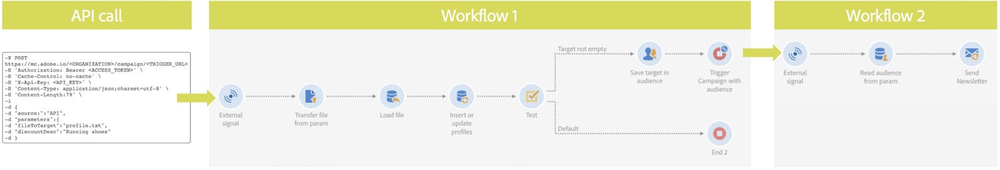

## 前提条件 {#prerequisites}

ワークフローを設定する前に、ワークフロー1と2を作成し、それぞれに&#x200B;**[!UICONTROL External signal]** アクティビティを設定する必要があります。 これにより、ワークフローの呼び出し時に、これらのシグナルアクティビティをターゲットにすることができます。

## 手順1:API呼び出しの設定 {#step-1--configuring-the-api-call}

パラメーターを使用して、トリガーワークフロー1へのAPI呼び出しを行います。 API呼び出し構文について詳しくは、[Campaign Standard REST API ドキュメント ](../../api/using/triggering-a-signal-activity.md)を参照してください。

この場合、ワークフローを次のパラメーターで呼び出します。

* **fileToTarget**: データベースにインポートするファイルの名前。
* **discountDesc**：割引の配達に表示する説明。

```
-X POST https://mc.adobe.io/<ORGANIZATION>/campaign/<TRIGGER_URL>
-H 'Authorization: Bearer <ACCESS_TOKEN>' 
-H 'Cache-Control: no-cache' 
-H 'X-Api-Key: <API_KEY>' 
-H 'Content-Type: application/json;charset=utf-8' 
-H 'Content-Length:79' 
-i
-d {
-d "source:":"API",
-d "parameters":{
-d "fileToTarget":"profile.txt",
-d "discountDesc":"Running shoes"
-d } 
```

## 手順2：ワークフローの設定1 {#step-2--configuring-workflow-1}

ワークフロー1は次のように構築されます。

* **[!UICONTROL External signal]** アクティビティ：ワークフロー内で使用するには、外部パラメーターを宣言する必要があります。
* **[!UICONTROL Transfer file]** アクティビティ：パラメーターで定義された名前のファイルを読み込みます。
* **[!UICONTROL Load file]** アクティビティ：読み込まれたファイルからデータベースにデータを読み込みます。
* **[!UICONTROL Update data]** アクティビティ：読み込まれたファイルのデータを使用して、データベースを挿入または更新します。
* **[!UICONTROL Test]** アクティビティ：データがインポートされているかどうかを確認します。
* **[!UICONTROL Save audience]** アクティビティ：ファイルにデータが含まれている場合、プロファイルをオーディエンスに保存します。
* **[!UICONTROL End activity]** アクティビティ：ワークフロー2内で使用するパラメーターを使用して、ワークフロー2を呼び出します。

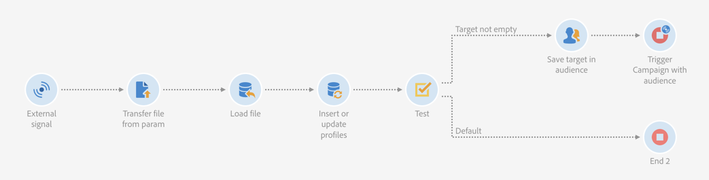

ワークフローを設定するには、次の手順に従います。

1. API呼び出しで定義されたパラメーターを宣言します。 これを行うには、**[!UICONTROL External signal]** アクティビティを開き、パラメーターの名前とタイプを追加します。

   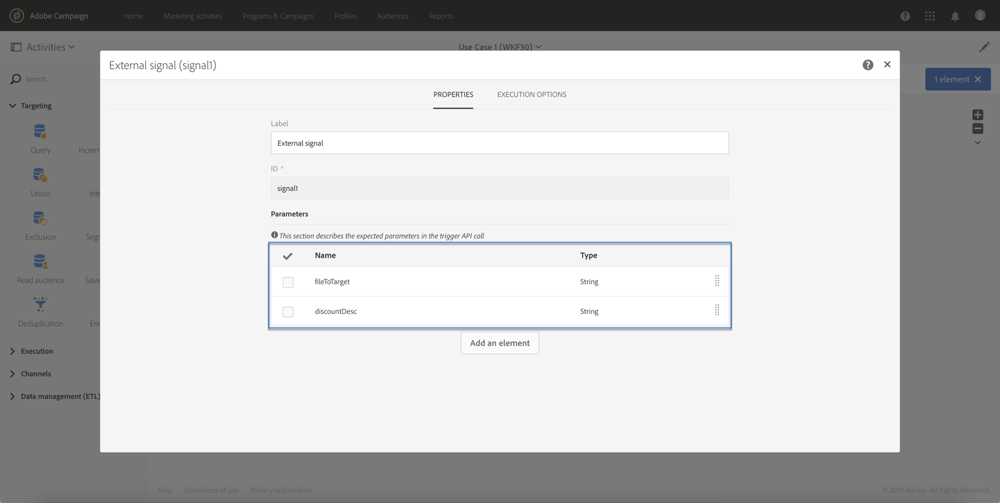

1. データをデータベースにインポートする&#x200B;**[!UICONTROL Transfer file]** アクティビティを追加します。これを行うには、アクティビティをドラッグ&amp;ドロップして開き、「**[!UICONTROL Protocol]**」タブを選択します。
1. **[!UICONTROL Use a dynamic file path]** オプションを選択し、**fileToTarget** パラメーターを転送するファイルとして使用します。

   ```
   $(vars/@fileToTarget)
   ```

   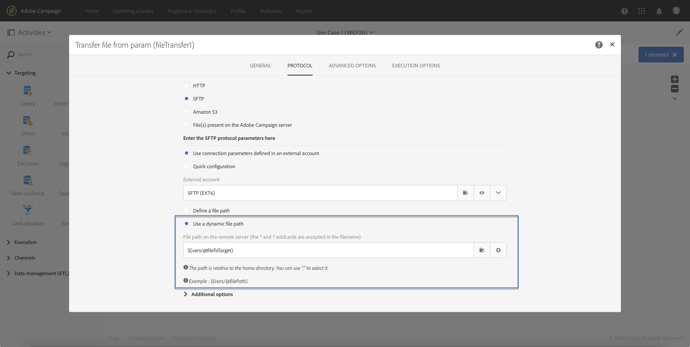

1. ファイルからデータベースにデータをロードします。

   これを行うには、**[!UICONTROL Load file]** アクティビティをワークフローにドラッグ&amp;ドロップし、必要に応じて設定します。

1. インポートしたファイルのデータをデータベースに挿入して更新します。

   これを行うには、**[!UICONTROL Update data]** アクティビティをドラッグ&amp;ドロップし、**[!UICONTROL Identification]** タブを選択して紐付け条件を追加します（この場合は&#x200B;**電子メール** フィールド）。

   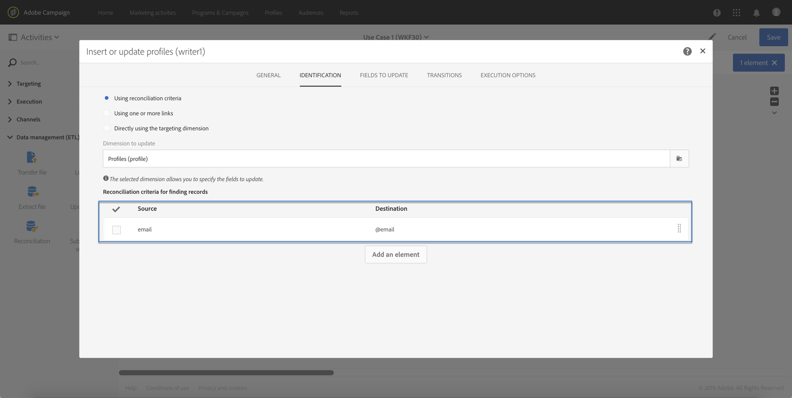

1. 「**[!UICONTROL Fields to update]**」タブを選択し、データベースで更新するフィールドを指定します（この場合は&#x200B;**firstname**&#x200B;および&#x200B;**email** フィールド）。

   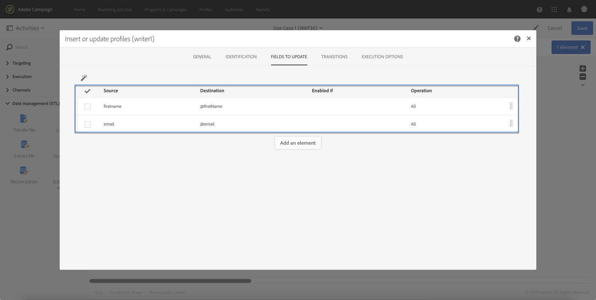

1. ファイルからデータを取得したかどうかを確認します。 これを行うには、**[!UICONTROL Test]** アクティビティをワークフローにドラッグ&amp;ドロップし、**[!UICONTROL Add an element]** ボタンをクリックして条件を追加します。
1. 条件に名前を付けて定義します。 この場合、アウトバウンドトランジションに次の構文のデータが含まれているかどうかをテストします。

   ```
   $long(vars/@recCount)>0
   ```

   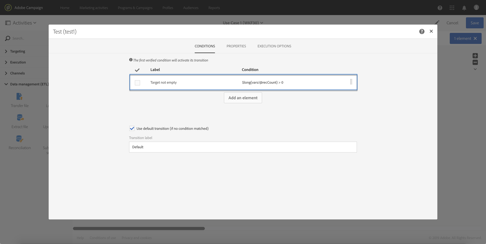

1. データが取得された場合は、オーディエンスに保存します。 これを行うには、**[!UICONTROL Save audience]** アクティビティを&#x200B;**ターゲットが空でない**&#x200B;移行に追加してから開きます。
1. **[!UICONTROL Use a dynamic label]** オプションを選択し、**fileToTarget** パラメーターをオーディエンスのラベルとして使用します。

   ```
   $(vars/@fileToTarget)
   ```

   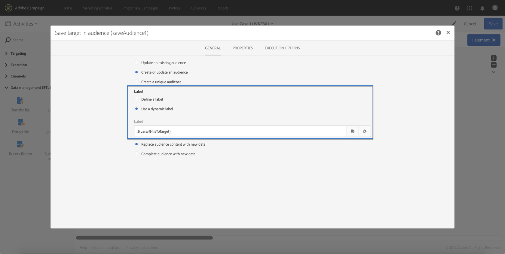

1. パラメーターを使用してワークフロー2を呼び出す&#x200B;**[!UICONTROL End]** アクティビティをドラッグ&amp;ドロップし、開きます。
1. 「**[!UICONTROL External signal]**」タブを選択し、トリガーするワークフローと関連するシグナルアクティビティを指定します。
1. ワークフロー2内で使用するパラメーターとその関連値を定義します。

   この場合、最初にAPI呼び出しで定義されたパラメーター（**fileToTarget**&#x200B;および&#x200B;**discountDesc**）と、定数値（「20%割引」）を持つ追加の&#x200B;**segmentCode** パラメーターを渡す必要があります。

   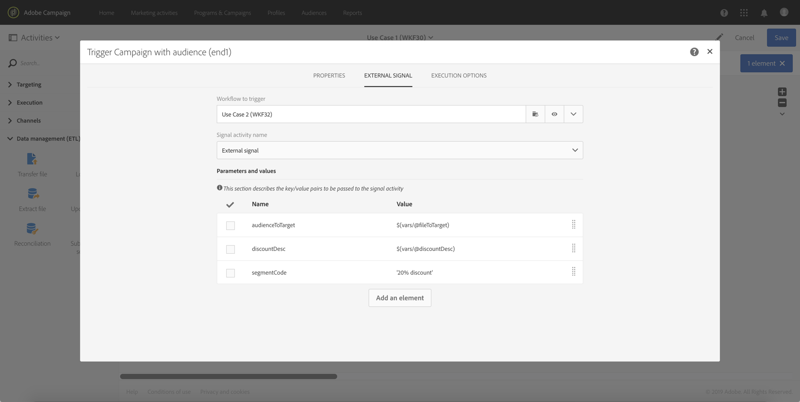

ワークフロー1が設定され、ワークフロー2を構築できるようになりました。 詳しくは、[この節](../../automating/using/use-case-calling-workflow.md#step-3--configuring-workflow-2)を参照してください。

## 手順3：ワークフローの設定2 {#step-3--configuring-workflow-2}

ワークフロー2は次のように構築されます。

* **[!UICONTROL External signal]** アクティビティ：ワークフロー内で使用するには、パラメーターを宣言する必要があります。
* **[!UICONTROL Read audience]** アクティビティ：ワークフロー1に保存されたオーディエンスを読み取ります。
* **[!UICONTROL Email delivery]** アクティビティ：パラメーターでパーソナライズされた、定期的なメッセージをターゲットオーディエンスに送信します。

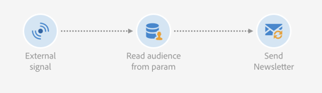

ワークフローを設定するには、次の手順に従います。

1. ワークフロー1で定義されたパラメーターを宣言します。

   これを行うには、**[!UICONTROL External signal]** アクティビティを開き、ワークフロー1の&#x200B;**[!UICONTROL End]** アクティビティで定義されている各パラメーターの名前とタイプを追加します。

   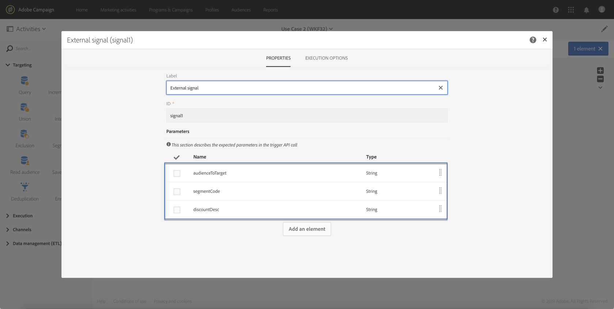

1. ワークフロー1に保存されたオーディエンスを使用します。 これを行うには、**[!UICONTROL Read audience]** アクティビティをワークフローにドラッグ&amp;ドロップしてから開きます。
1. **[!UICONTROL Use a dynamic audience]** オプションを選択し、**fileToTarget** パラメーターを読み取るオーディエンスの名前として使用します。

   ```
   $(vars/@fileToTarget)
   ```

   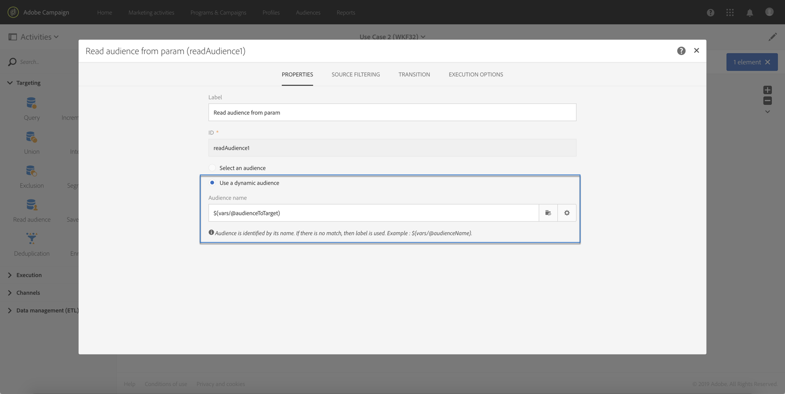

1. **segmentCode** パラメーターに従って、アウトバウンドトランジションに名前を付けます。

   これをおこなうには、「**[!UICONTROL Transition]**」タブを選択し、「**[!UICONTROL Use a dynamic segment code]**」オプションを選択します。

1. アウトバウンドトランジションの名前として&#x200B;**segmentCode** パラメーターを使用します。

   ```
   $(vars/@segmentCode)
   ```

   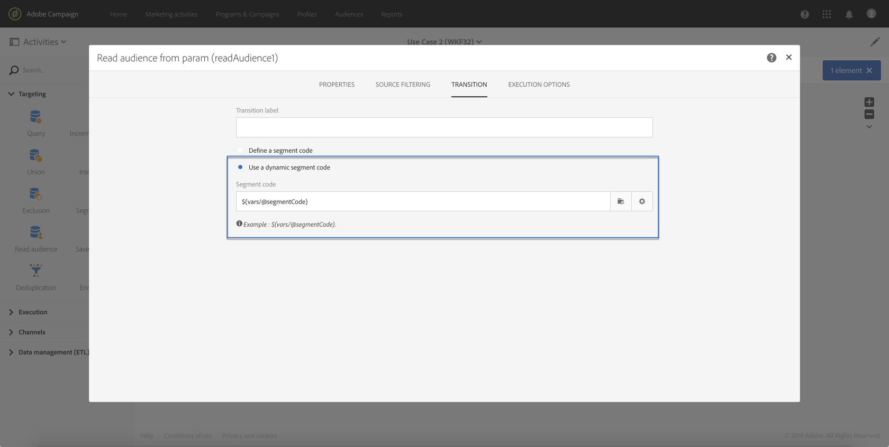

1. **[!UICONTROL Email delivery]** アクティビティをドラッグ&amp;ドロップして、オーディエンスにメッセージを送信します。
1. メッセージで使用するパラメーターを特定して、**discountDesc** パラメーターでパーソナライズします。 これを行うには、アクティビティの詳細オプションを開き、パラメーター名と値を追加します。

   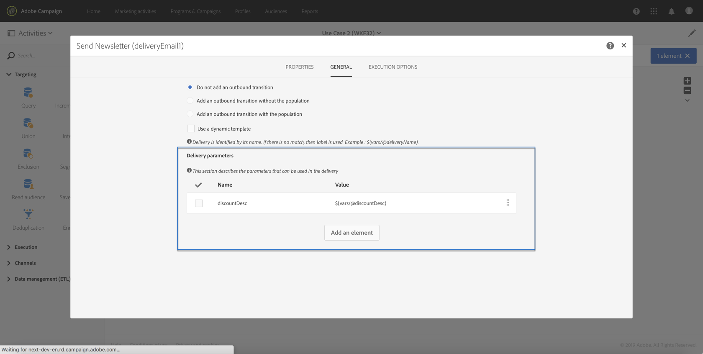

1. メッセージを設定できるようになりました。 アクティビティを開き、**[!UICONTROL Recurring email]**&#x200B;を選択します。

   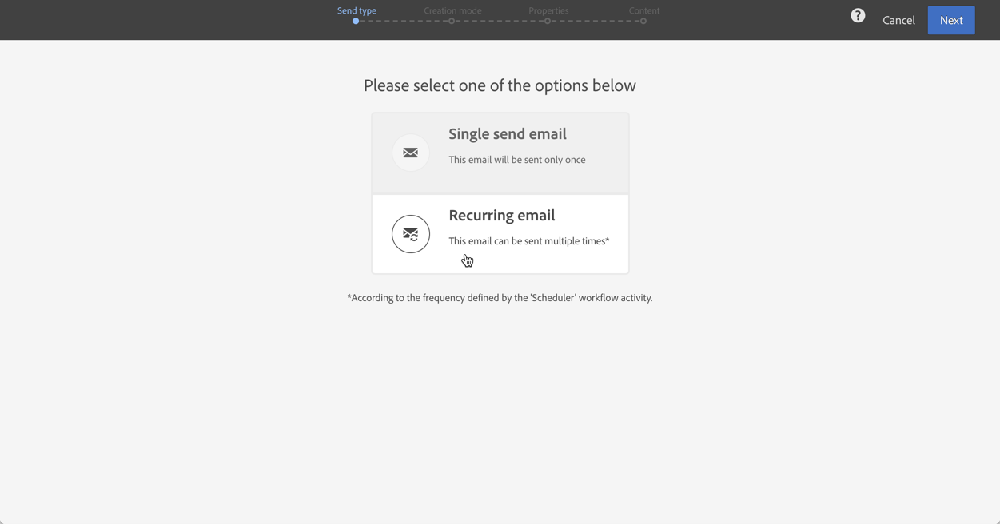

1. 使用するテンプレートを選択し、ニーズに応じてメールプロパティを定義します。
1. **discountDesc** パラメーターをパーソナライゼーションフィールドとして使用します。 これを行うには、パーソナライゼーションフィールドリストから選択します。

   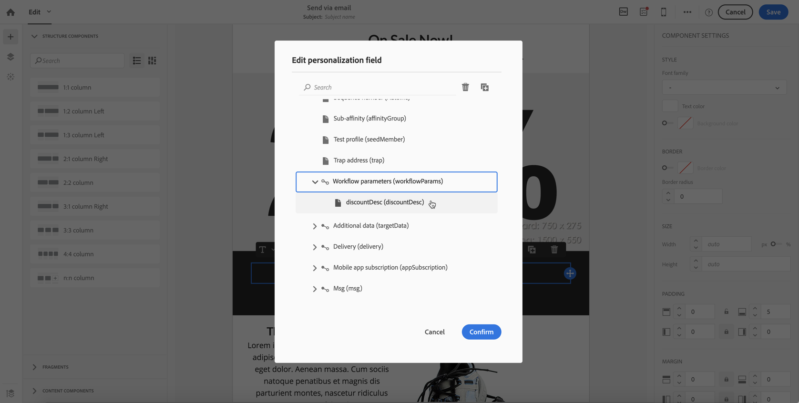

1. メッセージの設定を完了し、通常どおりに送信できるようになりました。

   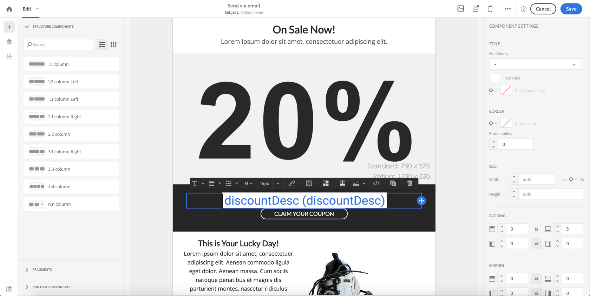

## ワークフローの実行 {#executing-the-workflows}

ワークフローを構築したら、実行できます。 API呼び出しを実行する前に、2つのワークフローが開始されていることを確認します。
