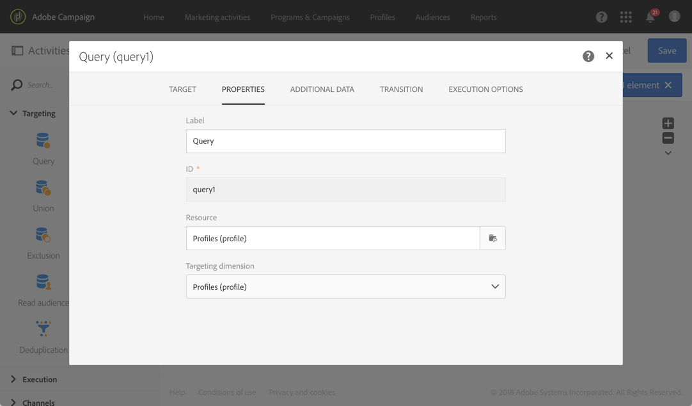

# ターゲティングディメンションとは異なるリソースの使用 {#using-resources-different-from-targeting-dimensions}

この使用例では、ターゲティングディメンションとは異なるリソースを使用して、例えば、距離テーブル内の特定のレコードを検索する方法を示します。

ターゲティングディメンションとリソースについて詳しくは、 [この節](../../automating/using/query.md#targeting-dimensions-and-resources)

**例 1：配信が「お帰りなさい」というラベルでターゲットするプロファイルの識別**。

* この場合、プロファイルをターゲットします。ターゲティングディメンションを **[!UICONTROL Profiles (profile)]** に設定します。
* 配信のラベルに従って、選択したプロファイルをフィルターします。したがって、リソースを **[!UICONTROL Delivery logs]** に設定します。フィルタリングを配信ログテーブルで直接おこなうことで、パフォーマンスが向上します。

**例 2：配信が「お帰りなさい」というラベルでターゲットしなかったプロファイルの識別**

前の例では、ターゲティングディメンションとは異なるリソースを使用しました。この操作は、距離テーブル（この例では配信ログ）に&#x200B;**存在する**&#x200B;レコードを検索する場合にのみ実行できます。

距離テーブルに&#x200B;**存在しない**&#x200B;レコード（特定の配信がターゲットしなかったプロファイルなど）を検索する場合は、距離テーブル（配信ログ）にレコードが存在しないので、同じリソースとターゲティングディメンションを使用する必要があります。

* この場合、プロファイルをターゲットします。ターゲティングディメンションを **[!UICONTROL Profiles (profile)]** に設定します。
* 配信のラベルに従って、選択したプロファイルをフィルターします。配信ログテーブルに存在しないレコードを検索するので、配信ログを直接フィルターすることはできません。したがって、リソースを **[!UICONTROL Profile (profile)]** に設定し、プロファイルテーブルでクエリを作成します。

