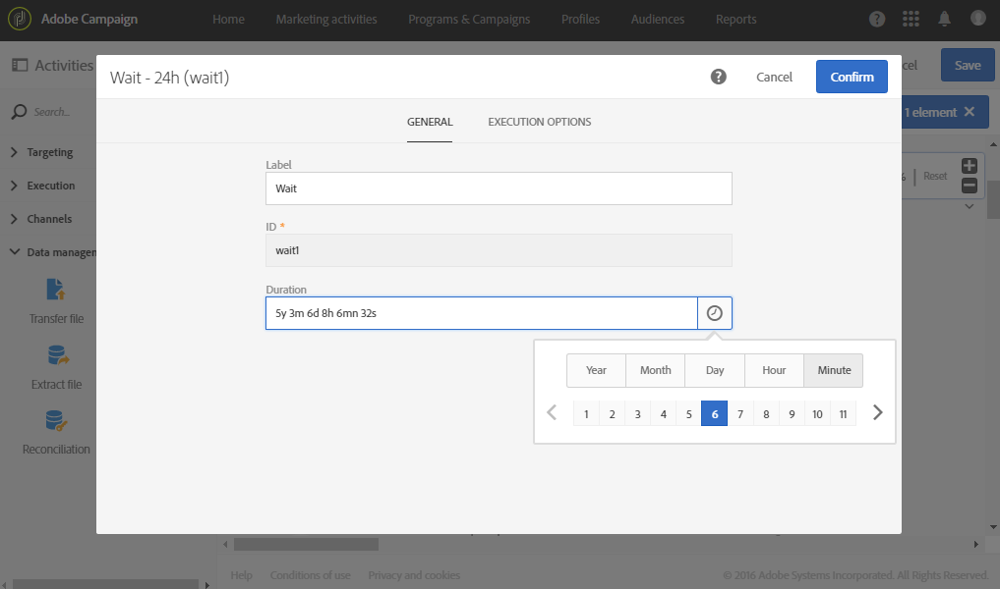

# 待機{#wait}

## 説明 {#description}

「**[!UICONTROL Wait]**」アクティビティは、ワークフローの一部の実行を一時的に中断します。数秒から数ヶ月の遅延の後に、アウトバウンドトランジションがアクティブになり、その後、指定されたアクティビティが実行されます。

## 使用状況 {#context-of-use}

「**[!UICONTROL Wait]**」アクティビティは、実行する 2 つのアクティビティ間に一定の時間間隔を設定するために使用します。例えば、E メール配信アクティビティを実行したあと数日間待機し、この期間中に発生した開封数とクリック数を分析してから、フォローアップ操作（リマインダー E メール、オーディエンスの作成など）を実行します。

## 設定 {#configuration}

1. ワークフローに「**[!UICONTROL Wait]**」アクティビティをドラッグ＆ドロップします。
1. アクティビティを選択し、表示されるクイックアクションの  ボタンを使用して開きます。
1. アクティビティのインバウンドトランジションからアウトバウンドトランジションがアクティブ化されるまでの待機時間（**[!UICONTROL Duration]**）を指定します。

   この期間は手動で入力するか、フィールド内のセレクターを使用して入力できます。

   

1. アクティビティの設定を確認し、ワークフローを保存します。

## 例 {#example}

以下に、「**[!UICONTROL Wait]**」アクティビティの一般的なユースケースを示します。イベントへの招待メールを送信します。送信後 24 時間が経過すると、E メール配信ログが分析され、最初の E メールを受信したものの登録しなかった人に対してリマインダー E メールが送信されます。

ワークフローは次のとおりです。

* 最初の「**[!UICONTROL Query]**」アクティビティでは、招待メールを送信するプロファイルのターゲティングをおこないます。
* 「**[!UICONTROL Email delivery]**」では、選択したプロファイルに対して最初の招待メールを送信します。
* 24 時間の「**[!UICONTROL Wait]**」アクティビティにより、招待メールが送信された後、その他のワークフローを実行するまで一定の時間を空けます。
* 2 つ目の「**[!UICONTROL Query]**」では、最初の E メールを受信したものの記載されているサブスクリプションリンクをクリックしなかったプロファイルをターゲットに指定します。
* 2 つ目の「**[!UICONTROL Email delivery]**」では、選択したオーディエンスにリマインダー E メールを送信します。

