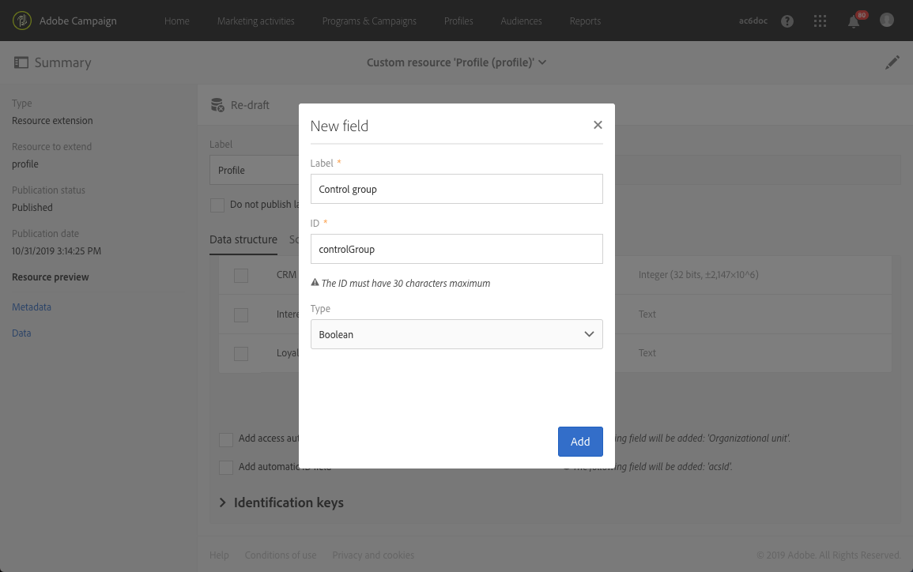

# ワークフローの使用例：コントロールグループの作成 {#building-control-group}

配信の影響を測定するには、特定のメッセージを受け取らないように、一部のプロファイルをターゲットから除外する必要がある場合があります。 この制御グループは、メッセージを受け取ったターゲット母集団の行動と比較するために使用できます。

Adobe Campaign Standardでこれを行うには、次のアクティビティを含むワークフローを構築します。
* 特定の母集団をターゲットにするクエリーアクティビティ。
* この訪問者からランダムな制御グループを分離するセグメント化アクティビティ。
* メインターゲットにメッセージを送信する電子メール配信アクティビティ。
* ターゲットから除外されたプロファイル（ランダムコントロールグループ）を更新するUpdateデータアクティビティ。

## プロファイルリソースの拡張 {#extending-profile}

まず、コントロールグループに対応する新し **[!UICONTROL Profile]** いフィールドを使用して、リソースを拡張する必要があります。 ワークフローが実行されると、ターゲットから除外されたプロファイルに関して、このフィールドがチェックされます。

1. // **[!UICONTROL Administration]** から **[!UICONTROL Development]** をクリ **[!UICONTROL Custom Resources]**&#x200B;ックします **[!UICONTROL Create]**。
1. まだ拡張していない場合は、リソースを選択 **[!UICONTROL Extend an existing resource]** して選択し **[!UICONTROL Profile]** ます。
1. タブで、コ **[!UICONTROL Data structure]** ントロールグループに新しいフィールドを追加し、フィールド **[!UICONTROL Boolean]** を選択 **[!UICONTROL Type]** します。

   

1. タブから **[!UICONTROL Screen definition]** セクションを展 **[!UICONTROL Detail screen configuration]** 開し、作成したフィールドを選択して、各プロファイルに表示します。

   

1. 変更を保存します。
1. 拡張リソースを発行するには、データベース構造 **[!UICONTROL Profile]** を更新します。 詳しくは、カ [スタムリソースの公開を参照してくださ](../../developing/using/updating-the-database-structure.md#publishing-a-custom-resource)い。

カスタムリソースの拡張について詳しくは、「リソースを追 [加するための主要な手順」を参照してくださ](../../developing/using/key-steps-to-add-a-resource.md)い。

## ワークフローの作成 {#creating-a-workflow}

1. で、を **[!UICONTROL Marketing Activities]**&#x200B;クリックし **[!UICONTROL Create]** てを選択しま **[!UICONTROL Workflow]**&#x200B;す。
1. ワークフロー **[!UICONTROL New Workflow]** タイプとして選択し、をクリックしま **[!UICONTROL Next]**&#x200B;す。
1. ワークフローのプロパティを入力し、をクリックしま **[!UICONTROL Create]**&#x200B;す。

ワークフローを作成する詳細な手順は、「ワークフローの構築」セク [ションに記載され](../../automating/using/building-a-workflow.md) ます。

## クエリーアクティビティの作成 {#create-a-query-activity}

1. /で、 **[!UICONTROL Activities]** をドラ **[!UICONTROL Targeting]**&#x200B;ッグ&amp;ドロップしま **[!UICONTROL Query activity]**&#x200B;す。
1. アクティビティをダブルクリックして、ターゲットを定義します。
1. 例えば、で、ドラッ **[!UICONTROL Shortcuts]**&#x200B;グ&amp;ドロップし、演算子 **[!UICONTROL Profile]**&#x200B;を使 **[!UICONTROL Age]** 用して「25」 **[!UICONTROL Greater than]** と入力し **[!UICONTROL Value]** ます。
1. Click **[!UICONTROL Confirm]**.

Queryアクティビティを構築する詳細な手順は、「 [Query](../../automating/using/query.md) 」セクションに示します。

## セグメント化アクティビティの作成 {#creating-a-segmentation-activity}

1. アクティビティをドラッグ&amp;ド **[!UICONTROL Segmentation]** ロップし、ダブルクリックします。
1. タブで、編 **[!UICONTROL Segments]** 集するセグメントを選択します。
1. そのセグメ **[!UICONTROL Configuration]** ントのタブで、オプションを選択 **[!UICONTROL Limit the population of this segment]** します。

   

1. タブで、オ **[!UICONTROL Limitation]** プションが選択されている **[!UICONTROL Random sampling]** ことを確認します。

   

1. 初期母集団の割合を定義します（例：10%、クリック） **[!UICONTROL Confirm]**。 コントロールグループは、ターゲット母集団の10%で構成され、ランダムに選択されます。
1. タブで、オ **[!UICONTROL Advanced options]** プションを選択 **[!UICONTROL Generate complement]** し、フィールドとフィー **[!UICONTROL Transition label]** ルドに入 **[!UICONTROL Segment code]** 力します。

   

1. Click **[!UICONTROL Confirm]**.

セグメント化アクティビティを作成する詳細な手順については、「セグメント化  」の節を参照してください。

## 電子メールアクティビティの作成 {#creating-an-email-activity}

1. &gt;で、メ **[!UICONTROL Activities]** インの **[!UICONTROL Channels]**&#x200B;ターゲットセグメントの後に **[!UICONTROL Email Delivery]** ドラッグ&amp;ドロップします。
1. アクティビティをクリックし、編  集する場合に選択します。
1. を選択し、 **[!UICONTROL Single send email]** をクリックしま **[!UICONTROL Next]**&#x200B;す。
1. 電子メールテンプレートを選択し、をクリックしま **[!UICONTROL Next]**&#x200B;す。
1. 電子メールのプロパティを入力し、をクリックしま **[!UICONTROL Next]**&#x200B;す。
1. 電子メールのレイアウトを作成するには、[オン]をクリックしま **[!UICONTROL Use the Email Designer]**&#x200B;す。
1. コンテンツを編集して保存します。
1. メッセージダ **[!UICONTROL Schedule]** ッシュボードのセクションで、[!UICONTROL要求確認] **オプションの選択を解除します** 。

電子メールアクティビティを作成する詳細な手順は、「電子メール配信」セクション [に示され](../../automating/using/email-delivery.md) ます。

## Updateデータアクティビティの作成 {#creating-update-data-activity}

1. アクティビティをコントロールグル **[!UICONTROL Update data]** ープセグメントの後にドラッグ&amp;ドロップします。
1. アクティビティを選択し、表示されるクイックアクシ  ョンのボタンを使用して開きます。
1. タブで、 **[!UICONTROL General]** ドロップダ **[!UICONTROL Update]** ウンリ **[!UICONTROL Operation type]** ストから選択します。
1. In the **[!UICONTROL Identification]** tab, select the **[!UICONTROL Directly using the targeting dimension]** option.
1. 更新するデ **[!UICONTROL Profile]** ィメンションとして以前に拡張したリソースを選択します。

   

1. タブで、リ **[!UICONTROL Fields to update]** ソースに追加したコントロールグループフィールドをとし **[!UICONTROL Profile]** て選択し、条 **[!UICONTROL Destination]** 件としてtrueを入力します。

   

1. Click **[!UICONTROL Confirm]**.

Updateデータアクティビティを作成する詳細な手順は、「データを更新」セクション [に記載され](../../automating/using/update-data.md) ます。

## ワークフローの実行 {#running-the-workflow}

をクリック **[!UICONTROL Start]** して、ワークフローを実行します。

ワークフローが実行されると、制御グループの母集団は除外され、メッセージは残りのメインターゲットに送信されます。

リソー **[!UICONTROL Profile]** スは次のように更新されます。プロファイルがコントロールグループに含まれていた場合は、対応するフィールドがチェックされます。

メッセージから除外され、受信しなかった小さなグループと比較して、メッセージの受信者の反応を比較できるようになりました。

## 同じコントロールグループの再利用 {#reusing-same-control-group}

上の例では、グローバルコントロールグループを作成できます。これは、配信とは独立してプロファイル属性として保存されているためです。 実際に、リソース拡張の一部として作成された新しい「コントロールグループ」フィールドは、 **[!UICONTROL Profile]** 上記のワークフローの実行後に更新されます。

したがって、次回同じコントロールグループを使用する場合は、ランダムなセグメント化を行う代わりに、新しい「コントロールグループ」フィールドでセグメント化を行うことができます。

手順は次のとおりです。
1. アクティビティを作 **[!UICONTROL Segmentation]** 成する際に、タブで編集するセグメントを選択 **[!UICONTROL Segments]** します。
1. そのセグメ **[!UICONTROL Configuration]** ントのタブで、このオプションを選択しないようにし **[!UICONTROL Limit the population of this segment]** ます。
1. タブで、メ **[!UICONTROL Filtering]** インワークスペースにドラッ **[!UICONTROL Profiles (attributes)]** グ&amp;ドロップします。

   

1. ウィンドウ **[!UICONTROL Add a rule - Profiles (attributes)]** で、「Control group」（リソースに追加したフィールド）を選択し、 **[!UICONTROL Profile]** フィルター条 **[!UICONTROL Yes]** 件として選択します。

   