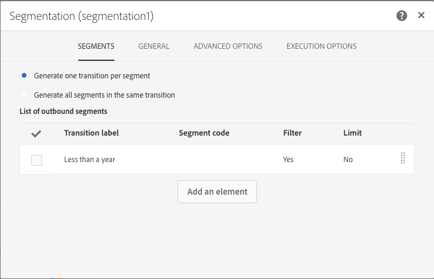

# 補集合を含む配信の作成 {#deliveries-with-complement}

顧客にメールを送信できます。1 年以内に作成されたクライアント用に 1 つ、1 年以上前に作成されたクライアント用に 1 つ。

1. 「**[!UICONTROL Marketing Activities]**」で、「**[!UICONTROL Create]**」をクリックして「**[!UICONTROL Workflow]**」を選択します。
1. ワークフローのタイプとして「**[!UICONTROL New Workflow]**」を選択し、「**[!UICONTROL Next]**」をクリックします。
1. ワークフローのプロパティを入力し、「**[!UICONTROL Create]**」をクリックします。

## クエリ アクティビティを作成します {#create-a-query-activity}

1. **[!UICONTROL Activities]**／**[!UICONTROL Targeting]** で、「[クエリ](../../automating/using/query.md)」アクティビティをドラッグ＆ドロップします。
1. アクティビティをダブルクリックします。
1. **[!UICONTROL Shortcuts]** で、**[!UICONTROL Profiles]** をドラッグ&amp;ドロップし、演算子 **[!UICONTROL email]** を使用して **[!UICONTROL is not empty]** を選択します。
1. **[!UICONTROL Shortcuts]** で、**[!UICONTROL Profiles]** をドラッグ&amp;ドロップし、値が **[!UICONTROL no longer contact by email]** の **[!UICONTROL no]** を選択します。
1. 「**[!UICONTROL Confirm]**」をクリックします。

## セグメント化アクティビティの作成 {#create-a-segmentation-activity}

1. **[!UICONTROL Activities]**/**[!UICONTROL Targeting]** で [ セグメント化 ](../../automating/using/segmentation.md) アクティビティをドラッグ&amp;ドロップし、ダブルクリックします。
1. セグメントの上にマウスポインターを置いて「」をクリックすると、今年データベースに追加された顧客をターゲットできます。
1. **[!UICONTROL Profiles]** をドラッグ&amp;ドロップし、フィルタータイプが **[!UICONTROL Created]** の **[!UICONTROL Relative]** を選択します。
1. **[!UICONTROL Level of precision]** を **[!UICONTROL Year]** に変更し、「**[!UICONTROL This year]**」を選択します。
1. 「**[!UICONTROL Confirm]**」を 2 回クリックします。
1. **[!UICONTROL Advanced Options]** で、「**[!UICONTROL Generate complement]**」をチェックして、残りの受信者をターゲットにしたセグメントを作成します。
1. 「**[!UICONTROL Confirm]**」をクリックします。
1. 「**[!UICONTROL Save]**」をクリックします。

>[!NOTE]
>
>ルールの構造を確認するには、「**[!UICONTROL Advanced Mode]**」をクリックします。

## メール配信の作成 {#create-an-email-delivery}

1. **[!UICONTROL Activities]**/**[!UICONTROL Channels]** で、[ メール配信 ](../../automating/using/email-delivery.md) アクティビティを各セグメントの後にドラッグ&amp;ドロップします。
1. アクティビティをクリックし、 を選択して編集します。
1. 「**[!UICONTROL Single send email]**」を選択し、「**[!UICONTROL Next]**」をクリックします。
1. メールテンプレートを選択し、「**[!UICONTROL Next]**」をクリックします。
1. メールのプロパティを入力し、「**[!UICONTROL Next]**」をクリックします。
1. メールのレイアウトを作成するには、「**[!UICONTROL Email Designer]**」をクリックします。
1. 要素を挿入するか、既存のテンプレートを選択します。
1. 各配信に固有のオファーを使用してメールをパーソナライズします。
1. 「**[!UICONTROL Preview]**」をクリックして、レイアウトを確認します。
1. 「**[!UICONTROL Save]**」をクリックします。

詳しくは、[メールのデザイン](../../designing/using/designing-from-scratch.md#designing-an-email-content-from-scratch)を参照してください。

