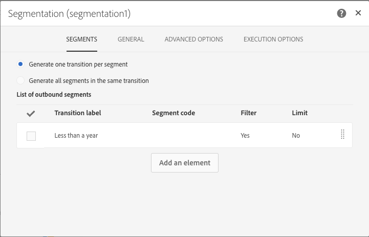

# 補集合を含む配信の作成 {#deliveries-with-complement}

お客様にメールを送信できます。1年以上前に作成された顧客向け、1年以上前に作成された顧客向け。

1. 「**[!UICONTROL Marketing Activities]**」で、「**[!UICONTROL Create]**」をクリックして「**[!UICONTROL Workflow]**」を選択します。
1. ワークフローのタイプとして「**[!UICONTROL New Workflow]**」を選択し、「**[!UICONTROL Next]**」をクリックします。
1. ワークフローのプロパティを入力し、「**[!UICONTROL Create]**」をクリックします。

## クエリアクティビティの作成 {#create-a-query-activity}

1. **[!UICONTROL Activities]**／**[!UICONTROL Targeting]** で、「[クエリ](../../automating/using/query.md)」アクティビティをドラッグ＆ドロップします。
1. アクティビティをダブルクリックします。
1. **[!UICONTROL Shortcuts]**&#x200B;で、**[!UICONTROL Profiles]**&#x200B;をドラッグ&amp;ドロップし、演算子&#x200B;**[!UICONTROL is not empty]**&#x200B;で&#x200B;**[!UICONTROL email]**&#x200B;を選択します。
1. **[!UICONTROL Shortcuts]**&#x200B;で、**[!UICONTROL Profiles]**&#x200B;をドラッグ&amp;ドロップし、値&#x200B;**[!UICONTROL no]**&#x200B;を持つ&#x200B;**[!UICONTROL no longer contact by email]**&#x200B;を選択します。
1. 「**[!UICONTROL Confirm]**」をクリックします。

## セグメント化アクティビティの作成 {#create-a-segmentation-activity}

1. **[!UICONTROL Activities]** > **[!UICONTROL Targeting]**&#x200B;で、[ セグメント化](../../automating/using/segmentation.md) アクティビティをドラッグ&amp;ドロップし、ダブルクリックします。
1. セグメントにカーソルを合わせ、をクリックすると、今年データベースに追加されたターゲット顧客に移動します。
1. **[!UICONTROL Profiles]**&#x200B;をドラッグ&amp;ドロップし、フィルタータイプ **[!UICONTROL Relative]**&#x200B;の&#x200B;**[!UICONTROL Created]**&#x200B;を選択します。
1. **[!UICONTROL Level of precision]**&#x200B;を&#x200B;**[!UICONTROL Year]**&#x200B;に変更し、**[!UICONTROL This year]**&#x200B;を選択します。
1. 「**[!UICONTROL Confirm]**」を 2 回クリックします。
1. **[!UICONTROL Advanced Options]**&#x200B;で、**[!UICONTROL Generate complement]**&#x200B;をチェックして、残りの受信者をターゲットとするセグメントを作成します。
1. 「**[!UICONTROL Confirm]**」をクリックします。
1. 「**[!UICONTROL Save]**」をクリックします。

>[!NOTE]
>
>ルールの構造を確認するには、**[!UICONTROL Advanced Mode]**&#x200B;をクリックします。

## メール配信の作成 {#create-an-email-delivery}

1. **[!UICONTROL Activities]** > **[!UICONTROL Channels]**&#x200B;で、各セグメントの後ろに[ メール配信](../../automating/using/email-delivery.md) アクティビティをドラッグ&amp;ドロップします。
1. アクティビティをクリックし、 を選択して編集します。
1. 「**[!UICONTROL Single send email]**」を選択し、「**[!UICONTROL Next]**」をクリックします。
1. メールテンプレートを選択し、「**[!UICONTROL Next]**」をクリックします。
1. メールのプロパティを入力し、「**[!UICONTROL Next]**」をクリックします。
1. メールのレイアウトを作成するには、「**[!UICONTROL Email Designer]**」をクリックします。
1. 要素を挿入するか、既存のテンプレートを選択します。
1. 各配信に特化したオファーでメールをパーソナライズします。
1. 「**[!UICONTROL Preview]**」をクリックして、レイアウトを確認します。
1. 「**[!UICONTROL Save]**」をクリックします。

詳しくは、[メールのデザイン](../../designing/using/designing-from-scratch.md#designing-an-email-content-from-scratch)を参照してください。

