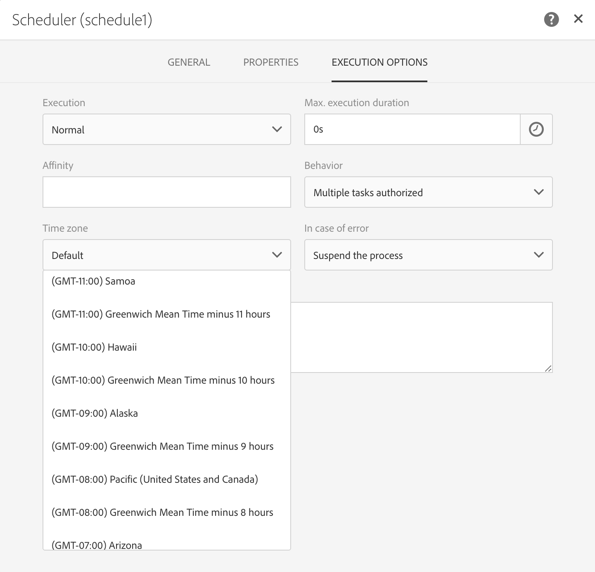
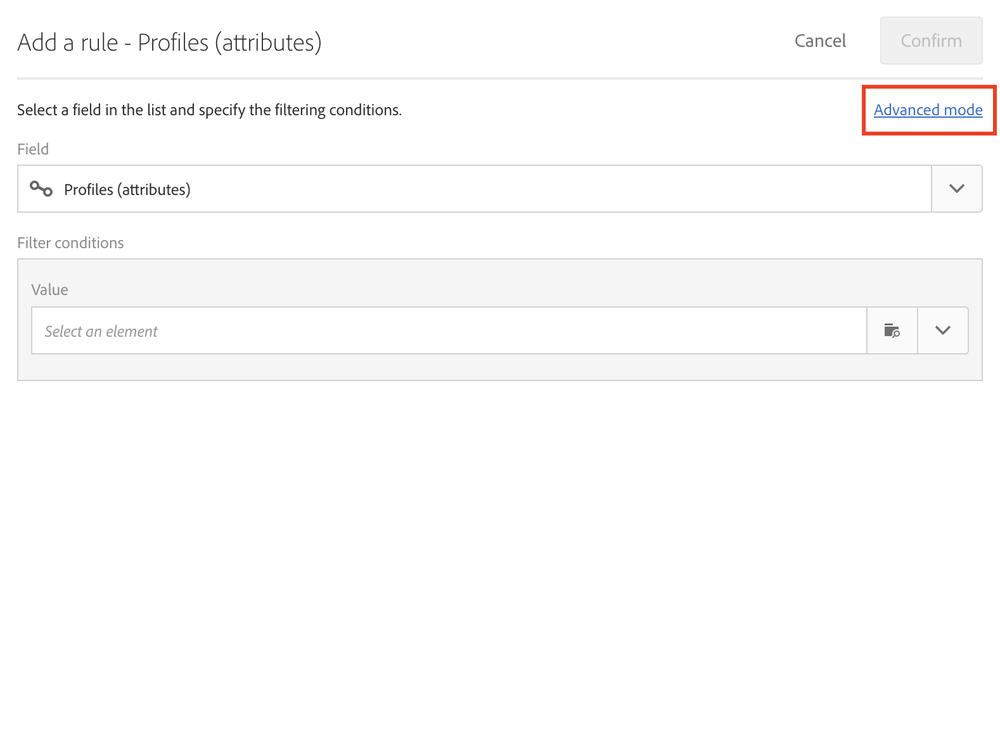
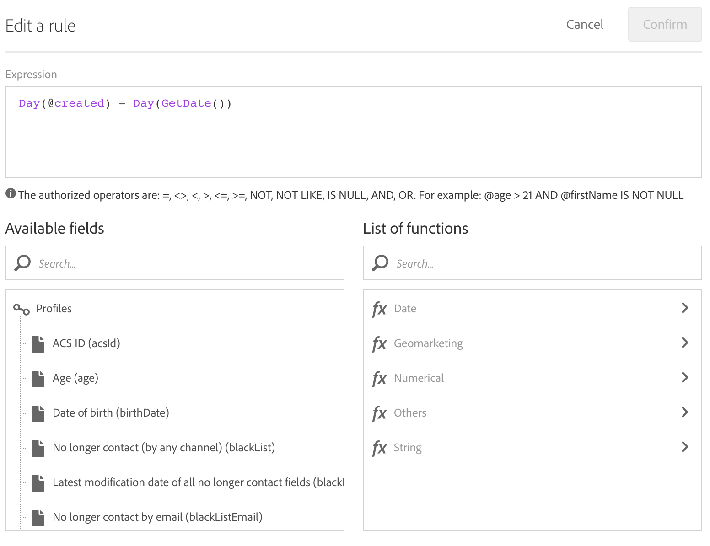
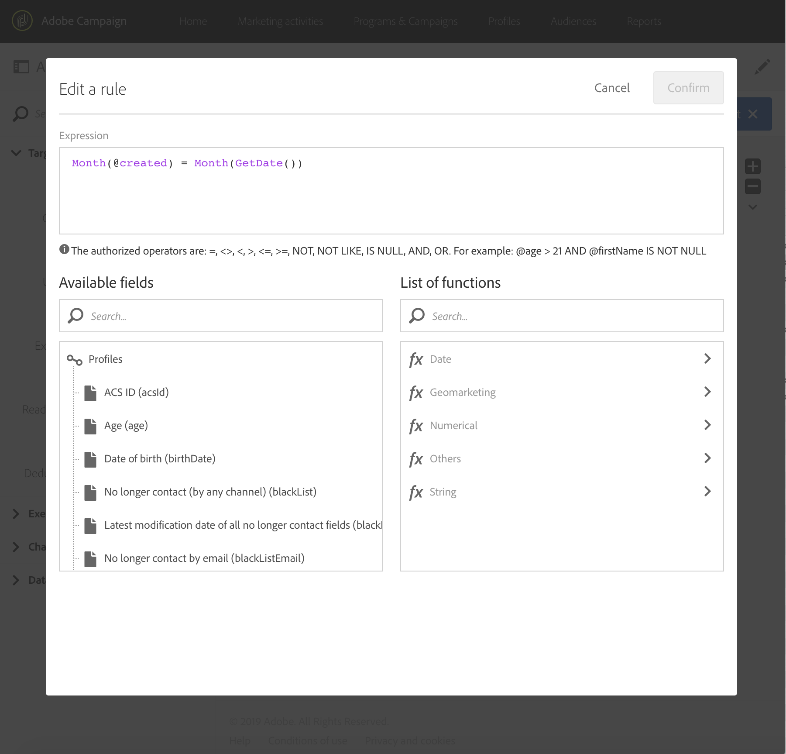
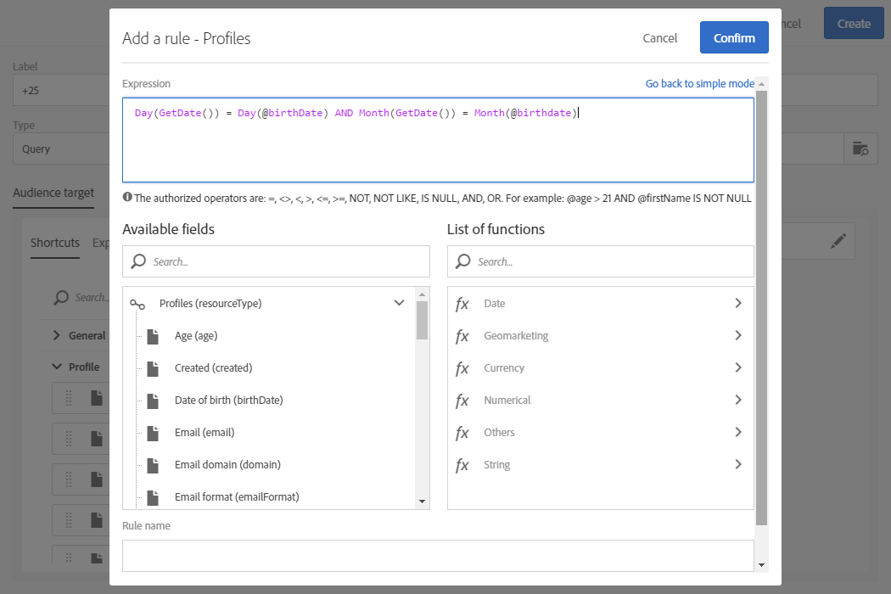

# プロファイルの作成日での配信作成 {#creation-date-query}

顧客のプロファイル作成の記念日にメールでオファーを送信できます。

1. 「**[!UICONTROL Marketing Activities]**」で、「**[!UICONTROL Create]**」をクリックして「**[!UICONTROL Workflow]**」を選択します。
1. ワークフローのタイプとして「**[!UICONTROL New Workflow]**」を選択し、「**[!UICONTROL Next]**」をクリックします。
1. ワークフローのプロパティを入力し、「**[!UICONTROL Create]**」をクリックします。

## スケジューラーアクティビティの作成 {#creating-a-scheduler-activity}

1. **[!UICONTROL Activities]** > **[!UICONTROL Execution]**&#x200B;で、[ スケジューラー](../../automating/using/scheduler.md) アクティビティをドラッグ&amp;ドロップします。
1. アクティビティをダブルクリックします。
1. 配信の実行を設定します。
1. 「**[!UICONTROL Execution frequency]**」で、「**[!UICONTROL Daily]**」を選択します。
1. ワークフローの実行の&#x200B;**[!UICONTROL Time]**&#x200B;と&#x200B;**[!UICONTROL Repetition frequency]**&#x200B;を選択します。
1. ワークフローの&#x200B;**[!UICONTROL Start]**&#x200B;日付と&#x200B;**[!UICONTROL Expiration]**&#x200B;を選択してください。
1. アクティビティを確認し、ワークフローを保存します。

>[!NOTE]
>
>ワークフローを特定のタイムゾーンで開始するには、**[!UICONTROL Execution options]** タブで、**[!UICONTROL Time zone]** フィールドでスケジューラーのタイムゾーンを設定します。 デフォルトで選択されるタイムゾーンは、ワークフローのプロパティで定義されたタイムゾーンです（[ワークフローの作成](../../automating/using/building-a-workflow.md)を参照）。

## クエリアクティビティの作成 {#creating-a-query-activity}

1. 受信者を選択するには、[ クエリ ](../../automating/using/query.md) アクティビティをドラッグ&amp;ドロップし、ダブルクリックします。
1. **[!UICONTROL Profiles]**&#x200B;を追加し、値&#x200B;**[!UICONTROL no]**&#x200B;を持つ&#x200B;**[!UICONTROL no longer contact by email]**&#x200B;を選択します。

### 実行日と同じ日に作成されたプロファイルの取得 {#retrieving-profiles-created-on-the-same-day}

1. **[!UICONTROL Profile]**&#x200B;で、**[!UICONTROL Created]** フィールドをドラッグ&amp;ドロップします。**[!UICONTROL Advanced Mode]**をクリックします。
   
1. **[!UICONTROL list of functions]**&#x200B;で、**[!UICONTROL Date]** ノードから&#x200B;**[!UICONTROL Day]**&#x200B;をダブルクリックします。
1. 次に、フィールド **[!UICONTROL Created]**&#x200B;を引数として挿入します。
1. 演算子として&#x200B;**[!UICONTROL equals to (=)]**&#x200B;を選択します。
1. 「値」で、**[!UICONTROL List of functions]**&#x200B;の&#x200B;**[!UICONTROL Date]** ノードから「**[!UICONTROL Day]**」を選択します。
1. 引数として&#x200B;**[!UICONTROL GetDate()]**&#x200B;関数を挿入します。

作成日が現在の日と等しいプロファイルを取得しました。

その結果、次のことが可能になります。

`Day(@created) = Day(GetDate())`

「**[!UICONTROL Confirm]**」をクリックします。

### 実行月と同じ月に作成されたプロファイルの取得{#retrieving-profiles-created-on-the-same-month}

1. **[!UICONTROL Query]** エディターで、最初のクエリを選択して複製します。
1. 複製を開きます。
1. クエリ内の&#x200B;**[!UICONTROL Day]**&#x200B;を&#x200B;**[!UICONTROL Month]**&#x200B;に置き換えます。
1. 「**[!UICONTROL Confirm]**」をクリックします。

その結果、次のことが可能になります。

`Month(@created) = Month(GetDate())`

最後のクエリは次のように表示されます。

`Day(@created) = Day(GetDate()) AND Month(@created) = Month(GetDate())`

## メール配信の作成{#creating-an-email-delivery}

1. [ メール配信](../../automating/using/email-delivery.md) アクティビティをドラッグ&amp;ドロップします。
1. アクティビティをクリックし、 を選択して編集します。
1. 「**[!UICONTROL Recurring email]**」を選択し、「**[!UICONTROL Next]**」をクリックします。
1. メールテンプレートを選択し、「**[!UICONTROL Next]**」をクリックします。
1. メールのプロパティを入力し、「**[!UICONTROL Next]**」をクリックします。
1. メールのレイアウトを作成するには、「**[!UICONTROL Email Designer]**」をクリックします。
1. 要素を挿入するか、既存のテンプレートを選択します。
1. フィールドとリンクを使用してメールをパーソナライズ。
詳しくは、[電子メールのデザイン ](../../designing/using/designing-from-scratch.md#designing-an-email-content-from-scratch)を参照してください。
1. 「**[!UICONTROL Preview]**」をクリックして、レイアウトを確認します。
1. 「**[!UICONTROL Save]**」をクリックします。

**関連トピック：**

* [メールチャネル](../../channels/using/creating-an-email.md)
