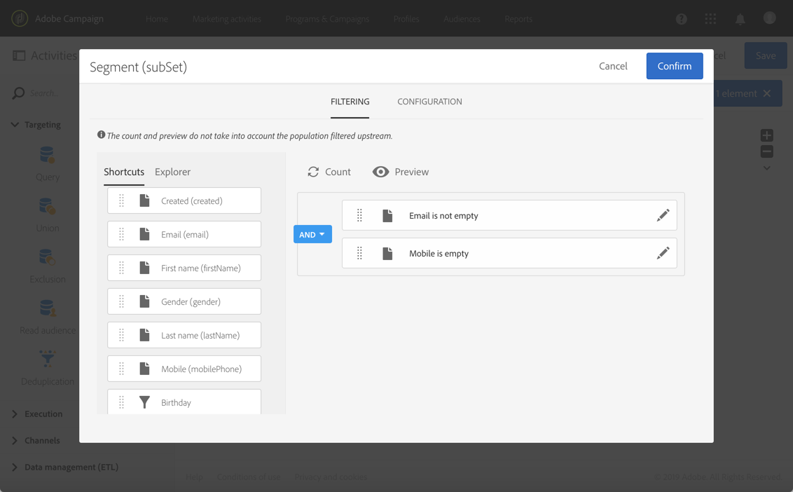

# チャネル間配信の作成{#cross-channel-delivery}

このドキュメントでは、標準的な使用例を基に Adobe Campaign のクロスチャネル配信ワークフロー作成機能を紹介します。

ここでの目的は、データベースの受信者からオーディエンスを選択し、2つの異なるグループにセグメント化することです。これは、最初のグループに電子メールを送信し、2番目のグループにSMSメッセージを送信することを目的としています。

Adobe Campaignで使用できるワークフローと様々なチャネルの詳細については、次のドキュメントを参照してください。

* [ワークフローの検索](../../automating/using/get-started-workflows.md)
* [通信チャネルの検出](../../channels/using/get-started-communication-channels.md)

## ワークフローの作成 {#creating-workflow}

任意のグループに 2 つの異なる配信を送信するには、まずターゲットを定義する必要があります。

そのためには、受信者を特定するクエリを作成しなければならないので、ワークフローを作成する必要があります。

プログラムまたは任意のキャンペーンで新しいワークフローを作成します。

1. で、 **[!UICONTROL Marketing Activities]**&#x200B;をクリック **[!UICONTROL Create]** してを選択し **[!UICONTROL Workflow]**&#x200B;ます。
1. ワークフローのタイプ **[!UICONTROL New Workflow]** として選択し、をクリックし **[!UICONTROL Next]**&#x200B;ます。
1. ワークフローのプロパティを入力し、をクリックし **[!UICONTROL Create]**&#x200B;ます。

ワークフローを作成する詳細な手順については、「ワークフローの [構築](../../automating/using/building-a-workflow.md) 」の節を参照してください。

## Creating a Query activity {#creating-query-activity}

ワークフローを作成したら、そのインターフェイスにアクセスできます。

ワークフローにクエリアクティビティを挿入して、配信を受け取るプロファイルをターゲットします。

1. /で、 **[!UICONTROL Activities]** クエリ **[!UICONTROL Targeting]** アクティビティをドラッグ&amp;ドロップします。
1. アクティビティを重複クリックします。
1. タブでショートカットを参照し **[!UICONTROL Target]** 、 [オーディエンスの1つを選択します](../../audiences/using/about-audiences.md)。
1. ショートカットを編集領域にドラッグ&amp;ドロップします。 選択したショートカットの種類に応じて、ウィンドウが表示されます。
1. ターゲットエレメントを設定し、クエリを確認します。

1つまたは複数の要素に対してクエリを作成できます。

ボタンを使用して、クエリのターゲットプロファイル数の予測を表示します。 **[!UICONTROL Count]**

## セグメントアクティビティの作成 {#creating-segmentation-activity}

クエリアクティビティでターゲットを特定したら、ターゲットを 2 つの別々の母集団にセグメント化する条件を選択する必要があります。一方は E メールを受信し、もう一方は SMS を受信します。

You have to use a [Segmentation](../../automating/using/segmentation.md) activity to create one or several segments from a population computed upstream in a query.

**E メール**&#x200B;グループでは、E メールアドレスが定義されているが、携帯電話番号がない受信者をターゲットにします。**SMS** グループには、携帯電話番号がプロファイルに保存されている受信者が含まれます。

最初のトランジション（電子メール）を設定するには：

1. デフォルトでは、 **[!UICONTROL Segments]** タブに最初のセグメントが表示されます。 プロパティを編集して、そのセグメントを設定します。

   

1. フィルター条件 **[!UICONTROL Email]** としてプロファイルを選択します。

   

1. 画面に表示される新しいウィンドウで、 **[!UICONTROL Is not empty]** 演算子を選択します。

   

1. 2追加つ目のフィルタ条件、 **[!UICONTROL Mobile]**&#x200B;および演算子の選択を行い **[!UICONTROL Is empty]**&#x200B;ます。

   

   電子メールが定義されているが、携帯電話番号が定義されていないクエリからのプロファイルはすべて、このトランジションに含まれます。

1. ワークフローをより明確にするために、トランジションラベルを編集できます。 変更を確認します。

   

最初のトランジションが設定されます。 2番目のトランジション(SMS)を構成するには：

1. 新しいトランジションを追加するには、 **[!UICONTROL Add an element]** ボタンをクリックします。
1. 携帯電話番号が入力されたすべてのプロファイルを取得できる条件を定義します。 これを行うには、 **[!UICONTROL Mobile]****[!UICONTROL Is not empty]** 論理演算子を使用してフィールドにルールを作成します。

   

   携帯電話番号が定義されているクエリからのプロファイルはすべて、このトランジションに含まれます。

1. トランジションのラベルを編集できます。 変更を確認します。

2番目のトランジションも設定されます。

## 配信の作成 {#creating-deliveries}

2つのトランジションが既に作成されているので、セグメントアクティビティのアウトバウンドトランジションに2種類の配信を追加する必要があります。 電子 [メール配信](../../automating/using/email-delivery.md) アクティビティと [SMS配信](../../automating/using/sms-delivery.md) アクティビティ。

Adobe Campaignを使用すると、ワークフローに配信を追加できます。 これを行うには、ワークフローの配信パレットの **[!UICONTROL Channels]** カテゴリからアクティビティを選択します。

電子メール配信を作成するには：

1. 最初のセグメントの後に [電子メール配信](../../automating/using/email-delivery.md) アクティビティをドラッグ&amp;ドロップします。
1. アクティビティを編集するには、重複をクリックします。
1. 選択 **[!UICONTROL Simple email]**.
1. を選択 **[!UICONTROL Add an outbound transition with the population]** し、をクリックし **[!UICONTROL Next]**&#x200B;ます。

   

   アウトバウンドトランジションでは、母集団とトラッキングログを回復できます。 例えば、これを使用して、最初のメールをクリックしなかったユーザーに2番目のメールを送信できます。

1. 電子メールテンプレートを選択し、をクリックし **[!UICONTROL Next]**&#x200B;ます。
1. 電子メールのプロパティを入力し、をクリックし **[!UICONTROL Next]**&#x200B;ます。
1. 電子メールのレイアウトを作成するには、を選択し **[!UICONTROL Use the Email Designer]**&#x200B;ます。
1. コンテンツを編集して保存します。
1. メッセージダッシュボードの **[!UICONTROL Schedule]** セクションで、[!UICONTROL要求確認]を選択解除してから、 **[!UICONTROL要求確認メッセージを送信する** ]オプションを選択します。

SMS配信を作成するには：

1. 他のセグメントの後に [SMS配信](../../automating/using/sms-delivery.md) アクティビティをドラッグ&amp;ドロップします。
1. アクティビティを編集するには、重複をクリックします。
1. を選択 **[!UICONTROL SMS]** し、をクリックし **[!UICONTROL Next]**&#x200B;ます。
1. SMSテンプレートを選択し、をクリックし **[!UICONTROL Next]**&#x200B;ます。
1. SMSプロパティを入力し、をクリックし **[!UICONTROL Next]**&#x200B;ます。
1. コンテンツを編集して保存します。

配信の作成と編集が完了したら、ワークフローを開始できる状態になります。

## ワークフローの実行 {#running-the-workflow}

ワークフローが開始されると、 **[!UICONTROL Query]** アクティビティが対象とする訪問者がセグメント化され、電子メールまたはSMS配信を受信します。

To execute your workflow, click the **[!UICONTROL Start]** button from the action bar.

You can access your deliveries from the **[!UICONTROL Marketing plans]** > **[!UICONTROL Marketing activities]** advanced menu via the Adobe Campaign logo. Click the delivery then the **[!UICONTROL Reports]** button to access the [delivery reports](../../reporting/using/about-dynamic-reports.md#accessing-dynamic-reports), such as the delivery summary, the open rate or the email rendering according to the recipients&#39; message inbox.
