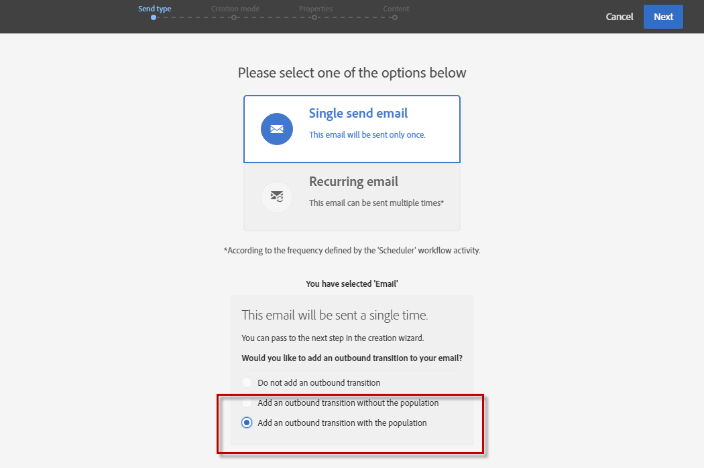

# クロスチャネル配信の作成{#cross-channel-delivery}

このドキュメントでは、標準的な使用例を基に Adobe Campaign のクロスチャネル配信ワークフロー作成機能を紹介します。

ここでは、1 つのグループに E メールを送信し、もう 1 つのグループに SMS メッセージを送信することを目的に、データベースの受信者からオーディエンスを選択し、2 つの別々のグループにセグメント化します。

Adobe Campaign で使用できるワークフローと様々なチャネルの詳細については、次のドキュメントを参照してください。

* [ワークフローの検出](../../automating/using/get-started-workflows.md)
* [通信チャネルの検出](../../channels/using/get-started-communication-channels.md)

## ワークフローの作成 {#creating-workflow}

任意のグループに 2 つの異なる配信を送信するには、まずターゲットを定義する必要があります。

そのためには、受信者を特定するクエリを作成しなければならないので、ワークフローを作成する必要があります。

プログラムとキャンペーンのどちらかで新しいワークフローを作成します。

1. 「**[!UICONTROL Marketing Activities]**」で、「**[!UICONTROL Create]**」をクリックして「**[!UICONTROL Workflow]**」を選択します。
1. ワークフローのタイプとして「**[!UICONTROL New Workflow]**」を選択し、「**[!UICONTROL Next]**」をクリックします。
1. ワークフローのプロパティを入力し、「**[!UICONTROL Create]**」をクリックします。

ワークフローを作成する詳細な手順については、[ワークフローの作成](../../automating/using/building-a-workflow.md)の節を参照してください。

## クエリアクティビティの作成 {#creating-query-activity}

ワークフローを作成したら、そのインターフェイスにアクセスできます。

クエリアクティビティをワークフローに挿入し、配信を受信するプロファイルをターゲティングします。

1. **[!UICONTROL Activities]**／**[!UICONTROL Targeting]** で、「[クエリ](../../automating/using/query.md)」アクティビティをドラッグ＆ドロップします。
1. アクティビティをダブルクリックします。
1. 「**[!UICONTROL Target]**」タブでショートカットを参照し、[オーディエンス](../../audiences/using/about-audiences.md)の 1 つを選択します。
1. ショートカットを編集領域にドラッグ＆ドロップします。選択したショートカットの種類に応じて、ウィンドウが表示されます。
1. ターゲティング要素を設定し、クエリを確認します。

1 つまたは複数の要素に対してクエリを作成できます。

「**[!UICONTROL Count]**」ボタンを使用して、クエリのターゲットプロファイル数の予測を表示します。

## Segmentation アクティビティの作成 {#creating-segmentation-activity}

クエリアクティビティでターゲットを特定したら、ターゲットを 2 つの別々の母集団にセグメント化する条件を選択する必要があります。一方は E メールを受信し、もう一方は SMS を受信します。

を使用する必要があります。 [セグメント化](../../automating/using/segmentation.md) 「 」アクティビティを使用して、クエリで upstream を計算した母集団から 1 つ以上のセグメントを作成します。

**E メール**&#x200B;グループでは、E メールアドレスが定義されているが、携帯電話番号がない受信者をターゲットにします。**SMS** グループには、携帯電話番号がプロファイルに保存されている受信者が含まれます。

最初のトランジション（E メール）を設定するには：

1. デフォルトでは、「**[!UICONTROL Segments]**」タブに最初のセグメントが表示されます。プロパティを編集して、そのセグメントを設定します。

   

1. フィルター条件としてプロファイルの「**[!UICONTROL Email]**」を選択します。

   

1. 画面に表示される新しいウィンドウで、「**[!UICONTROL Is not empty]**」演算子を選択します。

   

1. 2 番目のフィルター条件、「**[!UICONTROL Mobile]**」を追加し、演算子「**[!UICONTROL Is empty]**」を選択します。

   

   E メールが定義されているが、携帯電話番号が定義されていないクエリからのプロファイルはすべて、このトランジションに含まれます。

1. ワークフローをより明確にするために、トランジションラベルを編集できます。変更を確認します。

   

最初のトランジションが設定されます。2 番目のトランジション（SMS）を構成するには：

1. 新規トランジションを追加するには、「**[!UICONTROL Add an element]**」ボタンをクリックします。
1. 携帯電話番号が入力されたすべてのプロファイルを取得できる条件を定義します。これをおこなうには、「**[!UICONTROL Mobile]**」論理演算子を使用して「**[!UICONTROL Is not empty]**」フィールドにルールを作成します。

   

   携帯電話番号が定義されているクエリからのプロファイルはすべて、このトランジションに含まれます。

1. トランジションのラベルを編集できます。変更を確認します。

これで 2 番目のトランジションも設定されました。

## 配信の作成 {#creating-deliveries}

2 つのトランジションが既に作成されているので、Segmentation アクティビティのアウトバウンドトランジションに 2 種類の配信を追加する必要があります。 [E メール配信](../../automating/using/email-delivery.md) アクティビティと [SMS 配信](../../automating/using/sms-delivery.md) アクティビティ。

Adobe Campaign を使用すると、ワークフローに配信を追加できます。これをおこなうには、ワークフローのアクティビティパレットの「**[!UICONTROL Channels]**」カテゴリから配信を選択します。

E メール配信を作成するには：

1. ドラッグ&amp;ドロップ [E メール配信](../../automating/using/email-delivery.md) アクティビティを開始します。
1. アクティビティを編集するには、ダブルクリックします。
1. 「**[!UICONTROL Simple email]**」を選択します。
1. 「**[!UICONTROL Add an outbound transition with the population]**」を選択し、「**[!UICONTROL Next]**」をクリックします。

   

   送信トランジションでは、母集団とトラッキングログを回復できます。例えば、これを使用して、最初のメールをクリックしなかったユーザーに 2 番目のメールを送信できます。

1. E メールテンプレートを選択し、「**[!UICONTROL Next]**」をクリックします。
1. E メールのプロパティを入力し、「**[!UICONTROL Next]**」をクリックします。
1. E メールのレイアウトを作成するには、「**[!UICONTROL Use the Email Designer]**」を選択します。
1. コンテンツを編集して保存します。
1. Adobe Analytics の **[!UICONTROL Schedule]** 「 」セクションで、 **[!UICONTROL Request confirmation before sending messages]** オプション。

SMS 配信を作成するには：

1. ドラッグ&amp;ドロップ [SMS 配信](../../automating/using/sms-delivery.md) アクティビティが表示されます。
1. アクティビティを編集するには、ダブルクリックします。
1. 「**[!UICONTROL SMS]**」を選択し、「**[!UICONTROL Next]**」をクリックします。
1. SMS テンプレートを選択し、「**[!UICONTROL Next]**」をクリックします。
1. SMS のプロパティを入力し、「**[!UICONTROL Next]**」をクリックします。
1. コンテンツを編集して保存します。

配信の作成と編集が完了したら、ワークフローを開始する準備ができました。

## ワークフローの実行 {#running-the-workflow}

ワークフローを開始すると、 **[!UICONTROL Query]** アクティビティはセグメント化され、E メールまたは SMS 配信を受信します。

ワークフローを実行するには、アクションバーの「**[!UICONTROL Start]**」ボタンをクリックします。

Adobe Campaign ロゴの、**[!UICONTROL Marketing plans]**／**[!UICONTROL Marketing activities]** 詳細設定メニューから、配信にアクセスできます。配信をクリックし、「**[!UICONTROL Reports]**」ボタンをクリックすると、配信の概要、開封率、受信者の受信ボックスに基づく E メールのレンダリングなどの[配信レポート](../../reporting/using/about-dynamic-reports.md#accessing-dynamic-reports)にアクセスできます。
