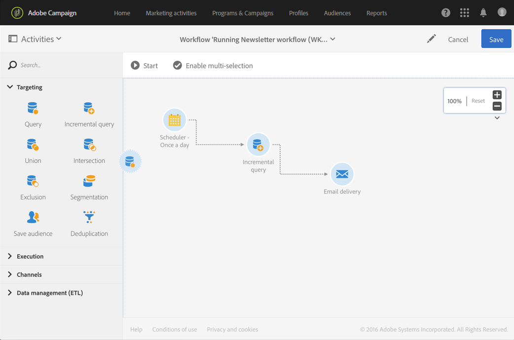
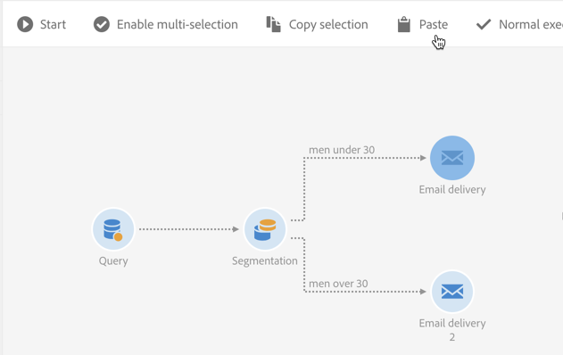

# ワークフローインターフェイス{#workflow-interface}

ワークフローを作成して、キャンペーンーとプログラムのプロセス全体を管理できます。

ワークフロー編集画面は、次の要素で構成されています。

* 使用可能な [アクティビティを参照するパレット](#palette)。
* アクティビティが設定および編成される [ワークスペース](#workspace)。
* ア [クションバー](#action-bar)。ワークフローやそのコンポーネントを操作するためのボタンで構成されています。
* ク [イックアクション](#quick-actions)(選択したアクティビティの周りに表示される)を使用して、操作を行うことができます。

## パレット {#palette}

パレットは画面の左側に表示されます。 使用可能なすべてのアクティビティは、次の複数のカテゴリに分類されます。

* [ターゲット](../../automating/using/about-targeting-activities.md):訪問者データのターゲット設定、操作、アクティビティのフィルタリングに固有のアクティビティ
* [実行](../../automating/using/about-execution-activities.md):ワークフローの編成と実行に固有のアクティビティ
* [チャネル](../../automating/using/about-channel-activities.md):様々な通信チャネルを表すアクティビティ
* [データ管理(ETL)](../../automating/using/about-data-management-activities.md):データの操作に固有のアクティビティ

ワークフロー内のパレットのアクティビティを使用するには、ワークスペースにドラッグ&amp;ドロップします。

ワークフローを開始する前に、パレットから追加した各アクティビティを設定する必要があります。

## ワークスペース {#workspace}

ワークスペースは、ワークフローエディターの中央ゾーンです。 このゾーンでは、トランジションをドロップし、アクティビティを使用してリンクし、構成することができます。

2つのアクティビティをリンクするには、矢印の端を最初のアクティビティから次のアクティビティに移動して、接続します。 アクティビティを後ろの矢印の点に向けて移動して、前のアクティビティにリンクさせることもできます。 いずれかのアクティビティを移動しても、リンクは維持されます。

データを処理するアクティビティに続くトランジションには、中間の訪問者が含まれます。 ワークフロープロパティのセクションで **[!UICONTROL Keep interim results]** オプションをオンにすると、これら **[!UICONTROL Execution]** にアクセスできます。

>[!CAUTION]
>
>このオプションは、多くのディスク領域を消費しますが、ワークフローの作成と適切な設定および動作の確保に役立つように設計されています。実稼働インスタンスでは、このチェックボックスをオフのままにします。

アクティビティを選択すると、アクティビティの周りにクイックアクションが表示され、ユーザーが操作できるようになります。 例えば、アクティビティを設定するには、そのユーザーを選択し、クイックアクションの  ボタンを使用して開きます。

特定の機能は、ワークスペースでのみ有効になります。

* 複数のアクティビティとトランジションの周りにゾーンを描画して選択します。
* 複数のアクティビティまたはトランジションを選択するには、 **Ctrl** +左クリックを押します。
* Enter **キーを押して** 、現在選択されているアクティビティまたはトランジションの詳細を表示します。
* 現在選択されているアクティビティを削除するには、 **Delete** キーを押します。
* 選択したアクティビティをコピーするには **Ctrl + C** 、ワークスペースに貼り付けるには **Ctrl + V** 。

## アクションバー {#action-bar}

ワークスペースで選択した要素、またはワークフローの実行ステータスに応じて、アクションバーで使用できるボタンは異なる場合があります。

 **[!UICONTROL Open activity]** ワークフローのプロパティを編集できます。

 **[!UICONTROL Start]** ワークフローを開始します。

 **[!UICONTROL Pause]** ワークフローを一時停止します。

 **[!UICONTROL Stop]** ワークフローの実行を中断します。 停止した場所から再開できません。

 **[!UICONTROL Restart]** ワークフローを再開します。

 **[!UICONTROL Log and tasks]** ワークフローの実行ログを開きます。

 **[!UICONTROL Enable multi-selection]** 複数選択モードを有効にします。 ワークフローは、2つ以上のアクティビティで構成する必要があります。

 **[!UICONTROL Disable multi-selection]** 複数選択モードを無効にします。 

 **[!UICONTROL Open transition]** 選択したトランジションを開きます。 

  **[!UICONTROL Normal execution]** 選択が無効になっているか一時停止としてマークされている場合は、選択を再有効にします。 

 **[!UICONTROL Execution suspended]** 選択したアクティビティでワークフローを一時停止します。 

 **[!UICONTROL No execution]** アクティビティを無効にします。 

 **[!UICONTROL Delete selection]** 選択したアクティビティを削除します。 

 **[!UICONTROL Copy selection]** 選択したアクティビティをコピーします。

 **[!UICONTROL Paste]** コピーされたアクティビティを貼り付けます。

## クイックアクション {#quick-actions}

アクティビティを選択すると、アクティビティの周りにクイックアクションボタンが表示され、ユーザーが操作できるようになります。

 **[!UICONTROL Open activity]** 選択したアクティビティを開きます。

 **[!UICONTROL Copy selection]** 選択したアクティビティをコピーします。

 **[!UICONTROL Open the activity's advanced options]** 選択した電子メールまたはSMS配信アクティビティの詳細オプションを開きます。

 **[!UICONTROL Normal execution]** 選択が無効になっているか一時停止としてマークされている場合は、選択を再有効にします。

 **[!UICONTROL Execution suspended]** 選択したアクティビティでワークフローを一時停止します。

 **[!UICONTROL No execution]** アクティビティを無効にします。

 **[!UICONTROL Immediate execution]** 選択範囲を直ちに処理します。 このボタンは、スケジューラーおよび待機アクティビティでのみ使用できます。

 **[!UICONTROL Delete selection]** 選択したアクティビティを削除します。

## ワークフローアクティビティの複製 {#duplicating-workflow-activities}

ワークスペースを使用すると、ワークフローアクティビティをコピーして同じワークフロー内に貼り付けたり、同じキャンペーンインスタンスから別のワークフロー内に貼り付けたりして重複できます。

アクティビティを複製すると、その設定全体が保持されます。 配信アクティビティ（電子メール、SMS、プッシュ通知など）の場合、アクティビティに関連付けられている配信オブジェクトが複製されます。

>[!NOTE]
>
>ワークフローアクティビティをインスタンス間で複製することはできません。 テクニカルワークフローからのアクティビティは複製できません。

アクティビティを重複するには、次の手順に従います。

1. アクティビティを選択し、クイックアクションの **[!UICONTROL Copy selection]** ボタンをクリックします。

   キーボードショートカットの **Ctrl + C** (C)を使用することもできます。

   

1. ターゲットワークフローワークスペース内で右クリックし、 **[!UICONTROL Paste]** ボタンをクリックします。

   [ **Ctrl] + [V** ]キーボードショートカットを使用することもできます。

   

1. アクティビティは複製され、最初に設定されたすべての設定が反映されます。

複数のアクティビティをコピー&amp;ペーストして、ワークフロー全体を重複することもできます。

これを行うには、アクティビティの周りにゾーンを描画して選択します。 次に、アクションバーの **[!UICONTROL Copy selection]** ボタンをクリックします(または、 **Ctrl + C**)。 その後、それらを目的の場所に貼り付けることができます。

