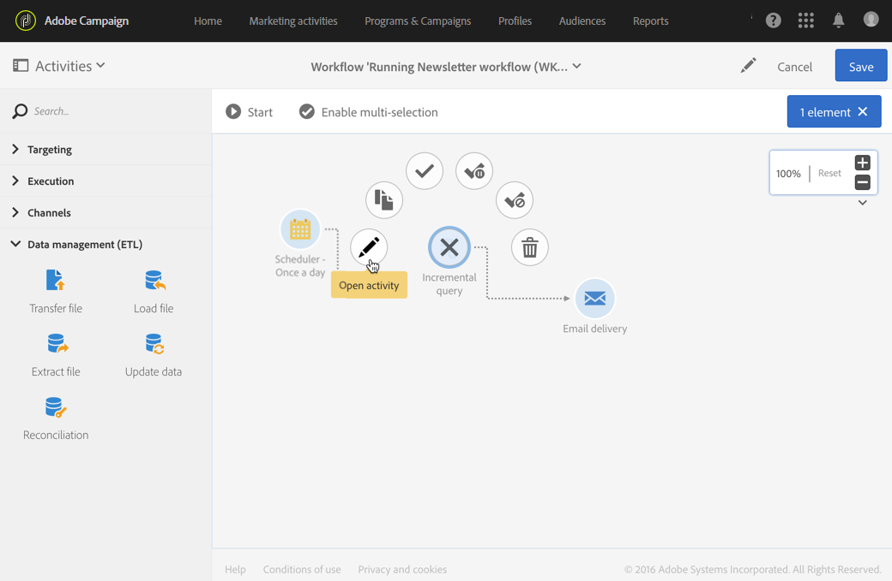
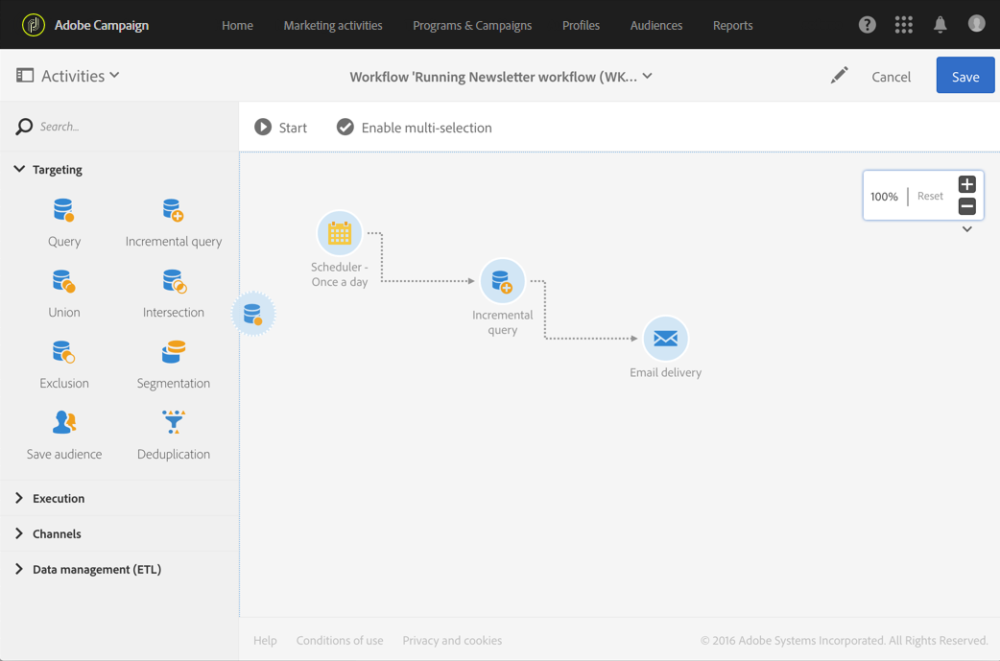
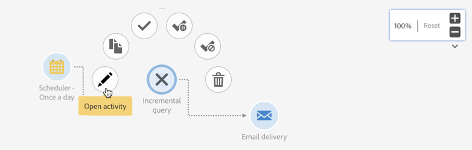
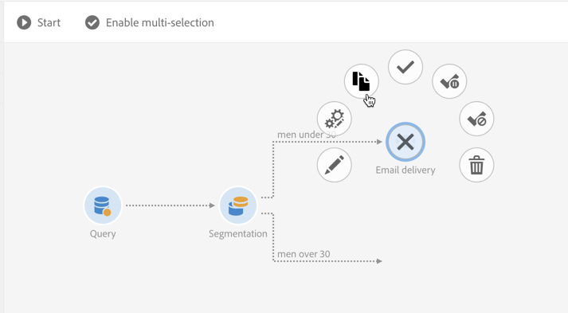
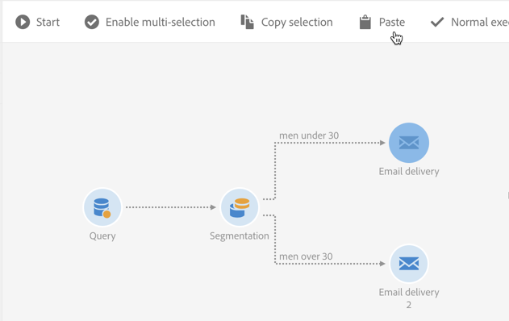
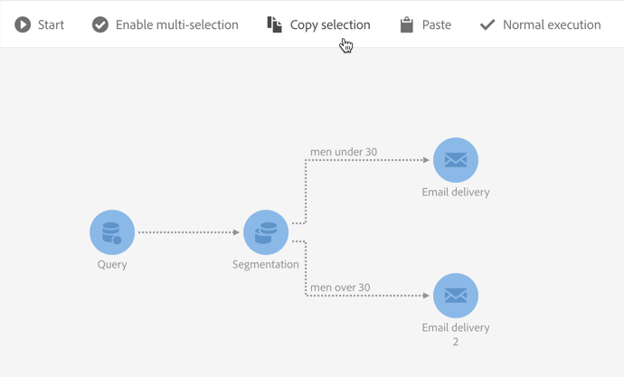

# ワークフローインターフェイス{#workflow-interface}

ワークフローを作成して、キャンペーンやプログラムのプロセス全体を管理できます。

ワークフロー編集画面は、次の要素で構成されます。

* 使用可能なアクティビティを参照する[ パレット ](#palette)。
* アクティビティが設定および整理された[Workspace](#workspace)。
* [ アクションバー](#action-bar)は、ワークフローやそのコンポーネントを操作できるボタンで構成されています。
* 選択したアクティビティの周囲に表示される[ クイックアクション ](#quick-actions)を使用すると、このアクティビティを操作できます。

 [ ビデオでワークフローを作成する方法を確認](#video)

## パレット {#palette}

パレットは画面の左側にあります。 使用可能なすべてのアクティビティは、次のカテゴリに分類されます。

* [ ターゲティング ](../../automating/using/about-targeting-activities.md)：ターゲティング、母集団データの操作、およびアクティビティのフィルタリングに固有のアクティビティ
* [実行](../../automating/using/about-execution-activities.md): ワークフローの整理と実行に固有のアクティビティ
* [ チャネル ](../../automating/using/about-channel-activities.md)：使用可能な様々なコミュニケーションチャネルを表すアクティビティ
* [ データ管理（ETL） ](../../automating/using/about-data-management-activities.md)：データ操作に固有のアクティビティ

ワークフローのパレットからアクティビティを使用するには、それをワークスペースにドラッグ&amp;ドロップします。

ワークフローを開始する前に、パレットから追加された各アクティビティを設定する必要があります。

## ワークスペース {#workspace}

ワークスペースは、ワークフローエディターの中央ゾーンです。 このゾーンでは、アクティビティをドロップし、トランジションを使用してアクティビティをリンクし、設定できます。

2つのアクティビティをリンクするには、最初のアクティビティから次のアクティビティまで、矢印の端を接続するまで移動します。 アクティビティを前のアクティビティにリンクするために、その後ろの矢印のポイントに向かってアクティビティを移動することもできます。 いずれかのアクティビティを移動しても、リンクされたままになります。

データを処理するアクティビティに続くトランジションには、中間母集団が含まれます。 ワークフロープロパティの「**[!UICONTROL Execution]**」セクションの「**[!UICONTROL Keep interim results]**」オプションをオンにすると、アクセスできます。

>[!CAUTION]
>
>このオプションは、多くのディスク領域を消費しますが、ワークフローの作成と適切な設定および動作の確保に役立つように設計されています。 実稼働インスタンスでは、このチェックボックスをオフのままにします。

アクティビティを選択すると、アクティビティの周囲にクイックアクションが表示され、アクティビティを操作できます。 例えば、アクティビティを設定するには、アクティビティを選択し、クイックアクションの「」ボタンを使用してアクティビティを開きます。

特定の機能は、ワークスペースでのみ有効になります。

* その周りにゾーンを描画して、いくつかのアクティビティとトランジションを選択します。
* **Ctrl** +左クリックを押して、複数のアクティビティやトランジションを選択します。
* 現在選択されているアクティビティまたはトランジションの詳細を表示するには、**Enter**&#x200B;を押します。
* 現在選択されているアクティビティを削除するには、**削除**&#x200B;を押します。
* 選択したアクティビティをコピーするには&#x200B;**Ctrl + C**&#x200B;を押し、ワークスペースに貼り付けるには&#x200B;**Ctrl + V**&#x200B;を押します。

## アクションバー {#action-bar}

ワークスペースまたはワークフローの実行ステータスで選択した要素によって、アクションバーで使用できるボタンが異なる場合があります。

 **[!UICONTROL Open activity]** ワークフローのプロパティを編集できます。

 **[!UICONTROL Start]** ワークフローを開始します。

 **[!UICONTROL Pause]** ワークフローを一時停止します。

 **[!UICONTROL Stop]** ワークフローの実行を中断します。 停止した場所から再開できません。

 **[!UICONTROL Restart]** ワークフローを再起動します。

 **[!UICONTROL Log and tasks]** ワークフローの実行ログを開きます。

 **[!UICONTROL Enable multi-selection]** 複数選択モードを有効にします。 ワークフローは、少なくとも2つのアクティビティで構成する必要があります。

 **[!UICONTROL Disable multi-selection]** 複数選択モードを無効にします。 

 **[!UICONTROL Open transition]** 選択したトランジションを開きます。 

  **[!UICONTROL Normal execution]** 以前に無効化または一時停止としてマークされている場合は、選択を再度有効にします。 

 **[!UICONTROL Execution suspended]** 選択したアクティビティでワークフローを一時停止します。 

 **[!UICONTROL No execution]** アクティビティを無効にします。 

 **[!UICONTROL Delete selection]** 選択したアクティビティを削除します。 

 **[!UICONTROL Copy selection]** 選択したアクティビティをコピーします。

 **[!UICONTROL Paste]** コピーしたアクティビティを貼り付けます。

## クイックアクション {#quick-actions}

アクティビティを選択すると、アクティビティの周囲にクイックアクションボタンが表示され、アクティビティを操作できます。

 **[!UICONTROL Open activity]** 選択したアクティビティを開きます。

 **[!UICONTROL Copy selection]** 選択したアクティビティをコピーします。

 **[!UICONTROL Open the activity's advanced options]** 選択した電子メールまたはSMS配信アクティビティの詳細オプションを開きます。

 **[!UICONTROL Normal execution]** 以前に無効化または一時停止としてマークされている場合は、選択を再度有効にします。

 **[!UICONTROL Execution suspended]** 選択したアクティビティでワークフローを一時停止します。

 **[!UICONTROL No execution]** アクティビティを無効にします。

 **[!UICONTROL Immediate execution]** 選択を直ちに処理します。 このボタンは、 スケジューラーおよび待機 アクティビティでのみ使用できます。

 **[!UICONTROL Delete selection]** 選択したアクティビティを削除します。

## ワークフローアクティビティの複製 {#duplicating-workflow-activities}

ワークスペースを使用すると、ワークフローアクティビティを同じワークフローにコピー&amp;ペーストしたり、同じCampaign インスタンスから別のワークフローにコピーしたりして、ワークフローアクティビティを複製できます。

アクティビティが複製されると、その設定全体が保持されます。 配信アクティビティ（電子メール、SMS、プッシュ通知など）の場合、アクティビティに添付された配信オブジェクトが複製されます。

>[!NOTE]
>
>ワークフローアクティビティをインスタンスから別のインスタンスに複製することはできません。 テクニカルワークフローのアクティビティは複製できません。

アクティビティを複製するには、次の手順に従います。

1. アクティビティを選択し、クイックアクションから「**[!UICONTROL Copy selection]**」ボタンをクリックします。

   **Ctrl + C** キーボードショートカットを使用することもできます。

   

1. 対象のワークフローワークスペースで右クリックし、**[!UICONTROL Paste]** ボタンをクリックします。

   **CTRL + V** キーボードショートカットを使用することもできます。

   

1. アクティビティが複製され、最初に設定されたすべての設定が複製されます。

複数のアクティビティをコピー&amp;ペーストして、ワークフロー全体を複製することもできます。

これを行うには、アクティビティの周囲にゾーンを描画してアクティビティを選択します。 次に、アクションバーから&#x200B;**[!UICONTROL Copy selection]** ボタンをクリックします（または&#x200B;**Ctrl + C** キーを押します）。 次に、それらを目的の場所に貼り付けることができます。

## チュートリアルビデオ {#video}

このビデオでは、ワークフローの作成方法を説明します。

>[!VIDEO](https://video.tv.adobe.com/v/23937?quality=12)

その他のCampaign Standardのハウツー動画は[こちら](https://experienceleague.adobe.com/docs/campaign-standard-learn/tutorials/overview.html?lang=ja)でご覧いただけます。
