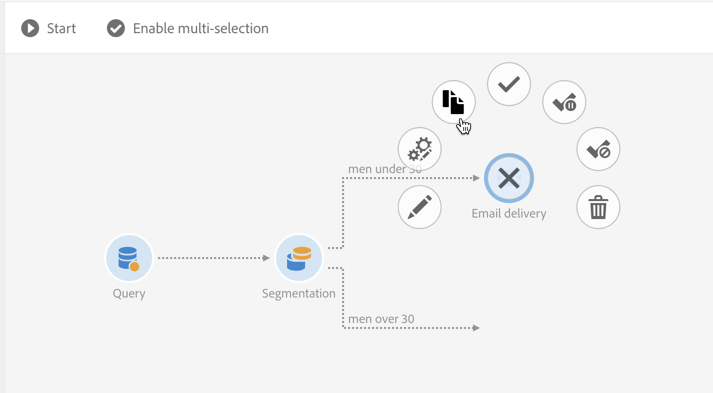

# ワークフローインターフェイス{#workflow-interface}

ワークフローを作成して、キャンペーンおよびプログラムのプロセス全体を管理できます。

ワークフロー編集画面は、次の要素で構成されています。

* 使用可能 なアクティビティを参照するパレット。
* アクテ [ィビティが設定](#workspace)、整理されるWorkspace。
* アクシ [ョンバー](#action-bar)。ワークフローやそのコンポーネントを操作するためのボタンで構成されています。
* 選択し [たアクティビティの周りに表示されるクイックアクション](#quick-actions)(Quick Actions)を使用して、アクティビティを操作できます。

## パレット {#palette}

パレットは画面の左側に表示されます。 使用可能なすべてのアクティビティは、次のカテゴリに分類されます。

* [ターゲット](../../automating/using/about-targeting-activities.md):訪問者データのターゲット設定、操作、およびアクティビティのフィルタリングに固有のアクティビティ
* [実行](../../automating/using/about-execution-activities.md):ワークフローの編成と実行に固有のアクティビティ
* [チャネル](../../automating/using/about-channel-activities.md):様々な通信チャネルを表す活動
* [データ管理(ETL)](../../automating/using/about-data-management-activities.md):データ操作に固有のアクティビティ

ワークフローのパレットからアクティビティを使用するには、ワークスペースにアクティビティをドラッグ&amp;ドロップします。

ワークフローを開始する前に、パレットから追加した各アクティビティを設定する必要があります。

## ワークスペース {#workspace}

ワークスペースは、ワークフローエディターの中央ゾーンです。 このゾーンでは、アクティビティをドロップし、トランジションを使用してアクティビティをリンクし、設定することができます。

2つのアクティビティをリンクするには、矢印の終わりを最初のアクティビティから次のアクティビティに移動し、接続するまで待ちます。 前のアクティビティにリンクするために、アクティビティを後ろの矢印の位置に移動することもできます。 いずれかのアクティビティを移動しても、そのアクティビティはリンクされたままになります。

データを処理するアクティビティに従って、中間訪問者を含む遷移が行われます。 ワークフロープロパティのセクションでオプションを **[!UICONTROL Keep interim results]** 選択すると、こ **[!UICONTROL Execution]** れらにアクセスできます。

アクティビティを選択すると、そのアクティビティに関するクイックアクションが表示され、アクティビティを操作できます。 例えば、アクティビティを設定するには、アクティビティを選択し、クイックアクションのボ  タンを使用して開きます。

特定の関数は、ワークスペースでのみ有効になります。

* 複数のアクティビティとトランジションを選択し、その周囲にゾーンを描画します。
* Ctrl **** +左クリックを押して、複数のアクティビティまたはトランジションを選択します。
* Enterキーを **押すと** 、現在選択されているアクティビティまたはトランジションの詳細が表示されます。
* 現在選択さ **れているアクティビティを削除するには、Delete** （削除）を押します。
* 選択し **たアクティビティをコピーするにはCtrl + C** 、ワークスペー **スに貼り付けるにはCtrl + V** を押します。

## アクションバー {#action-bar}

ワークスペースで選択した要素やワークフローの実行ステータスに応じて、アクションバーで使用できるボタンが異なる場合があります。

 **[!UICONTROL Open activity]** ワークフローのプロパティを編集できます。

 **[!UICONTROL Start]** ワークフローを開始します。

 **[!UICONTROL Pause]** ワークフローを一時停止します。

 **[!UICONTROL Stop]** ワークフローの実行を中断します。 停止した場所からは再開できません。

 **[!UICONTROL Restart]** ワークフローを再開します。

 **[!UICONTROL Log and tasks]** ワークフローの実行ログを開きます。

 **[!UICONTROL Enable multi-selection]** 複数選択モードを有効にします。 ワークフローは、少なくとも2つのアクティビティで構成されている必要があります。

 **[!UICONTROL Disable multi-selection]** 複数選択モードを無効にします。 

 **[!UICONTROL Open transition]** 選択したトランジションを開きます。 

  **[!UICONTROL Normal execution]** 選択が無効になっているか、一時停止としてマークされている場合は、再び有効にします。 

 **[!UICONTROL Execution suspended]** 選択したアクティビティでワークフローを一時停止します。 

 **[!UICONTROL No execution]** アクティビティを無効にします。 

 **[!UICONTROL Delete selection]** 選択したアクティビティを削除します。 

 **[!UICONTROL Copy selection]** 選択したアクティビティをコピーします。

 **[!UICONTROL Paste]** コピーされたアクティビティを貼り付けます。

## クイックアクション {#quick-actions}

アクティビティを選択すると、そのアクティビティの周囲にクイックアクションボタンが表示され、アクティビティを操作できます。

 **[!UICONTROL Open activity]** 選択したアクティビティを開きます。

 **[!UICONTROL Copy selection]** 選択したアクティビティをコピーします。

 **[!UICONTROL Open the activity's advanced options]** 選択した電子メールまたはSMS配信アクティビティの詳細オプションを開きます。

 **[!UICONTROL Normal execution]** 選択が無効になっているか、一時停止としてマークされている場合は、再び有効にします。

 **[!UICONTROL Execution suspended]** 選択したアクティビティでワークフローを一時停止します。

 **[!UICONTROL No execution]** アクティビティを無効にします。

 **[!UICONTROL Immediate execution]** 選択範囲を強制的に即時処理します。 このボタンは、スケジューラーおよび待機ア クティビティでの み使用できます  。

 **[!UICONTROL Delete selection]** 選択したアクティビティを削除します。

## ワークフローアクティビティの複製 {#duplicating-workflow-activities}

ワークスペースを使用すると、ワークフローアクティビティをコピーして同じワークフローに貼り付けたり、同じキャンペーンインスタンスから別のワークフローに貼り付けたりして、複製できます。

アクティビティが複製されると、その設定全体が保持されます。 配信アクティビティ（電子メール、SMS、プッシュ通知など）の場合、アクティビティに添付された配信オブジェクトが複製されます。

>[!NOTE]
>
>ワークフローアクティビティをインスタンスから別のインスタンスに複製することはできません。 技術ワークフローのアクティビティは複製できません。

アクティビティを複製するには、次の手順に従います。

1. アクティビティを選択し、クイックアクシ **[!UICONTROL Copy selection]** ョンからボタンをクリックします。

   また、キーボードショートカッ **トのCtrl + C** (C)を使用することもできます。

   

1. ターゲットワークフローワークスペース内で右クリックし、ボタンをクリック **[!UICONTROL Paste]** します。

   [Ctrl] + [V]キーボードシ **ョートカットを使用する** こともできます。

   

1. アクティビティが複製され、最初に設定されたすべての設定が反映されます。

また、複数のアクティビティをコピーして貼り付け、ワークフロー全体を複製することもできます。

これを行うには、アクティビティの周囲にゾーンを描画してアクティビティを選択します。 次に、アクショ **[!UICONTROL Copy selection]** ンバーからボタンをクリックします(または **Ctrl + cキーを押します**)。 その後、目的の場所に貼り付けることができます。

