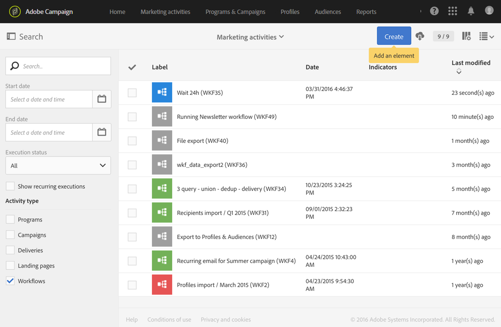

# ワークフローのライフサイクル {#life-cycle}

ワークフローのライフサイクルには、3つの主なステップが含まれ、各ステップはステータスと色にリンクされます。

* **編集** （グレー）

   これは、ワークフローの最初のデザインフェーズです（[ワークフローの作成](../../automating/using/building-a-workflow.md#creating-a-workflow)を参照）。 ワークフローはまだサーバーで処理されておらず、安全に変更できます。

* **処理中** （青）

   最初のデザインフェーズが完了したら、ワークフローを開始し、サーバーで処理できます。

* **完了** （緑）

   進行中のタスクがなくなった場合、またはオペレーターがインスタンスを明示的に停止した場合に、ワークフローが完了します。

ワークフローを開始すると、その他に2つのステータスがある場合もあります。

* **警告** （黄色）

   ワークフローを終了できなかったか、またはボタンを使用して一時停止しました。

* **エラー** （赤）

   ワークフローの実行時にエラーが発生しました。 ワークフローは停止され、ユーザーはアクションを実行する必要があります。 このエラーの詳細を調べるには、ボタンを使用してワークフローログにアクセスします（[監視](../../automating/using/monitoring-workflow-execution.md)を参照）。

マーケティングアクティビティのリストを使用すると、すべてのワークフローとそのステータスを表示できます。 詳しくは、[マーケティングアクティビティの管理](../../start/using/marketing-activities.md#about-marketing-activities)を参照してください。

