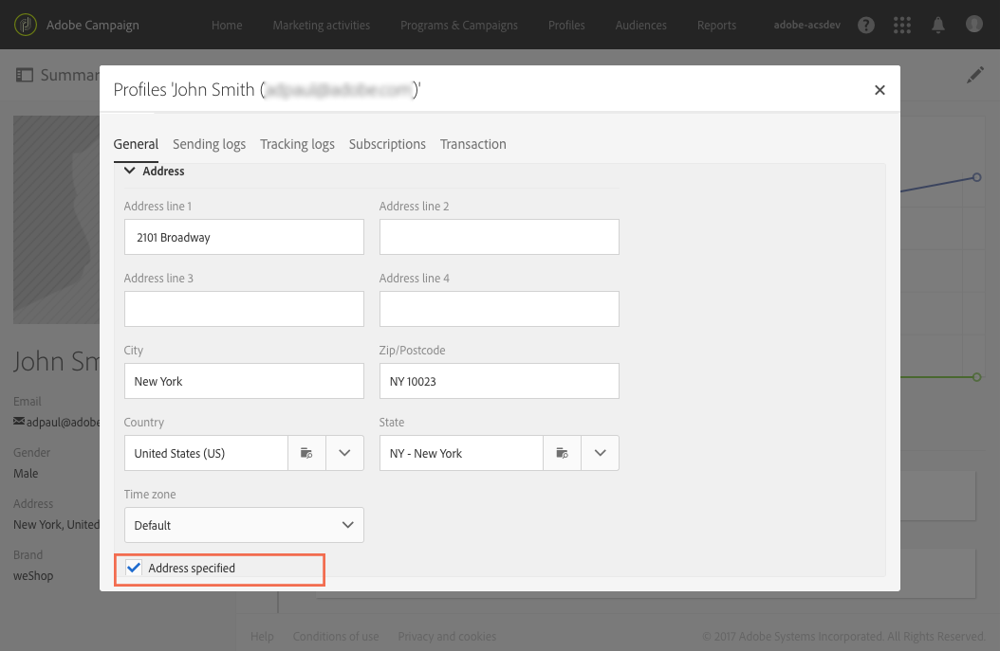

# ダイレクトメールについて{#about-direct-mail}

ダイレクトメールは、ダイレクトメールプロバイダーから求められるファイルのパーソナライズおよび生成を可能にするオフラインチャネルです。ダイレクトメールにより、カスタマージャーニーにオンラインチャネルとオフラインチャネルを混在させることができます。

>[!NOTE]
>
>この機能はオプションです。使用許諾契約書を確認してください。この **[!UICONTROL Export]** 役割は、ダイレクトメールを使用する必要があります。 管理者に問い合わせてください。

オンラインチャネルでは、メッセージ（E メール、SMS、モバイルアプリ配信など）を作成し、Adobe Campaign から直接オーディエンスにメッセージを送信できます。オフラインチャネルの場合は異なります。ダイレクトメール配信を準備すると、Adobe Campaign により、すべてのターゲットプロファイルと選択した連絡先情報（例えば、郵便の宛先）を含むファイルが生成されます。その後、このファイルを実際の発送処理をおこなうダイレクトメールプロバイダーに送信できます。

次の節では、ワンショットダイレクトメール配信の作成方法と生成方法を説明します。 また、ワークフローにダイレクトメールアクティビティを含めて、オンラインとオフラインのチャネルを組み合わせたキャンペーンを調整することもできます。 詳しくは、[ワークフロー](../../automating/using/get-started-workflows.md)ガイドを参照してください。

Adobe Campaignのユーザープロセスは次のとおりです。

1. 配信の作成
1. オーディエンスの選択
1. コンテンツの定義
1. 連絡日の設定
1. ファイルの生成

**関連トピック：**

* [使用例： 電子メールとダイレクトメールの配信の結合](../../automating/using/coupling-email-direct-mail.md)

## 推奨事項 {#recommendations}

### ダイレクトメールプロバイダ {#direct-mail-providers}

まず、ダイレクトメールプロバイダーに連絡して、推奨事項を収集する必要があります。 抽出ファイルに含める必要があるプロファイル情報を識別して、コミュニケーションをパーソナライズし、オーディエンスに送信できるようにします。 例えば、姓と名、住所、プロモーションコードなど。 これらのフィールドは、ダイレクトメールのコンテンツの [[抽出](../../channels/using/defining-the-direct-mail-content.md#defining-the-extraction) ]タブで追加するフィールドです。

プロファイルの情報の **[!UICONTROL Address specified]** ボックスがオンになっていることを確認します。 このオプションを有効にすると、プロファイルがターゲットに追加されます。 準備段階では、タイポロジルールによって除外されません(ダイレクトメールの [作成を参照](../../channels/using/creating-the-direct-mail.md))。 プロファイルのインポート中に、このフィールドを更新することを忘れないでください。

### 郵送先住所 {#postal-addresses}

抽出ファイルに含めるフィールドを追加すると、そのノードで住所フィールドを使用でき **[!UICONTROL Location]** ます。

Adobe Campaignオファーには、最も一般的な住所の標準化に従った定義済みの計算済みフィールドのセットが含まれます。 ノードでフィールドを使用でき **[!UICONTROL Postal address]** ます。

An address can contain up to six lines by default: the first calculated field (**[!UICONTROL Line 1]** contains the first name and last name, the next lines contain the postal address (road etc.), and the last line contains the ZIP/Postal code and town or city.

