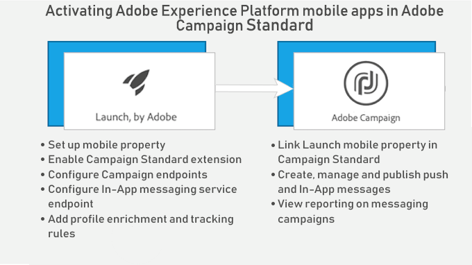

# アプリ内メッセージについて{#about-in-app-messaging}

アプリ内メッセージとは、モバイルアプリケーション内でユーザーがアクティブな場合にメッセージを表示できるメッセージングチャネルです。このメッセージタイプは、ユーザーの電話機の通知センターに配信されるプッシュ通知に適しています。プッシュ通知チャネルについて詳しくは、この[節](../../channels/using/about-push-notifications.md)を参照してください。

このチャネルを使用するには、モバイルアプリケーションが Adobe Experience Platform SDK と統合されている必要があります。これらのアプリをアプリ内配信のために Adobe Campaign で使用するには、Adobe Experience Platform Launch で有効にする必要があります。

Experience Platform SDK を利用したモバイルアプリケーションでアプリ内メッセージを送信するには、次の前提条件を満たす必要があります。

1. Adobe Campaign で、**[!UICONTROL In-App]** チャネルにアクセスできることを確認します。これらのチャネルにアクセスできない場合は、アカウントチームにお問い合わせください。

1. Experience Cloud SDK アプリケーションを使用して Adobe Campaign Standard のモバイル機能を活用するには、モバイルアプリを Adobe Experience Platform Launch で作成し、Adobe Campaign Standard で設定する必要があります。ステップバイステップガイドについては、この[ページ](https://helpx.adobe.com/jp/campaign/kb/configuring-app-sdk.html)を参照してください。

1. 設定が完了すると、アプリ内メッセージを準備できるようになります。詳しくは、この[ページ](../../channels/using/preparing-and-sending-an-in-app-message.md#preparing-your-in-app-message)を参照してください。

1. その後、[アプリ内メッセージ](../../channels/using/customizing-an-in-app-message.md)を送信するか、[ローカル通知メッセージタイプをカスタマイズする](../../channels/using/customizing-an-in-app-message.md#customizing-a-local-notification-message-type)かを決定します。

1. 配信の送信準備が整いました。詳しくは、こちらの[ページ](../../channels/using/preparing-and-sending-an-in-app-message.md#sending-your-in-app-message)を参照してください。

**関連するコンテンツ：**

* [アプリ内レポート](../../reporting/using/in-app-report.md)
* [Adobe Campaign Standard でサポートされるモバイルの使用例](https://helpx.adobe.com/jp/campaign/kb/configure-launch-rules-acs-use-cases.html)
* [Campaign Standard モバイルガイド](https://helpx.adobe.com/jp/campaign/kb/acs-mobile.html)

## アプリ内FAQ {#in-app-faq}

### Adobe Campaign Standardのアプリ内チャネルについて詳しく学ぶために役立つリソースの推奨事項は何ですか？{#resources-inapp}

以下のリソースを確認します。

* [ビデオTutorials](https://docs.adobe.com/content/help/en/campaign-standard-learn/tutorials/communication-channels/mobile/in-app/in-app-message-overview.html)
* [ブログ投稿](https://theblog.adobe.com/get-more-out-of-the-new-in-app-message-channel-from-adobe-campaign/)
* [コミュニティページ](https://experienceleaguecommunities.adobe.com/t5/adobe-campaign-standard/ct-p/adobe-campaign-standard-community)

### キャンペーン拡張APIのsetLinkageFieldとresetLinkageFieldの目的は何ですか。{#extensions-apis}

アプリ内メッセージはSDKによってキャンペーンから取り込まれるので、PIIデータを含むアプリ内メッセージが悪意のある手に渡されないようにする安全なメカニズムを提供したいと考えています。 そのため、デバイスに対するメッセージの安全な配信を確保するため、次のメカニズムが用意されています。

* モバイルプロファイルフィールド（appSubscriberRcpテーブル）は、個人用フィールドと機密フィールドとしてマークされます。この特定の情報が安全に配信されるようにする場合に使用します。
* そのようにマークされたフィールドは、追加のセキュリティメカニズムが組み込まれているプロファイルテンプレート（appSubscriberテンプレートまたはブロードキャストテンプレート内ではない）でのみ使用できます。
* プロファイルテンプレートを使用して作成されたメッセージは、ユーザーがアプリにログインしている場合にのみ提供されます。
* この安全なハンドシェイクを容易にするために、モバイルアプリ開発者は、setLinkageField APIを使用して追加の認証詳細を渡す必要があります。 appSubscriberRcpテーブルを拡張する際に、リンケージフィールドはモバイルプロファイルとCRMプロファイルの間のリンクとして識別されるものであることに注意してください。
* ユーザーがresetLinkageFieldを使用してアプリからログアウトしたときに、デバイスに保存されているアプリ内メッセージと、resetLinkagefieldをフラッシュする必要があります。 これにより、別のユーザーがアプリにログインした場合でも、以前のユーザー向けのメッセージは表示されなくなります。
* このセキュリティメカニズムクライアント側を実装するには、[モバイルSDK API](https://aep-sdks.gitbook.io/docs/using-mobile-extensions/adobe-campaign-standard/adobe-campaign-standard-api-reference)を参照してください。

### キャンペーンでアプリ内レポートを有効にするには、何をする必要がありますか？{#enable-inapp-reporting}

アプリ内トラッキングポストバックを設定する必要があります。 説明は[ここ](https://helpx.adobe.com/campaign/kb/config-app-in-launch.html#InApptrackingpostback)にあります。

ローカル通知追跡を導入するには、[ページ](../../administration/using/local-tracking.md)を参照してください。

### アプリ内チャネルで使用できるレポートはどれですか。{#report-inapp}

アプリ内チャネルのAdobe Campaignで、すぐに使用できるレポートを利用できます。 この[ドキュメント](../../reporting/using/in-app-report.md)を参照してください。

各アプリ内指標の計算方法については、この[ページ](../../reporting/using/indicator-calculation.md#in-app-delivery)を参照してください。

### アプリ内でプッシュと同様の多言語コンテンツのバリエーションをサポートしていますか。{#multilingual-inapp}

アプリ内メッセージに使用できる多言語テンプレートはありません。

ただし、目的が英語以外の言語でアプリ内メッセージを送信する場合は、利用可能なテキストボックスにコンテンツを直接貼り付けることができます。

### キャンペーンパーソナライゼーションフィールドをカスタムHTMLに追加できますか。{#custom-html-inapp}

いいえ、これはまだサポートされていません。

### 警告メッセージを設定しましたが、デバイスに表示されません。{#alert-message}

アラートメッセージには、少なくとも1つの却下ボタン（プライマリまたはセカンダリで、アクションを却下する必要があります）が必要です。 そうしないと、メッセージは保存できますが、受信されません。

### ローカル通知iOSカスタムサウンドが再生されない場合、代わりに、初期設定のサウンドが再生されますか？{#local-notification-sound}

iOSでのカスタムサウンドの場合、ローカル通知（sound.cafなど）を作成する際に、ファイル名に拡張子を付ける必要があります。 この拡張子が指定されていない場合は、デフォルトのサウンドが使用されます。

### アプリ内メッセージでディープリンクがサポートされているか。{#inapp-deeplinks}

はい、アプリ内メッセージでディープリンクがサポートされます。 ディープリンクには次のものを含める必要があります。

* ディープリンクを機能させるために配信追跡を無効にする必要があることを示す言語。
* ディープリンクの追跡を行うパートナーとしてBranchを持つAppsflier。 BranchとAdobe Campaign Standardの統合について詳しくは、[ページ](https://help.branch.io/using-branch/docs/adobe-campaign-standard-1)を参照してください。

### ユーザーがプッシュ通知からアプリを起動したときにアプリ内メッセージをトリガーできますか。{#inapp-push-trigger}

はい、これらのメッセージはデイジーチェーンメッセージとも呼ばれます。 次の手順に従います。

1. アプリ内メッセージの作成を参照してください。

1. カスタムイベントを定義し、このIAMのイベントトリガーとして選択します。例：&quot;フォールプレビューのプッシュからのトリガー&quot;

1. プッシュメッセージを作成する際に、カスタム変数を定義します。カスタム変数の値は、IAMのトリガーに使用されるイベントとして設定できます(例：Key = &quot;inappkey&quot;、value = &quot;fallプレビューのプッシュからのトリガー&quot;)。

1. モバイルアプリコードで、次のイベントトリガーを実装します。

   
