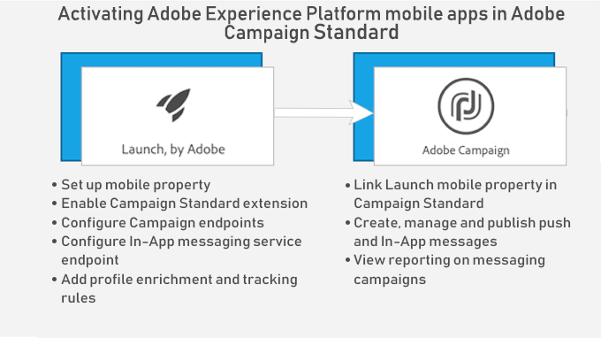

# アプリ内メッセージについて{#about-in-app-messaging}

アプリ内メッセージとは、モバイルアプリケーション内でユーザーがアクティブな場合にメッセージを表示できるメッセージングチャネルです。 このメッセージタイプは、ユーザーの電話機の通知センターに配信されるプッシュ通知に適しています。 プッシュ通知チャネルについて詳しくは、この[節](../../channels/using/about-push-notifications.md)を参照してください。

このチャネルを使用するには、モバイルアプリケーションが Adobe Experience Platform SDK と統合されている必要があります。 これらのアプリは、アプリ内配信のAdobe Campaignで使用する前に、データ収集UIでアクティベートする必要があります。

Experience Platform SDK を利用したモバイルアプリケーションでアプリ内メッセージを送信するには、次の前提条件を満たす必要があります。

1. Adobe Campaign で、**[!UICONTROL In-App]** チャネルにアクセスできることを確認します。 これらのチャネルにアクセスできない場合は、アカウントチームにお問い合わせください。

1. Adobe Campaign StandardのモバイルユースケースをExperience Cloud SDK アプリケーションで活用するには、モバイルアプリをデータ収集UIで作成し、Adobe Campaign Standardで設定する必要があります。 ステップバイステップガイドについては、この[ページ](../../administration/using/configuring-a-mobile-application.md)を参照してください。

1. 設定が完了すると、アプリ内メッセージを準備できるようになります。 詳しくは、この[ページ](../../channels/using/preparing-and-sending-an-in-app-message.md#preparing-your-in-app-message)を参照してください。

1. その後、[アプリ内メッセージ](../../channels/using/customizing-an-in-app-message.md)を送信するか、[ローカル通知メッセージタイプをカスタマイズする](../../channels/using/customizing-an-in-app-message.md#customizing-a-local-notification-message-type)かを決定します。

1. 配信の送信準備が整いました。 詳しくは、こちらの[ページ](../../channels/using/preparing-and-sending-an-in-app-message.md#sending-your-in-app-message)を参照してください。

**関連するコンテンツ：**

* [アプリ内レポート](../../reporting/using/in-app-report.md)
* [Adobe Campaign Standard でサポートされるモバイルのユースケース](../../administration/using/configuring-rules-launch.md)
* [Campaign Standard モバイルガイド](../../channels/using/get-started-communication-channels.md)

## 個人データや機密データを含むモバイルプロファイルフィールドの処理 {#handling-mobile-profile-fields-with-personal-and-sensitive-data}

Adobe Campaign では、モバイルデバイスから送信されたモバイルプロファイル属性データは、アプリケーション購読者から収集するデータを定義できる「**[!UICONTROL Subscriptions to an application (appSubscriptionRcp)]**」リソースに保存されます。

モバイルデバイスから Adobe Campaign に送信するデータを収集するには、このリソースを拡張する必要があります。 その詳しい手順については、この[ページ](../../developing/using/extending-the-subscriptions-to-an-application-resource.md)を参照してください。

アプリ内メッセージのパーソナライゼーション機能をより安全に有効にするには、このリソースのモバイルプロファイルフィールドを適宜設定する必要があります。 「**[!UICONTROL Subscriptions to an application (appSubscriptionRcp)]**」では、新しいモバイルプロファイルフィールドを作成する際に「**[!UICONTROL Personal and Sensitive]**」をオンにして、アプリ内メッセージのパーソナライズ時に使用できないようにします。

>[!NOTE]
>
>カスタムリソースを拡張した実装がこのテーブルに既に存在する場合は、各フィールドに適切なラベルを付けてから、アプリ内メッセージのパーソナライズに利用することをお勧めします。

「**[!UICONTROL Subscriptions to an application]**」カスタムリソースが設定されて公開されると、「**[!UICONTROL Target users based on their Mobile profile (inApp)]**」テンプレートを使用してアプリ内配信の準備を開始できます。 パーソナライズのために「**[!UICONTROL Subscriptions to an application (appSubscriptionRcp)]**」リソースで利用できるフィールドは、個人情報も機密性も含まないフィールドに限られます。

**個人情報や機密性を含むフィールド**&#x200B;を使用したパーソナライズが必要な場合は、ユーザーの PII データを保護するためのセキュリティメカニズムが強化された「**[!UICONTROL Target users based on their Campaign profile (inAppProfile)]**」テンプレートの使用をお勧めします。
