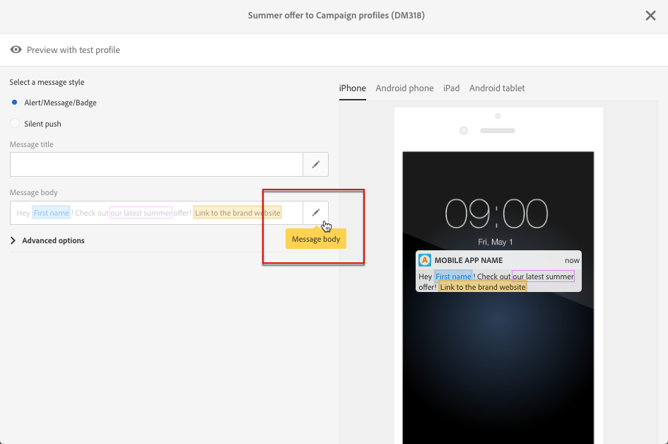

# SMS とプッシュコンテンツのデザインについて{#about-sms-and-push-content-design}

コンテンツエディターを使用して、Adobe Campaign で SMS メッセージとプッシュ通知のコンテンツを定義、変更、およびパーソナライズします。

ここでは、[SMS およびプッシュコンテンツエディターインターフェイス](../../channels/using/sms-and-push-content-editor-interface.md)を含む、SMS およびプッシュコンテンツエディターの特性について説明します。

1 つ以上のマーケティングアクティビティに共通するアクションについては、次の節で示します。

* SMS またはプッシュ通知コンテンツの個人設定については、[パーソナライゼーションフィールドの挿入](../../designing/using/personalization.md#inserting-a-personalization-field)および[コンテンツブロックの 追加](../../designing/using/personalization.md#adding-a-content-block)を参照してください。
* SMS メッセージまたはプッシュ通知での条件テキストの定義について詳しくは、[動的テキストの定義](../../channels/using/defining-dynamic-text.md)を参照してください。

SMS およびプッシュコンテンツエディターにアクセスするには：

* SMS ダッシュボードの「**[!UICONTROL Content]**」ブロックをクリックします。

  

* プッシュ通知ダッシュボードの「**[!UICONTROL Message body]**」フィールドの横にある鉛筆アイコンをクリックします。

  

**関連トピック：**

* [SMS メッセージの作成](../../channels/using/creating-an-sms-message.md)
* [プッシュ通知の作成と送信](../../channels/using/preparing-and-sending-a-push-notification.md)
